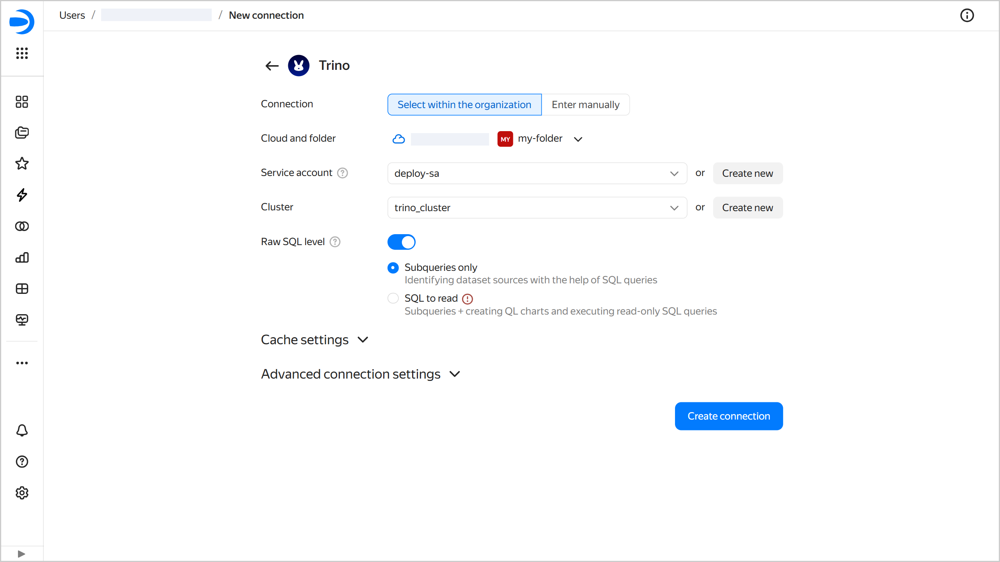
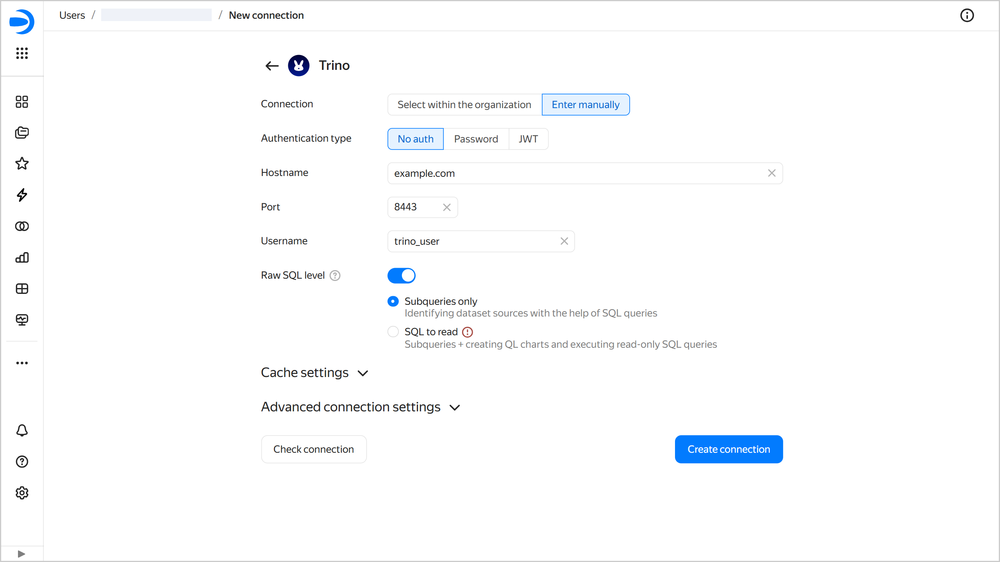
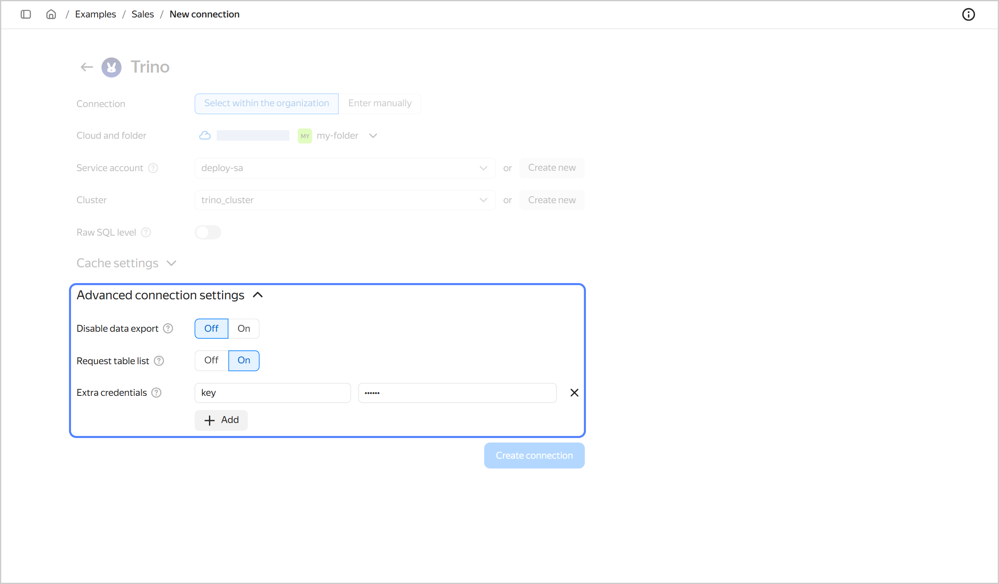
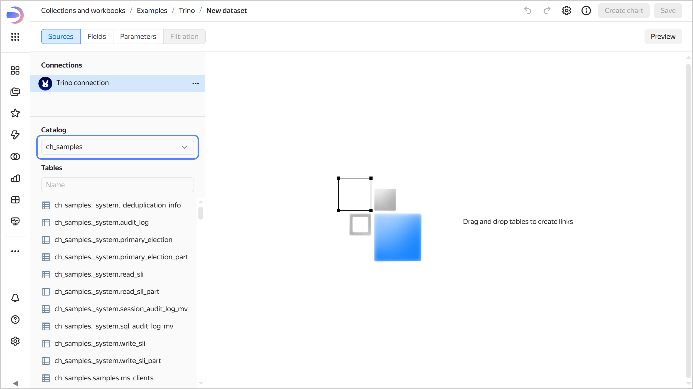

# Creating a connection to {{ TR }} in {{ datalens-full-name }}

To create a {{ TR }} connection:

1. Open the [connection creation page]({{ link-datalens-main }}/connections/new).
1. Under **Databases**, select the **{{ TR }}** connection.

1. Select the connection type:

    

    - Select in organization {#organization}

      1. 

          * **Cloud and folder**: Select the folder where your service account will be located.
          * **Service account**: Select an existing service account or [create a new one]({{ link-docs }}/iam/operations/sa/create).
          * **Cluster**. Specify the cluster from the list of available {{ TR }} clusters or [create]({{ link-docs }}/managed-trino/operations/cluster-create) a new one.

          

          

      1. 
      1. 

    - Specify manually {#manual}

      1. Select the **Authentication type**:
          * `Without authentication`
          * `Password`
          * `JWT`

      1. 

         

      1. 
      1. 
      1. Optionally, test the connection by clicking **Check connection**.

    

1. Click **Create connection**.
1. Select a [workbook](../../workbooks-collections/index.md) to save your connection to or create a new one. If using legacy folder navigation, select a folder to save the connection to.
1. Enter a name for the connection and click **Create**.

## Additional settings {#additional-settings}

You can specify additional connection settings under **Advanced connection settings**:



- Select in organization {#organization}

  * 
  * 

  

- Specify manually {#manual}

  



## Connecting an external database {#external-db-connection}



## Creating a dataset {#create-dataset}

The table search scope when connecting to {{ TR }} is limited to a specific folder.

When [creating a dataset](../../dataset/create-dataset.md) based on the {{ TR }} connection:

1. In the top-right corner of the connection page, click **Create dataset**.
1. Select the folder in the source. The tables it contains will be shown on the panel below.

   

   

   

1. Proceed with [this guide](../../dataset/create-dataset.md#add-data) from Step 4.

