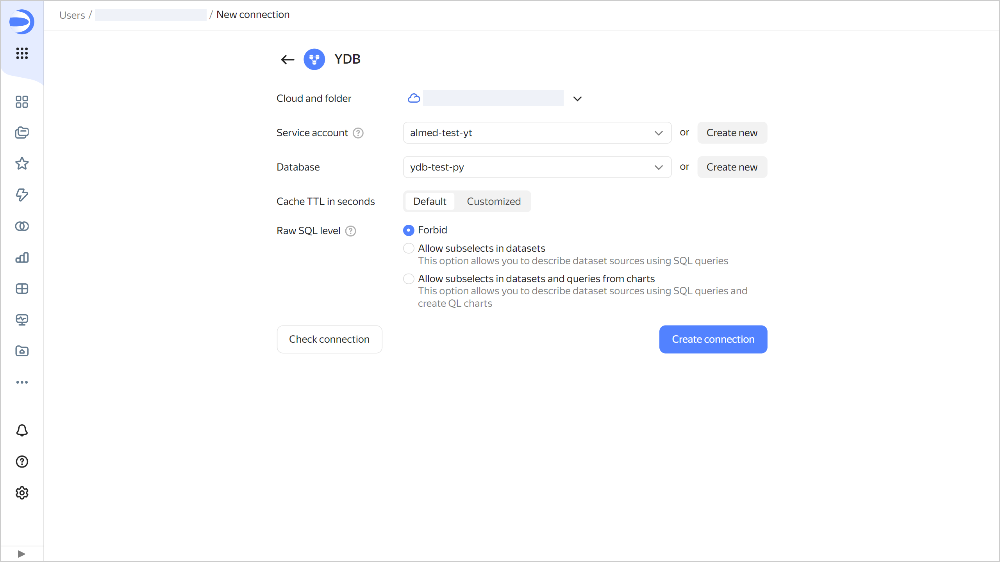

# Creating a {{ ydb-short-name }} connection



To create a connection, you will need a [service account](../../../iam/concepts/users/service-accounts.md) with the **ydb.viewer** or **viewer** [role](../../../iam/operations/sa/assign-role-for-sa.md).

To write subqueries in datasets and queries in QL charts, use [YQL syntax]({{ ydb.docs }}/yql/reference/syntax/).



To create a {{ ydb-short-name }} connection:

1. Open the page for [creating a new connection]({{ link-datalens-main }}/connections/new).
1. Under **Files and services**, select the **{{ ydb-short-name }}** connection.
1. Configure the connection as follows:

   
   * **Cloud and folder**. Select the folder where your service account will be located.
   * **Service account**. Select an existing service account or create a new one.
   * **Database**. Select the database to connect or create a new one.

   

   Capital letters are not allowed in {{ ydb-short-name }} database column names.

   

   * **Cache TTL in seconds**. Specify the cache time-to-live or leave the default value. The recommended value is 300 seconds (5 minutes).
   
   

   
   

1. (Optional) Test the connection. To do this, click **Check connection**.
1. Click **Create connection**.

1. Select a [workbook](../../workbooks-collections/index.md) to save your connection to or create a new one. If using legacy folder navigation, select a folder to save the connection to. Click **Create**.

1. Enter a name for the connection and click **Create**.



If the {{ ydb-name }} [quotas and limits](../../../ydb/concepts/limits.md) are exceeded, you may get the [`RESOURCE_EXHAUSTED`](../../../ydb/faq.md#resource-exhausted) error message. To avoid the error, follow these recommendations:

* Reduce the query rate. To achieve this, you can use filters or specify only the required chart fields to limit the amount of data you get.
* Follow the recommendations for [query optimization](../../concepts/optimization_recommendations.md).
* Use the {{ datalens-short-name }} [chart inspector](../../concepts/chart/inspector.md) to assess the data amount and upload time.
* Refer to the {{ ydb-name }} monitoring charts to see of the quotas and limits are exceeded. If you need to, you may slightly [increase](../../../ydb/operations/manage-databases.md#update-db-serverless) the [request unit](../../../ydb/concepts/serverless-and-dedicated.md#capacity) (RU) limit under **{{ ui-key.yacloud.ydb.overview.label_serverless-limits }}**.



Increasing the throughput limit in the serverless database settings may result in high usage costs. Since serverless DB resources are indefinitely large, the maximum consumption of RUs over a period of time can also reach any value, leading to excessive charges. When changing it, increase the value by only a very small amount, e.g., by 10 RUs per second.





