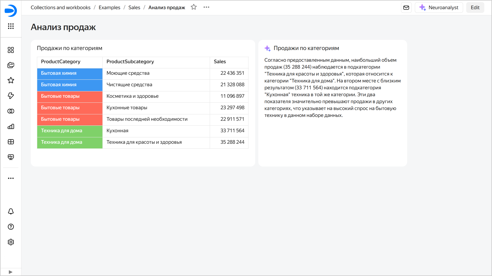

# Adding Neuroanalyst to a dashboard in {{ datalens-full-name }}

Follow these steps to add Neuroanalyst to a dashboard:



1. In the left-hand panel, click  **Dashboards** and select the dashboard you need.
1. At the top of the page, click **Edit**.
1. In the panel at the bottom of the page, drag  **Neuroanalyst** where you need.

   

1. Specify the widget settings:

   * **Chart for analysis**. Click  **Select chart** and select a chart from the list on the current dashboard tab.
   * **Header**. It sets the widget name; by default, it is the name of the selected chart. The name is displayed at the top of the widget if the **Header** option is enabled under **Appearance** (which it is by default).
   * **Prompt**. Enter a question for the Neuroanalyst to answer.

   

   
   
   

1. Click **Add**. The widget will appear on the dashboard.
1. In the top-right corner of the dashboard, click **Save**. Neuroanalyst will analyze the specified chart and generate conclusions based on the data and the custom prompt. The result will be updated every time you open the dashboard. If the data in the chart linked to Neuroanalyst changes after you receive the Neuroanalyst result, an  **Update** button will appear at the top of the widget.

   

   
   
   
