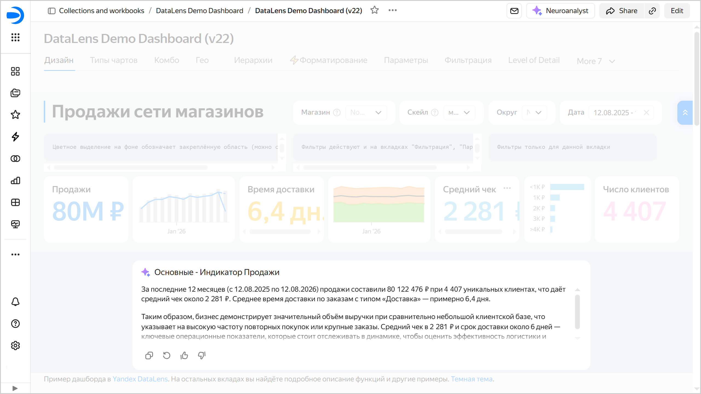

# Adding an insight widget to a dashboard in {{ datalens-full-name }}

To add a Neuroanalyst insight widget to the dashboard, follow these steps:



1. In the left-hand panel, click  **Dashboards** and select the dashboard you need.
1. At the top of the page, click **Edit**.
1. In the panel at the bottom of the page, click  **Insight** and drag it to a desired location.

   

1. Specify the main widget settings:

   * **Charts for analysis**. Click  **Add** and select a chart from the list on the current dashboard tab. You can specify up to five charts from the current dashboard tab in one insight. With Neuroanalyst, you can discover data relationships not visible in individual charts.
   * **Title**. It sets the widget name; by default, it is the name of the selected chart. The name is displayed at the top of the widget if the **Header** option is enabled under **Appearance** (which it is by default).
   * **Prompt**. Enter a question for the Neuroanalyst to answer.

   Specify widget appearance settings:

   * **Title**. Option to display the insight header.
   * **Actions with insight**. Option to display an action bar at the bottom of the insight:

     *  **Copy**. Copies the contents of the insight to the clipboard.
     *  **Once more**. Updates the insight response.
     *  **This answer is good**. Evaluates the insight response positively.
     *  **This answer is bad**. Evaluates the insight response negatively.

   * **Background**. It sets the widget background color and opacity for the light and dark theme individually.
   * **Rounding**. It sets the widget corner rounding.

   

      
   
   

   

1. Click **Add**. The widget will appear on the dashboard.
1. In the top-right corner of the dashboard, click **Save**. Neuroanalyst will analyze the specified chart and generate conclusions based on the data and the custom prompt. The result in **Insight** will be updated every time you open the dashboard. If the data in the chart linked to the **Insight** widget changes, an  **Update** button will appear at the top of the widget.

   

   

   
