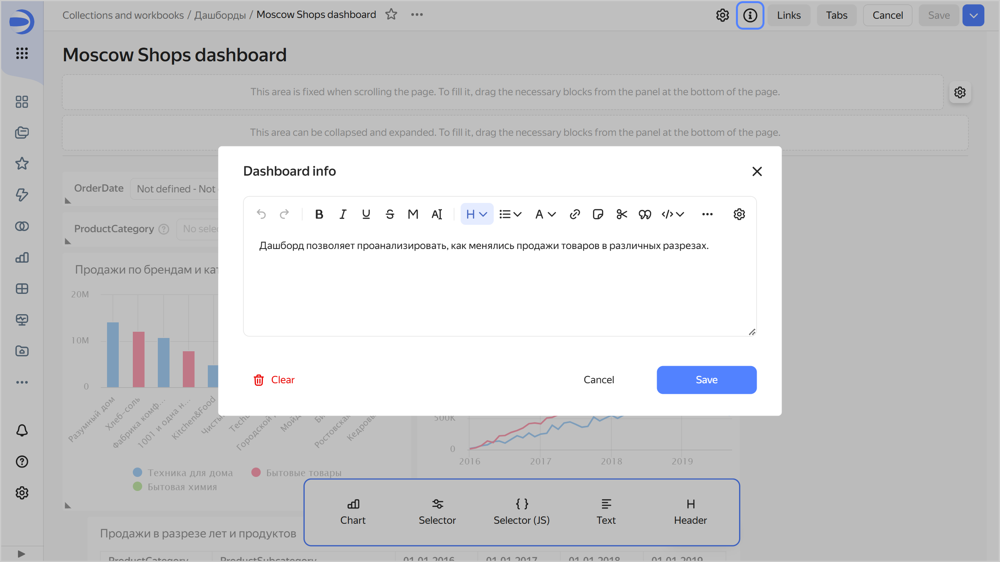
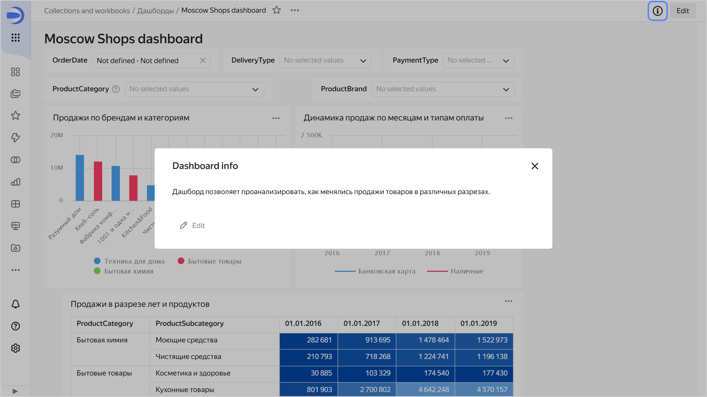

# Adding a description to a dashboard

To add a dashboard description:



1. In the left-hand panel, click  **Dashboards** and select the dashboard you need.
1. In the top-right corner, click **Edit**.
1. Click  at the top of the screen.
1. Enter the description and click **Save**.

   

   
   
   

1. In the top-right corner, click **Save**.

As a result, all users will see the  icon in the top-right corner of the dashboard. Clicking it opens the **Dashboard info** window with the description.





To remove the dashboard description, save an empty description in the **Dashboard info** window. Users will no longer see the  icon.
