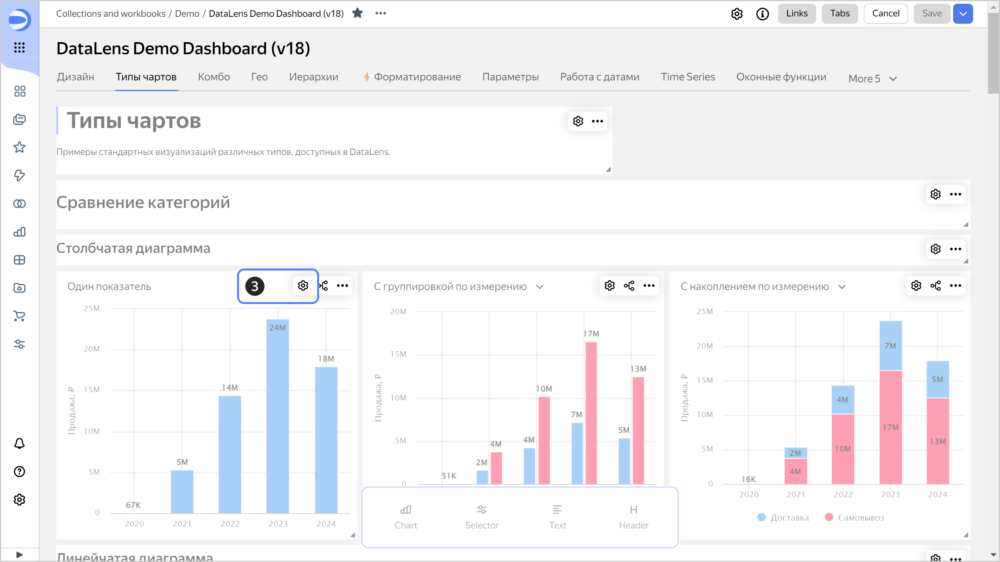

# Setting up filtering by charts

To set up [filtering of charts by other charts](../../dashboard/chart-chart-filtration.md) on the dashboard:

1. In the left-hand panel, click  **Dashboards** and select the dashboard you need. If you do not have a dashboard, [create one](../dashboard/create.md).
1. In the top-right corner of the dashboard, click **Edit**.
1. In the top-right corner of the chart to be filtered, click .

   

1. Enable the **Filtering** option.
1. Click **Save**.
1. (Optional) If needed, set up a one-way [link](../../dashboard/link.md) or remove links to charts you do not want to filter.

   

   By default, the filtering chart is linked to all the charts of the current dashboard tab that are based on the same dataset.

   

1. Click **Save**.
1. In the top-right corner of the dashboard edit window, click **Save**.
