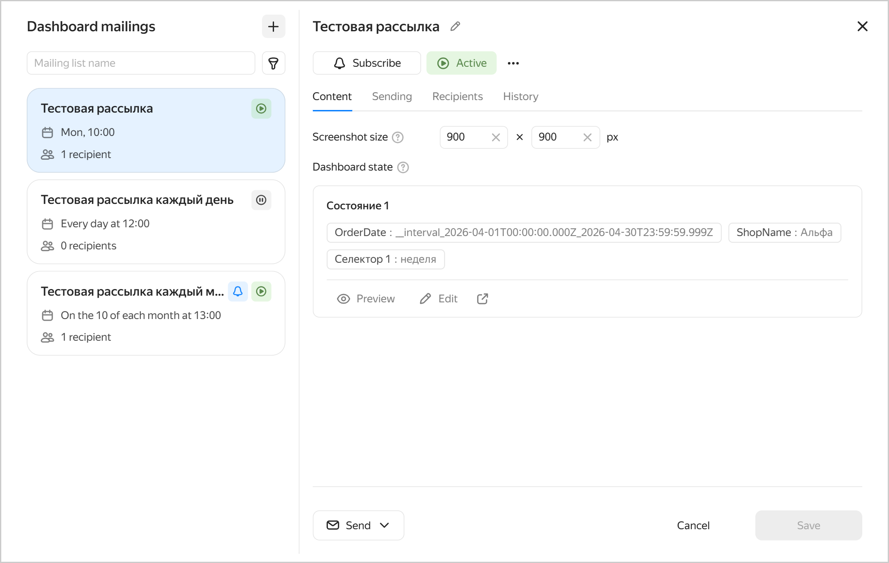
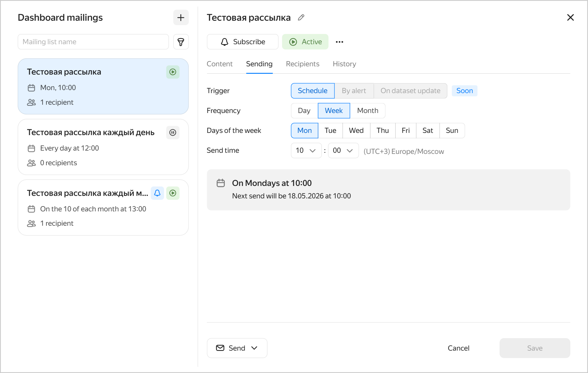
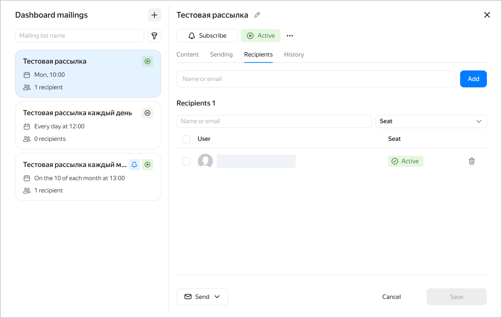
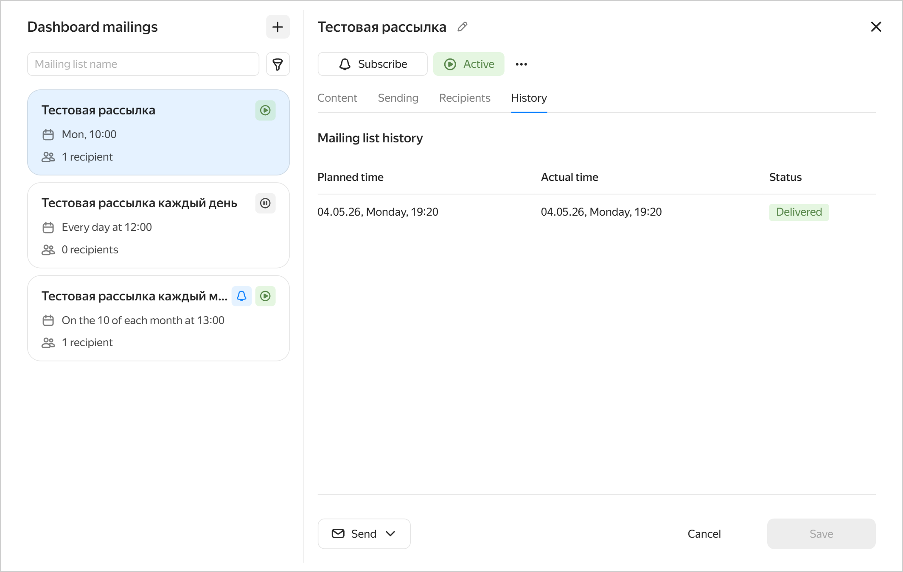

# Adding a mailing list



* Mailing lists are only available for dashboards located in [workbooks](../../../datalens/workbooks-collections/index.md).
* A user with the `{{ roles-datalens-admin }}` role can add or update a mailing list.



To add a mailing list for your dashboard:

1. In the left-hand panel, click  **Dashboards** and select the dashboard you need. If you do not have a dashboard, [create one](../dashboard/create.md).
1. Click  at the top of the screen.
1. Specify the mailing list settings:

   * Mailing list name:
   
     1. Next to the **New mailing list** field, click .
     1. Enter a mailing list name to display in the email header and subject line.

        Choose the name as per these requirements:

          * It starts and ends with an upper-case or lower-case Latin or Russian letter, number, or one of these characters: `_`, `@`, `(`, `)`, or`%`.
          * The remaining characters can be upper-case or lower-case Latin or Russian letters, numbers, spaces, or the following characters: `_`, `@`, `(`, `)`, `%`, `.`, `,`, `:`, `;`, `'`, `|`, `-`, `–`, `—`, `−`, `$`, `*`, and `&`.

     1. Optionally, enter a description for the mailing list.
     1. Click **Save**.

   * In the **What** step, set the email content:

     * Screenshot size. Available values:
       
       * Width: `360` to `1920` px
       * Height: `400` to `6000` px

     * Dashboard state:

       * Specify the tab and filters for the screenshot:
         
         * Click  **Edit**. In the window that opens, go to the relevant dashboard tab, configure the filters, and click **Done**.
         * Click  **Preview** to view the screenshot.
         * Click  to open the current dashboard in a new tab.

       

       * Currently, you can only add one screenshot per mailing list.
       * Update the state if you change selectors or dataset fields.

       

     After saving the mailing list, you can edit the email content in the **Content** tab.

     

     
   
     

   * Under **When**, specify the delivery settings:

     * **Trigger**: Set the event to trigger email delivery. Currently, mailing lists support scheduled delivery. Delivery triggered by alerts or dashboard updates will be available soon.

      

      - Schedule

        Set the email frequency:

        
        
        - Day

          Emails will be sent once a day. Specify the mailing time in the current time zone.

        - Week

          Select the days of the week and set the mailing time in the current time zone.

        - Month

          Specify the day of the month and time in the current time zone.

        

      

     After saving the mailing list, you can edit its delivery settings in the **Delivery** tab.

     

     
   
     

   * Under **Email to**, specify the recipients. To receive the emails, a user must have an active seat. If there are no recipients with an active seat, no emails will be sent.

     After saving the mailing list, you can edit the recipients in the **Recipients** tab.

     

     
   
     

   * In the **History** tab, you can view the mailing list history including dates, times, and delivery status. You can access history after saving the mailing list.

     

     
   
     

1. To add multiple mailing lists for your dashboard, click  at the top left of the **Dashboard mailings** window and repeat Step 3.
1. Click **Save**.

After you add a mailing list, it becomes `Active`, and the system starts sending emails to the specified recipients according to the delivery settings.

## Managing mailing lists {#maillist-operations}

You can rename or delete a mailing list, change its settings, pause or resume deliveries, subscribe or unsubscribe from a list, or send an email immediately:

1. In the left-hand panel, click  **Dashboards** and select the dashboard you need.
1. Click  at the top of the screen.
1. In the list on the left, select the mailing list. You can search by name or sort mailing lists by status.
1. Proceed with the relevant action:

   * Update settings. Go to the relevant tab and update the settings as follows:
     
     * Content: Specify the tab and filters for the screenshot to include in mailing list emails.
     * Sending: Specify the delivery settings.
     * Recipients: Specify the recipients.
     * History: View the mailing list history including dates, times, and delivery status.

   * Send an email immediately. At the bottom of the mailing lists window, click  **Send** and select who will receive the email: `Only me` or `All recipients`.

   * Subscribe or unsubscribe:
     
     * To subscribe to a mailing list, click  **Subscribe** at the top below the mailing list name, or click  →  **Subscribe**.
     * To unsubscribe from a mailing list, click  **Subscribed** at the top below the mailing list name, or click  →  **Unsubscribe**.

   * Pause or resume deliveries:
     
     * To pause a mailing list, click  **Active** at the top below the mailing list name, or click  →  **Pause**. The mailing list status will switch to `Paused`, and email deliveries will be suspended.
     * To activate a mailing list, click  **Paused** at the top below the mailing list name, or click  →  **Resume**. The mailing list status will switch to `Active`, and email deliveries will resume according to the mailing list settings.

   * Rename. To rename a mailing list, click  at the top to the right of the mailing list name, or click  →  **Rename** below its name. In the window that opens, enter the mailing list name and description and click **Save**.
   * Delete. To delete a mailing list, click  →  **Delete** at the top below the mailing list name.

