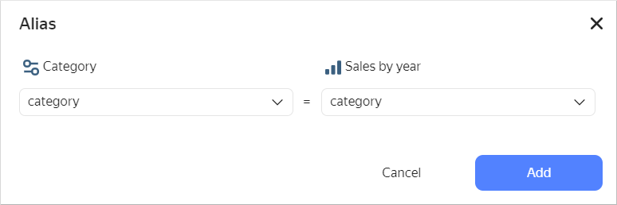
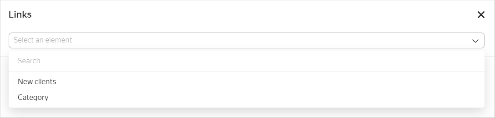

# Adding a selector to a dashboard

Before adding a selector, make sure that you have the `{{ permission-write }}` or `{{ permission-admin }}` permission for the dashboard. For more information, see [{#T}](../../security/manage-access.md).

To add a [selector](../../dashboard/selector.md) to a dashboard:



1. In the left-hand panel, click  **Dashboards** and select the dashboard you need.
1. At the top of the page, click **Edit**.
1. In the panel at the bottom of the page, choose **Selector**.

   

1. Choose your selector type:

   

   - Based on dataset

      Specify the selector parameters:

      * Under **General settings**:

         * **Dataset**: Dataset with data for the selector.
         * **Field**: Dataset field with selector values. It can be a dimension or a measure (for more information, see [{#T}](../../concepts/dataset/data-model.md#field)).
         * **Selector type**: Drop-down list, input field, calendar, or checkbox.

            

            * **Calendar** is only available for fields of the `Date` or `Date and time` type.
            * **Checkbox** is only available for fields of the `Boolean` type.
            * Measure selectors can only have the **Input field** type.

            

         * **Operation**: Comparison operation by which the selector filters the chart values (e.g., **Equal to**, **Greater than**, or **Less than**). If the field is left blank, the selector will filter by the **Equal to** operation by default. The list of available operations depends on the field type. Do not specify an operation if the selector filters the QL chart.
         * **Required field**: Allows setting the selector value as a required parameter. If enabled, `*` will be appended to the selector name. Not available for the **Checkbox** selector type.
         * **Multiple choice**: Allows choosing several values in the selector. Only available for the **List** selector type.
         * **Range**: Allows setting a time interval in the selector. Only available for the **Calendar** selector type.
         * **Default value**: Displayed when you first open the dashboard. This is a required field if the **Required field** option is enabled.

      * Under **Appearance**:

         * **Title**: Used to choose a selector when establishing a link with other widgets. The option enables you to control the display of the name on the dashboard.
         * **Inner title**: Text that is displayed in the selector to indicate a comparison operation. You can change the default value to your own one. For example, you can specify the `=` or `equal to` value for the **Equal to** operation. The parameter is only available for the **List** type.
         * **Tooltip**: This option allows adding a text comment to the selector. By default, when you enable the option, the tooltip text is substituted from the field description in the [dataset](../../concepts/dataset/index.md). You can change the tooltip text. When you change the dataset field description, the text is not automatically updated.

            When the option is enabled, the  icon appears on the dashboard next to the selector. Hover over the icon to bring up the tooltip.

   - Manual input

      Specify the selector parameters:

      * Under **General settings**:

         * **Field or parameter name**: Field name, which can be used to link the selector with other widgets in the [alias](../../dashboard/link.md#alias) configuration window.

            

         * **Selector type**: Drop-down list, input field, calendar, or checkbox.

            

            * **Calendar** is only available for fields of the `Date` or `Date and time` type.
            * **Checkbox** is only available for fields of the `Boolean` type.
            * Measure selectors can only have the **Input field** type.

            

         * **Operation**: Comparison operation by which the selector filters the chart values (e.g., **Equal to**, **Greater than**, or **Less than**). If the field is left blank, the selector will filter by the **Equal to** operation by default. The list of available operations depends on the field type. Do not specify an operation if the selector filters the QL chart.
         * **Required field**: Allows setting the selector value as a required parameter. If enabled, `*` will be appended to the selector name. Not available for the **Checkbox** selector type.
         * **Multiple choice**: Allows choosing several values in the selector. Only available for the **List** selector type.
         * **Possible values**: List of values to select. Only available for the **List** selector type.
         * **Range**: Allows setting a time interval in the selector. Only available for the **Calendar** selector type.
         * **Time**: Allows specifying time. Only available for the **Calendar** selector type.
         * **Default value**: Displayed when you first open the dashboard. This field must be set for the **List** type; otherwise, no value will be available in the selector. This is a required field if the **Required field** option is enabled.

      * Under **Appearance**:

         * **Title**: Used to choose a selector when establishing a link with other widgets.

            

            The option enables you to control the display of the name on the dashboard.

         * **Inner title**: Text that is displayed in the selector to indicate a comparison operation. You can change the default value to your own one. For example, you can specify the `=` or `equal to` value for the **Equal to** operation. The parameter is only available for the **List** type.
         * **Tooltip**: This option allows adding a text comment to the selector. By default, when you enable the option, the tooltip text is substituted from the field description in the [dataset](../../concepts/dataset/index.md). You can change the tooltip text. When you change the dataset field description, the text is not automatically updated.

            When the option is enabled, the  icon appears on the dashboard next to the selector. Hover over the icon to bring up the tooltip.

   

   In [QL charts](../../concepts/chart/ql-charts.md), you can control [selector parameters](../chart/create-sql-chart.md#selector-parameters) from the **Parameters** tab in the chart editing area and use the **Query** tab to specify a variable in the query itself in `not_var{{ variable }}` format.

1. Click **Add**. The widget will be displayed on the dashboard.



When adding a selector by a certain field to your dashboard, filters added at the chart level are no longer applied to the dashboard's chart.



## Limitations {#restrictions}

* For measure selectors, only one type is available: **Input field**.
* We recommend that you always make your measure selectors independent from other selectors. To do this, set your dashboard's [link](../../dashboard/link.md) type to **Not linked** with other selectors in the **Links** section when editing.
