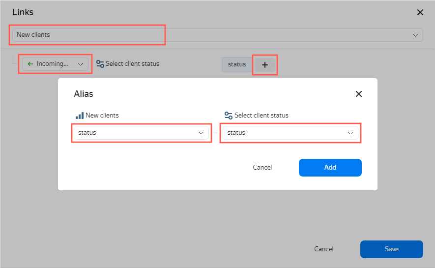
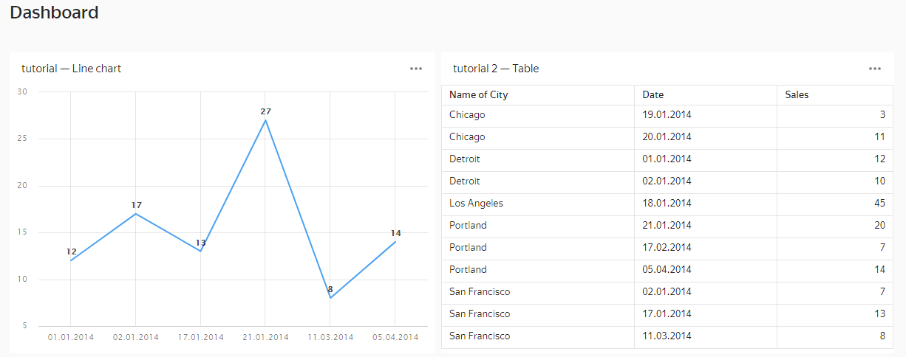
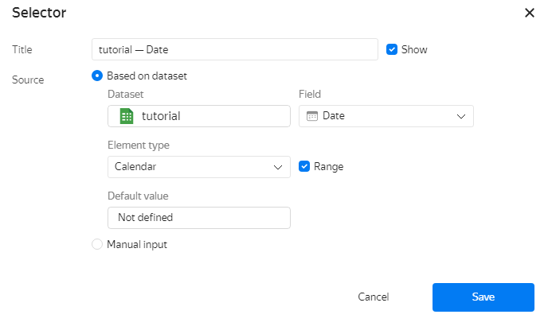
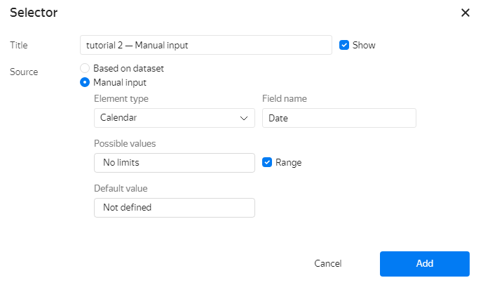
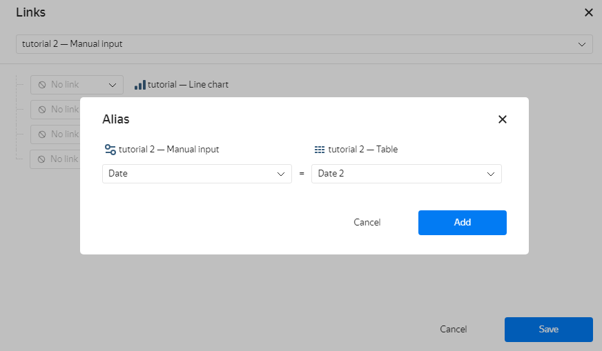
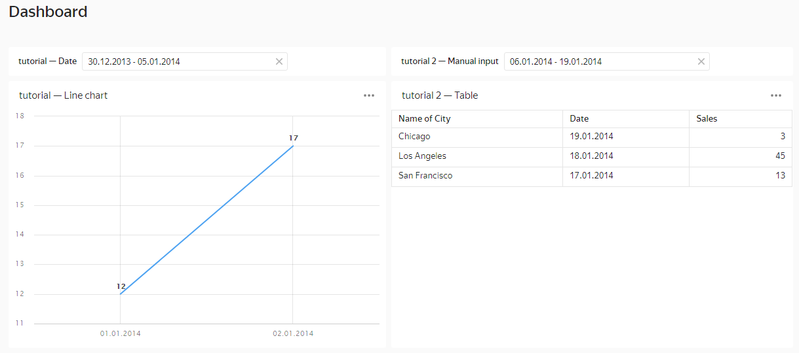
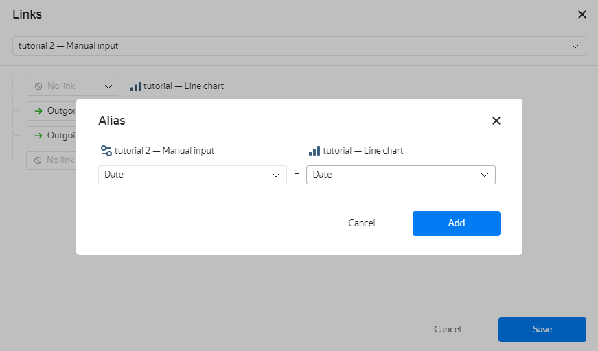

# Creating an alias

To add an [alias](../../dashboard/link.md#alias) for a pair of widgets:



1. In the left-hand panel, click  **Dashboards** and select the dashboard you need. If you do not have a dashboard, [create one](create.md).
1. At the top of the page, click **Edit**.
1. Click **Links**.

   1. Select the first widget from the list.
   1. For the second widget, select a link type from the drop-down list.
   1. Next to the name of the second widget, click .
   1. Set up the alias:

      1. In the window that opens, for both widgets, select from the list the fields for which you are creating the alias. The fields must be of the same type.

         

      1. Click **Add**.

   1. At the bottom of the **Links** window, click **Save**.

1. In the top-right corner of the dashboard, click **Save**.



A chart named **tutorial — Line chart** is based on the **tutorial** dataset and a chart named **tutorial 2 — Table** is based on the **tutorial 2** dataset.

1\. Let's add a **tutorial — Date** selector of the **Based on datasets** type to the dashboard. In the selector parameters, select the `tutorial` dataset and the `Date` field. A link between the selector and the **tutorial — Line chart** chart is established automatically, since they are based on the same dataset.

   

2\. Let's add a **tutorial 2 — Manual input** selector of the **Manual input** type to the dashboard. In the selector parameters, select the **Calendar** element type and the `Date` field.

   

3\. Let's establish a link between the **tutorial 2 — Manual input** selector and the **tutorial 2 — Table** chart using an alias. When creating an alias, select the `Date` field in the selector and the `Date 2` field in the `tutorial 2` dataset.

   

As a result, the **tutorial — Date** selector filters the **tutorial — Line chart** chart, and the **tutorial 2 — Manual input** selector filters the **tutorial 2 — Table chart**.

   

4\. Let's establish a link between the **tutorial 2 — Manual input** selector and the **tutorial 2 — Line chart** chart using an alias. When creating an alias, select the `Date` field in the selector and the `Date` field in the `tutorial` dataset.

   

Setting a link between the **tutorial 2 — Manual input** selector and the **tutorial — Line chart** chart links the **tutorial 2 — Manual input** and **tutorial — Date** selectors. This happens because the **tutorial — Line chart** chart and the **tutorial — Date** selector are based on the same dataset. As a result, any selector causes the appropriate values to be set automatically in the other selector and both charts' filters. To unlink the selectors, set their link type value to **Ignore**.



When adding an alias, make sure the field the selector uses for filtering is included in the dataset used to build the chart. Otherwise, the link will not work.






