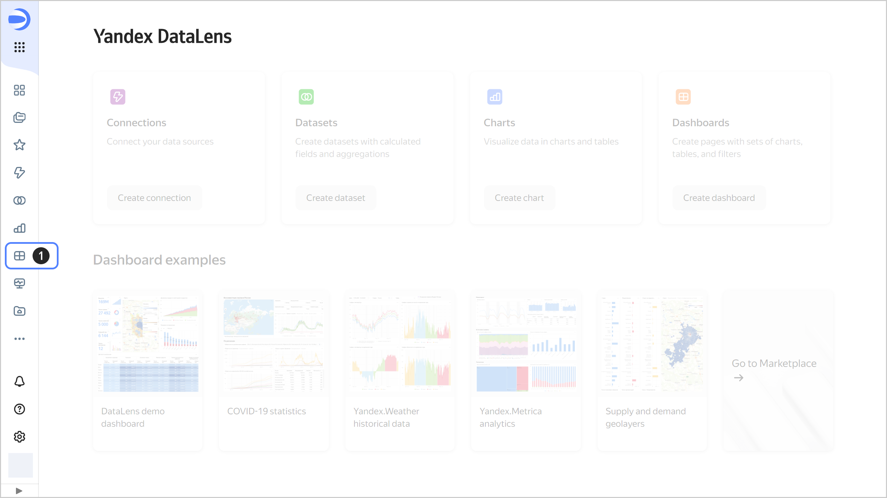
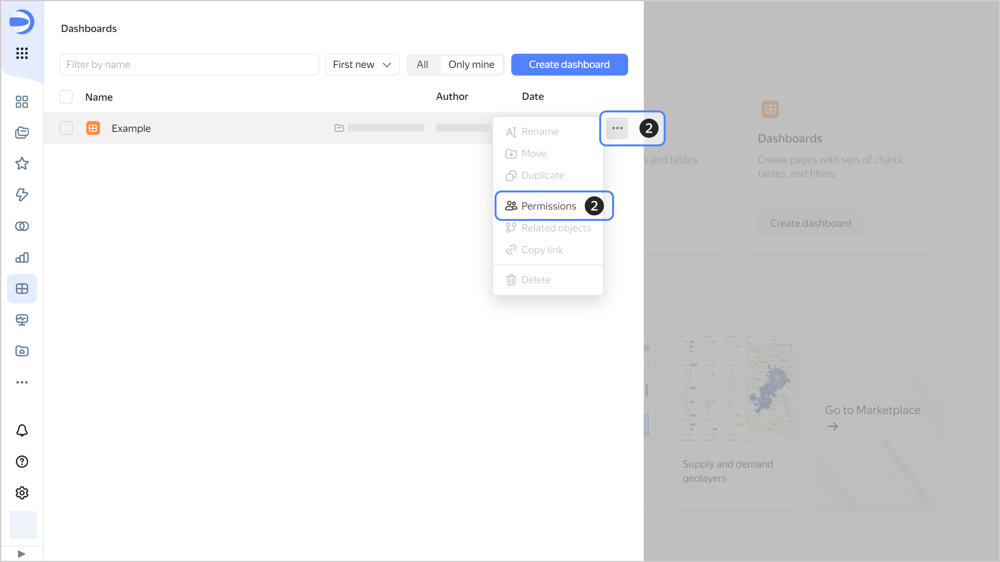
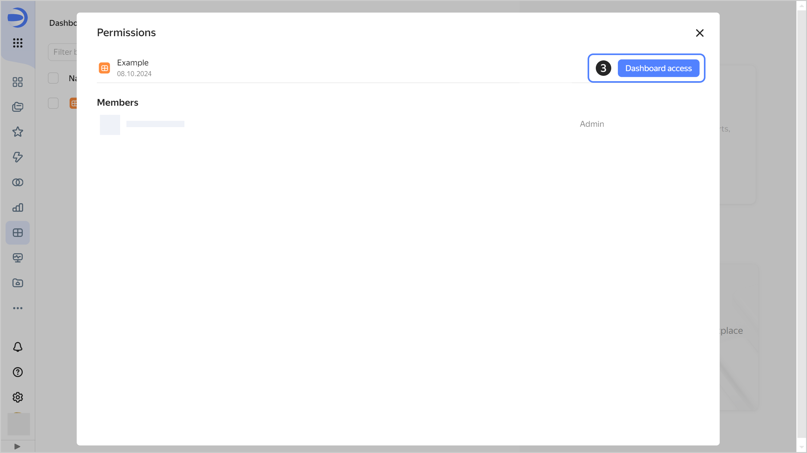
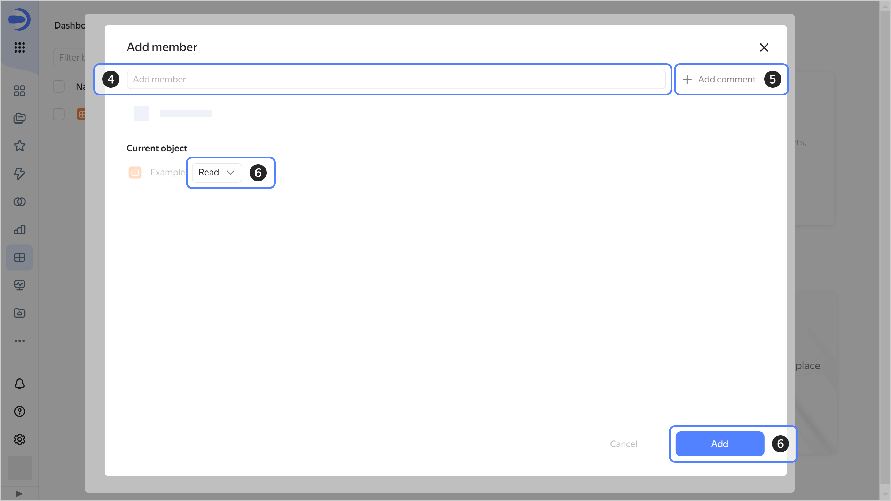

# Managing dashboard access

To configure dashboard permissions:

1. On the navigation page, find the dashboard that you want to change permissions for.

   

1. On the right side, click  and select **Permissions**.

   

1. Click **Dashboard access**.

   

1. Enter a username or select the **All** group.

   

1. (Optional) Write a comment for the user you are granting permissions to.
1. Specify the appropriate permissions and click **Add**.

   



