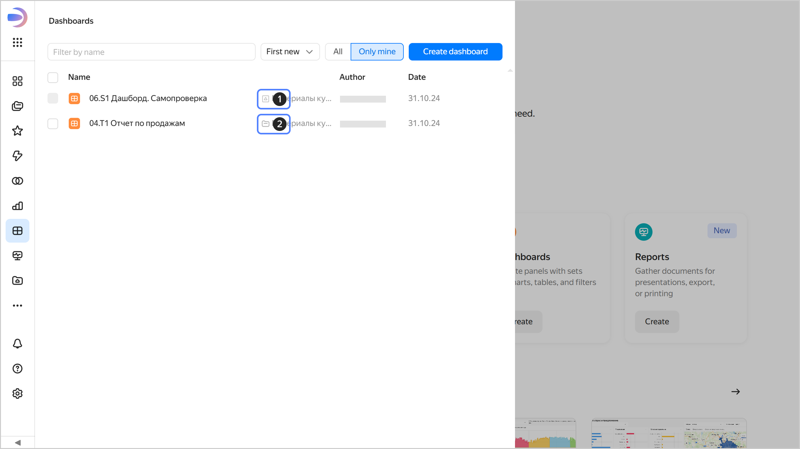

# Managing dashboard access

The steps you need to follow to configure access to a dashboard depend on whether it resides in a [workbook](../../workbooks-collections/index.md#enable-workbooks) or a folder. If a dashboard is stored in a workbook, its path begins with **Collections and workbooks**. If there are no such words, your dashboard is stored in a folder.





To configure dashboard permissions:



- In a workbook

  1. Make sure the user is assigned the required [role](../../security/roles.md#service-roles) to access {{ datalens-name }}. If not, contact your administrator to have them add the user as described in [this guide](../../security/add-new-user.md).

  1. Assign the user the relevant role for the workbook storing the dashboard. To do this:

     1. Go to the workbook page, click  next to the workbook, and select **Access**.

     1. Click **Add user**.

     1. In the window that opens, select the user, specify their [role](../../security/roles.md#workbook-roles), and click **Save**. The user will get access permissions for the workbook and objects inside it.

- In a folder

  1. In the left-hand panel, click  **{{ ui-key.datalens.component.aside-header.view.switch_dashboards }}**.
   
     

  1. In the row with the dashboard, click  and select **{{ ui-key.datalens.component.access-rights.view.section_main-title }}**.

     

  1. Click **{{ ui-key.datalens.component.access-rights.view.button_access-to-dash }}**.

     

  1. Enter a username or select the **All** group.

  1. Optionally, write a comment for the user you are granting permissions to.

  1. Specify the appropriate access permissions and click **{{ ui-key.datalens.component.access-rights.view.button_add }}**.

     

  



