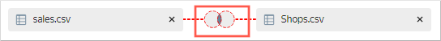
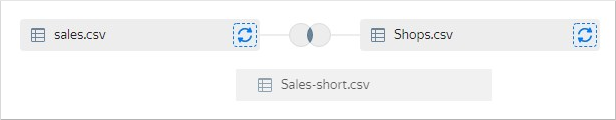
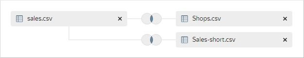
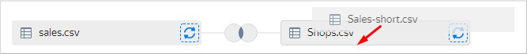
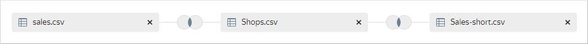
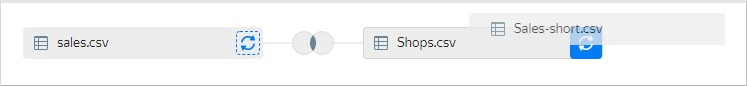

# Combining data from multiple CSV connections



For all other types of connections, data from different sources cannot be combined into the same dataset.



If a dataset is based on a connection to a CSV file, you can add data from a connection to another CSV file to it.

To combine data from multiple CSV files in a single dataset:

1. Open a dataset based on a CSV connection. If you don't have a dataset like that, [create one](create.md).
1. In the upper left-hand corner, select the **Sources** tab.
1. Under **Connections**, click  **Add**.
1. Select a connection to another CSV file.
1. The **Tables** section will display a table with data from this CSV file. Select this table and drag it into the workspace. A link will automatically be created between these tables based on the first matching field name and field data type.
1. Edit the link between the tables:

   1. Click the table link icon.

      

   1. Select the join type: `inner`, `left`, `right`, or `full`.
   1. Click **Add link**.
   1. Select the fields to join the tables on. You can only link fields with the same data type.
   1. Click **Apply**.

1. Repeat steps 3 through 6 to add connections to other CSV files.
1. When the third and subsequent tables are added, link are automatically created to the first table in the workspace.

   

   A link will automatically be created between these tables based on the first matching field name and field data type.

   

   When dragging a new table to the workspace, you can explicitly specify which table to link it to. Hover the new table over a previously added one to have a gray border display around the latter and release.

   

   A new link to the specified table is created.

   

   You can replace a previously added table. When dragging a new table, hover it over the icon with circular arrows to the right of the table being replaced to turn the icon background blue, then release.

   

1. Click **Save**.

#### See also {#see-also}

- [{#T}](../../concepts/data-join.md#add-connection)
- [{#T}](join-data.md)

