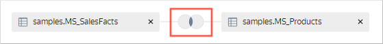
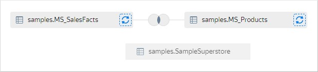
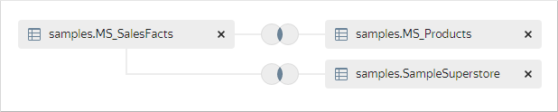
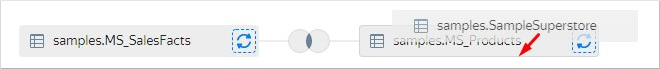
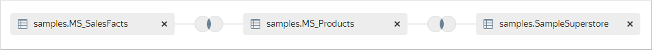
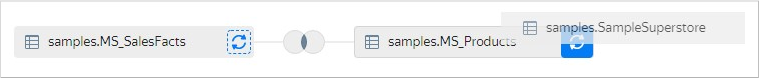

# Combining data from multiple tables

When [multiple source tables](../../concepts/dataset/settings.md#multi-table) are available, you can combine their data:



1. In the left-hand panel, click  **Datasets** and select the dataset you need. If you do not have a dataset, [create one](create.md).
1. In the top-left corner, select the **Sources** tab.
1. Under **Tables**, select a table and drag it to your workspace.
1. Select another table and drag it to your workspace. A link will automatically be created between these tables based on the first matching field name and field data type.

   

1. To edit this table link:

   1. Click the table link icon.

      

   1. Select the join type: `inner`, `left`, `right`, or `full`.
   1. Select the fields to join the tables on. You can only link fields with the same data type.
   1. If required, link other fields in the tables. To do this, click **Add link**.
   1. Optionally, you can disable the **Optimize link** option to make the link required. In this case, the `JOIN` operation will run even if you select fields from only one table.
   1. Click **Apply**.

1. Repeat steps 4 and 5 to add tables.
1. When the third and subsequent tables are added, link are automatically created to the first table in the workspace.

   

   A link will automatically be created between these tables based on the first matching field name and field data type.

   

   When dragging a new table to the workspace, you can explicitly specify which table to link it to. Hover the new table over a previously added one to have a gray border display around the latter and release.

   

   A new link to the specified table is created.

   

   You can replace a previously added table. When dragging a new table, hover it over the icon with circular arrows to the right of the table you are replacing for the icon background to turn blue, then release.

   

1. Click **Save**.

You can [add data to a dataset using an SQL query](add-data.md) and combine this data with other tables.

#### See also {#see-also}

* [{#T}](../../concepts/data-join.md#ui-join)
