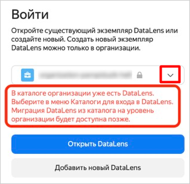

# Switching between DataLens instances

If you are an administrator or user of multiple [organizations](../../concepts/organizations.md), you can switch between them: This lets you work with multiple {{ datalens-short-name }} instances.

You can also switch to **Without organization** mode and use {{ datalens-short-name }} in a cloud folder.



Working in a cloud folder is available if you activated {{ datalens-short-name }} before. Currently, activation is only allowed at the organization level.



To switch to a different {{ datalens-short-name }} instance:

1. Go to the {{ datalens-short-name }} [homepage]({{ link-datalens-main }}).
1. Click on your account photo in the lower-left corner.
1. In the list, select the organization to switch to or **Without organization** mode:

   

   - Organization

     If the organization you selected has an organization-level {{ datalens-short-name }} instance, its instance will open.

     If the organization you selected has no organization-level {{ datalens-short-name }} instance but has an instance at the level of a folder in the cloud that belongs to the organization:

     1. In the drop-down menu, select the **Folders** tab.

        

     1. Select the desired cloud folder containing a {{ datalens-short-name }} instance.

        

     1. Click **Open Datalens**.

   - Without organization

     If you want to use a {{ datalens-short-name }} instance in your cloud folder but the cloud itself is not included in any organization:

     1. In the drop-down menu, select the **Folders** tab.
     1. Expand the list of folders in the desired cloud and select a folder.
     1. Click **Open Datalens**.

   