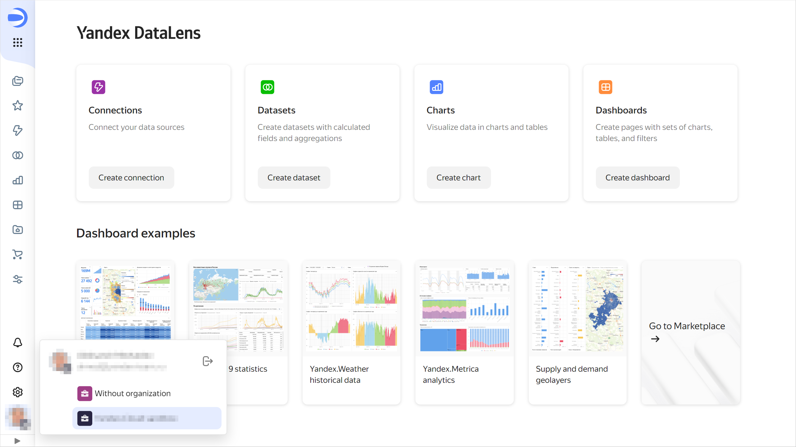

# Switching between {{ datalens-short-name }} instances

If you are an administrator or user of multiple [organizations](../../concepts/organizations.md), you can switch between them. Thus, you can work with multiple {{ datalens-short-name }} instances.

To switch to a different {{ datalens-short-name }} instance:

1. Go to the {{ datalens-short-name }} [home page]({{ link-datalens-main }}).
1. Click your account photo in the bottom-left corner.

   

1. Select the organization you want to switch to from the list:

   * If the selected an organization has {{ datalens-short-name }} activated, its instance will open.
   * If {{ datalens-short-name }} is not activated in the selected organization, you need to [activate](../../quickstart.md#before-you-begin) it.