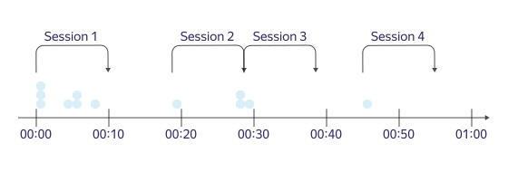

# Pricing for {{ datalens-full-name }}

## Pricing policy from September 27 to October 27, 2021

Starting October 27, 2021, {{ datalens-short-name }} will be available to all users free of charge.

If you subscribed to the **Standard** plan before September 27, it will be valid until the end of the billing period.

> For example, you paid for the **Standard** plan on September 26.
>
> Your billing period ends on October 26 and your account will be switched to free {{ datalens-short-name }} mode.

If you use [geocoding functions](concepts/limits.md), add a geo key in the [Service settings](https://datalens.yandex.com/settings) section until the end of your billing period for the **Standard** plan.

You don't have to enable geocoding functions on the service page while using a paid plan.

## Pricing policy before September 27, 2021

In {{ datalens-short-name }}, you pay for:

* The number of ten-minute sessions to the data source. The session considers requests from charts and dashboards.
* The size of the database for the materialized data.
* Additional {{ datalens-short-name }} features.

The number of sessions, the database size for materialized data, and the list of available features are determined by the monthly billing plan.
You can choose one of the following plans: **Free** or **Standard**.

The plan applies to [the folder](../resource-manager/concepts/resources-hierarchy.md#folder) where the {{ datalens-short-name }} instance is located.



Additional {{ datalens-short-name }} features that are available in {{ marketplace-short-name }} don't affect the selected plan and are paid separately.



## Prices and features {#prices}



















\* Geocoding functions: [GEOCODE](function-ref/GEOCODE.md) and [GEOINFO](function-ref/GEOINFO.md).

You can check the billing period of your {{ datalens-short-name }} instance in your [billing account](https://datalens.yandex.ru/billing).

## Sessions {#sessions}

Sessions are ten-minute periods when the user makes requests to a data source. For example, a user updates charts and dashboards and builds custom requests in the wizard.

The session starts with a data request and ends when there are no new requests for at least ten minutes.
The time difference between the first and last request is rounded up to ten minutes.

The session is calculated based on the user activity in the folder. If multiple users are working in the same {{ datalens-short-name }} instance at the same time, the service counts multiple sessions.
If one user is working in multiple {{ datalens-short-name }} instances at the same time, the service calculates sessions in these instances independently of one another.

### Session types {#session-types}

In {{ datalens-short-name }}, sessions are categorized as internal or external:

| Session type | Data source |
| ----- | ----- |
| Internal | Materialized datasets CSV connections Yandex.Metrica Metrica Logs API AppMetrica AppMetrica Logs API {{ yandex-cloud }}Managed databases:  - [Managed Service for ClickHouse](../managed-clickhouse/)  - [Managed Service for PostgreSQL](../managed-postgresql/)  - [Managed Service for MySQL®](../managed-mysql/) |
| External | Any external data source that is not related to Yandex or {{ yandex-cloud }}. |

### How sessions are calculated {#how-sessions-counted}

Each pricing plan determines the number of external sessions available. There is no limit to the number of internal sessions or requests, regardless of the pricing plan.
If a session has at least one request to an external data source, the whole session is considered external.

> For instance, a dashboard contains some charts that request a materialized dataset and a single chart that requests an external data source.

When this kind of dashboard updates, the session is considered external.

The session doesn't consider requests from:

* The preview window in datasets.
* Public dashboards and charts.

## Materialized data {#materialized-data}

A materialized data quota is available for each {{ datalens-short-name }} instance.

The quota includes:

* Dataset preview data.
* Materialized dataset data.
* Materialized connection data.
* Geocoding result caching data.

  

  The geocoding result cache is stored for 30 days.

  

## Enabling a billing plan {#enable-the-plan}

By default, {{ datalens-short-name }} activates with the **Free** plan.

You can switch to a paid **Standard** plan on the [Billing](https://datalens.yandex.ru/billing) page. The billing period starts on the date you switch to the **Standard** plan. When you enable the **Standard** plan, you're charged on the first day of the billing period. When the **Standard** plan is renewed, you're debited the day before the first day of a new billing period.

The plans are non-refundable.



Example:

> On January 10, you activated a {{ datalens-short-name }} instance with the **Free** plan.
>
> On January 15, you switched to the **Standard** plan: ₽1900 were debited to your account the same date.
>
> On February 14, you are debited for the next billing period (from February 15 to March 14) under the **Standard** plan.
>
> On March 14, you are debited for the next billing period (from March 15 to April 14) under the **Standard** plan.
>
> On March 18, you decide to cancel your **Standard** subscription. However, you may continue using it until the end of the billing period, April 14.
>
> The **Free** plan will be activated on April 15.



### Switching plans {#change-the-plan}

You can switch from the **Free** to the **Standard** plan at any time. When you switch plans, the billing period starts the same day.

So if you switch from the **Standard** plan to the **Free** plan, the new plan's period starts when your Standard plan's paid billing period ends.

### Automatic payment for additional sessions {#autoprolongation}

Automatic payment for additional sessions is not available under the **Free** plan. If you reach the session limit or the DB size limit for the **Free** plan, you can switch to the **Standard** plan. Automatic switching from the **Free** plan to the **Standard** plan is not supported.

Under the **Standard** plan, you can enable automatic payment for additional sessions in the [auto-renewal limit settings](https://datalens.yandex.ru/billing).

## Blocks {#locks}

### Blocking when the external sessions limit is reached {#locks-sessions}

If you reach the limit on the number of external sessions, {{ datalens-short-name }} automatically disables requests from your charts and dashboards to external sources. Other {{ datalens-short-name }} features remain accessible.
The {{ datalens-short-name }} homepage will display a message saying that the limit is reached.

To unblock your resources, do one of the following:

* Switch from the **Free** plan to the **Standard** plan.
* Enable [automatic payment for additional sessions](#autoprolongation) for the **Standard** plan.
* Wait for the start of the new billing period (for any plan).

### Cloud suspension {#locks-cloud}

Your cloud may be suspended if there are arrears on your account, if your trial period is over, or if you are in violation of the [{{ yandex-cloud }} Terms of Use](https://yandex.ru/legal/cloud_termsofuse/).

When a cloud is suspended, your {{ datalens-short-name }} instance will be unavailable. You won't be able to use {{ datalens-short-name }} until access to the cloud is restored.

Learn more in [Automatic cloud suspension](../overview/concepts/data-deletion.md#block).
