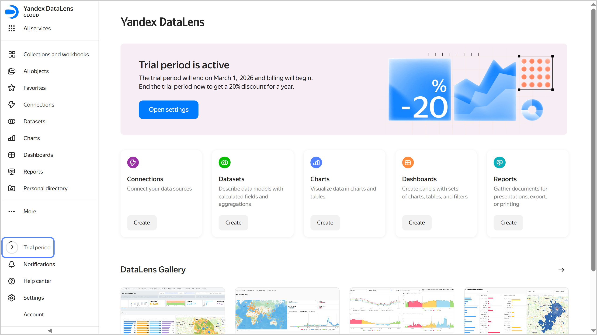

# {{ datalens-full-name }} pricing policy









## {{ datalens-name }} service plan {#effective-rules}

{{ datalens-full-name }} has a single service plan where access is free for individual users and teams are billed based on the number of [seats](#seats).

### Seats {#seats}

* Every {{ datalens-full-name }} user needs a seat, even if only to view or edit dashboards.
* Seats are issued automatically when new users first log in to {{ datalens-full-name }}.
* Seats can be managed by the administrator, see [this article](./settings/seats.md) for details.
* You can manage access to objects in {{ datalens-full-name }} using [roles and access permissions](./security/index.md); a seat does not provide access to objects.



By default, seat auto-purchasing is enabled in the instance: a seat is immediately issued to a user upon their first login to {{ datalens-name }}. The administrator can [disable this option](./settings/seats.md#purchase-automatically) in the settings to only assign already available seats to new users. If there are no such seats, the administrator will have to manually issue seats to new users.



Seats are counted towards the month's total, regardless of user activity. If the instance contains more than one seat, the total charge is calculated as follows:

> Number of seats × Cost per seat

You may schedule a cut in the number of seats at any time; however, the change will take effect only on the first day of the following calendar month.

Technical support coverage is determined by the [{{ yandex-cloud }}](../support/overview.md) support plan you select.

### Limiting the number of queries from private embedded charts {#packet-queries}

The seat count determines the limit on the number of queries from [private embedded charts](./security/private-embedded-objects.md) (charts from the wizard and Editor as well as and QL charts) within one {{ datalens-name }} instance. For embedded private dashboards, queries from the added charts are summed up.

There is no limit for regular queries made by users in the {{ datalens-name }} interface, nor for queries to [publicly embedded charts](./concepts/datalens-public.md).

* Limiting the number of queries from private embedded charts: 2,000 queries per seat per month. This limit does not apply to each individual seat, but rather to the entire {{ datalens-name }} instance based on the calculation:

   > 2,000 queries x Number of seats

* Only successfully completed requests for retrieving data to render charts are counted. If multiple requests are required to render a single chart, this is counted as one request.

* Seats are not linked to embedded charts directly; they do not have to be assigned to external viewers of these charts. What matters is the total number of seats purchased within the instance, both free and assigned to users.

   Thus, the more actively a {{ datalens-name }} instance is used (the more of its seats are purchased), the higher the private embedding limit will be.

* If {{ datalens-name }} is operated by several users, yet there are many queries from private embeddings, you will have to procure additional seats based on the calculation above.

* Every query for data from a private embedded chart is counted. For example, you have an embedded dashboard with 10 charts and 5 selectors. Refreshing the dashboard page will count 10 queries.
   
   [You can estimate the number of queries from private embedded charts](./settings/seats.md#embedded-queries-count) by enabling [Usage Analytics](./operations/connection/create-usage-tracking.md). If the total number of such queries exceeds the per-instance limit, you may have to purchase more seats.
   
   When the limit on the number of queries from private embedded charts is exceeded and [automatic seat purchase](./settings/seats.md#purchase-automatically) is enabled, there is no automatic repurchase of new seats.

### Trial period {#trial}

New {{ datalens-name }} users can take advantage of a 30-day trial period during which teamwork is free. At the end of the trial period, you will need to link a billing account to start paying for seats or reduce your per-instance consumption to one seat.

* If you do not link a billing account, all the seats in your instance will go inactive except for one. In which case the reduction will be automatically scheduled for the trial period expiry date, and you will not be able to change it until you link a billing account.
* Once you link a billing account, after the trial period expires, automatic paid consumption will start based on the [number of seats](./settings/seats.md#number-of-seats), which you can find displayed in the settings. At the same time, the automatic reduction of per-instance consumption to one seat will be cancelled.

The countdown of days until the end of the trial period is shown on the side panel indicator.





You can only use the trial period once per {{ datalens-name }} instance: it activates automatically when you activate the instance. When exiting the trial, your first month's cost is prorated based on remaining days in the month.

## Prices for the Russia region {#prices}



The cost of using {{ datalens-name }} depends on the number of seats per instance. For individual users with a single seat in the instance, {{ datalens-name }} is available at no charge. If {{ datalens-name }} is used for teamwork, and your instance has more than one seat, each seat will be charged.



#### See also {#see-also}

* [Pricing and payment questions](./qa/pricing.md)
* [Managing seats in {{ datalens-name }}](./settings/seats.md)
