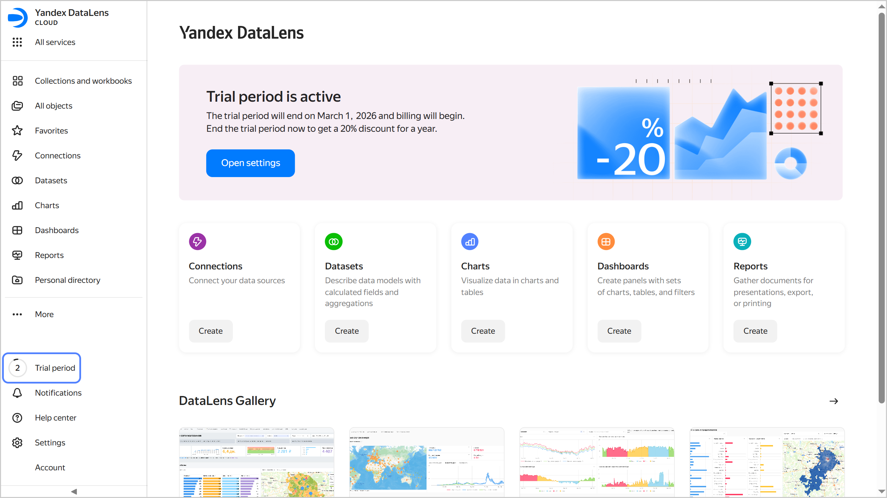

# {{ datalens-full-name }} pricing policy

{{ datalens-full-name }} is **free for individual users**, while **teams are billed based on the number of seats**. New accounts are offered a free [trial period](#trial) of up to 30 days with no limits on seats. {#seats}

* Every {{ datalens-full-name }} user needs a seat, even if only to view or edit dashboards.
* Seats are issued automatically when new users first log in to {{ datalens-full-name }}.
* [Seats are managed](./settings/seats.md) by the administrator.

Technical support coverage is determined by the [{{ yandex-cloud }}]({{ link-docs }}/support/overview) support plan you select.

## Prices for the Russia region {#prices}

{{ yandex-cloud }} resources are priced differently in different [regions](../overview/concepts/region.md). Your payment currency is determined by your contracting [legal entity]({{ link-docs }}/billing/quickstart/). All prices in RUB and KZT are inclusive of VAT.



## Trial period {#trial}

New {{ datalens-name }} customers receive a 15-day _trial period_ of free team access. Once the trial period ends, you must either add a billing account to pay for your seats, or reduce their number to one active seat.

* However, if you link a billing account before the trial period ends, the latter will be extended by another 15 days to a total of 30 days.
* If you do not link a billing account, all your seats will go inactive except for one. This downgrade is automatically scheduled for the trial period expiration date and cannot be modified until you link a billing account.
* After you add a billing account and your free trial ends, we will start charging you based on the [number of seats](./settings/seats.md#number-of-seats) specified in the settings. Your scheduled downgrade to a single seat will be canceled.

You can only use the trial period once per {{ datalens-name }} instance: it starts automatically when you activate {{ datalens-name }} in your organization. Following the end of the trial period, your first monthly charge will be prorated based on remaining days in the month.

The countdown of days until the end of the trial period is shown on the side panel indicator.





The seat count determines the limit on the number of queries from [private embedded charts](./security/private-embedded-objects.md) (wizard charts, Editor charts, QL charts) in {{ datalens-name }}. For embedded private dashboards, queries from the added charts are summed up. There is no limit for regular queries made by users in the {{ datalens-name }} interface, nor for queries to [publicly embedded charts](./concepts/datalens-public.md). {#packet-queries}



* Limit on number of queries from private embedded charts: 2,000 queries per seat per month. This limit does not apply to each individual seat, but rather to entire {{ datalens-name }} based on the calculation: {#packet-queries}

   > 2,000 queries x Number of seats

* Only successfully completed queries for chart rendering data are counted. If multiple queries are required to render a single chart, they are counted as one query.

* Seats are not linked to embedded charts directly; they do not have to be assigned to external viewers of these charts. What matters is the total number of seats purchased in {{ datalens-name }}, both free and assigned to users.

   Thus, the more actively {{ datalens-name }} is used (the more of its seats are purchased), the higher the private embedding limit will be.

* If {{ datalens-name }} is used by several users, yet there are many queries from private embeddings, you will have to procure additional seats based on the calculation above.

* Every query for data from a private embedded chart is counted. For example, you have an embedded dashboard with 10 charts and 5 selectors. Refreshing the dashboard page will count 10 queries.
   
   [You can estimate the number of queries from private embedded charts](./settings/seats.md#embedded-queries-count) by enabling [Usage Analytics](./operations/connection/create-usage-tracking.md). If the total number of such queries exceeds the {{ datalens-name }} limit, you may have to purchase more seats.
   
   If the limit on the number of queries from embedded private charts is exceeded and [auto-purchasing](./settings/seats.md#purchase-automatically) is on, no new seats will be automatically procured.



#### Useful links {#see-also}
* [Pricing and payment questions](./qa/pricing.md)
* [Managing seats in {{ datalens-name }}](./settings/seats.md)

