# Getting started with {{ datalens-short-name }}

This section outlines how to connect to a data source, create your first [dataset](dataset/index.md), build multiple [charts](concepts/chart/index.md) for data visualization, and place them on a [dashboard](concepts/dashboard.md).

## Getting started {#before-you-begin}



## Create a connection {#create-connection}

[Connections](./concepts/connection.md) contain information about data source access parameters, such as the DB host IP address and port. You can create datasets based on connections.

To create a connection:

1. Go to the {{ datalens-short-name }} [home page]({{ link-datalens-main }}).
1. Click **Create connection**.
1. Under **Databases**, select the **{{ CH }}** connection.

   1. In the window that opens, select `Specify manually` for the connection type and provide the following connection parameters:

      * Host name: `rc1a-ckg8nrosr2lim5iz.{{ dns-zone }}`
      * HTTP interface port: `8443` (default)
      * Username: `samples_ro`
      * Password: `MsgfcjEhJk`

   1. Enable **Allow subqueries in datasets and queries from charts**.
   1. Click **Check connection** and make sure you get a green check mark.
   1. Click **Create connection**.

      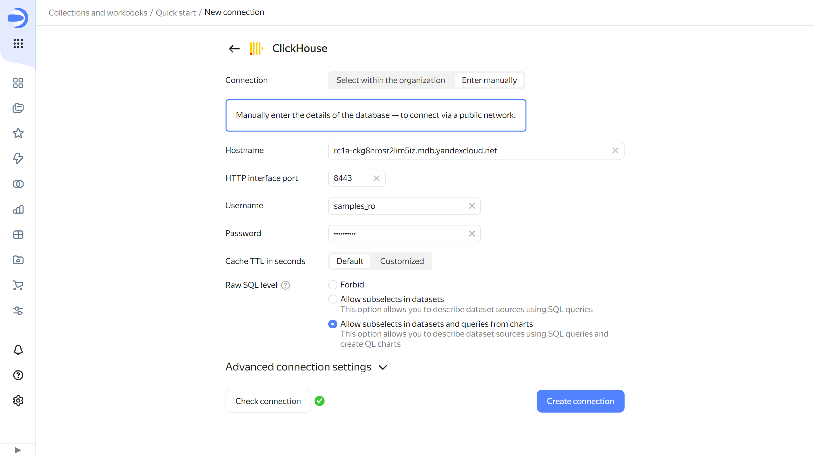

   1. In the window that opens, click **Create workbook**.

      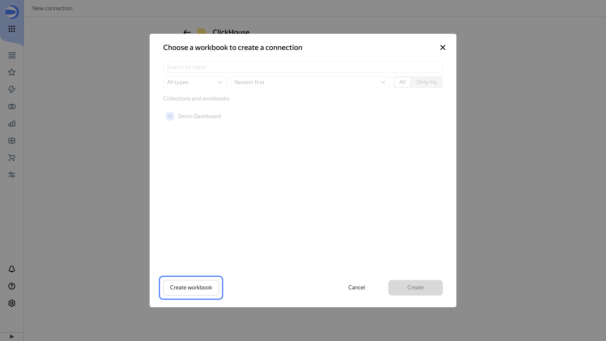

   1. Enter `Quick start` for the [workbook](./workbooks-collections/index.md) name and click **Create**.
   1. Select the workbook you created and click **Create**.
   1. Enter `Sample ClickHouse` for the connection name and click **Create**.

Wait for the connection to be saved.

## Create a dataset {#create-dataset}

A [dataset](./dataset/index.md) describes a set of data and its structure. It is created by connecting to a data source. A dataset is used when creating the following widgets:

* [Charts](./concepts/chart/index.md): To visualize data.
* [Selectors](./dashboard/selector.md): To filter data.

To create a dataset based on the `Sample ClickHouse` connection:

1. In the top-right corner of the connection page, click **Create dataset**.

1. Drag the `MS_SalesMiniTable` table to the workspace.

   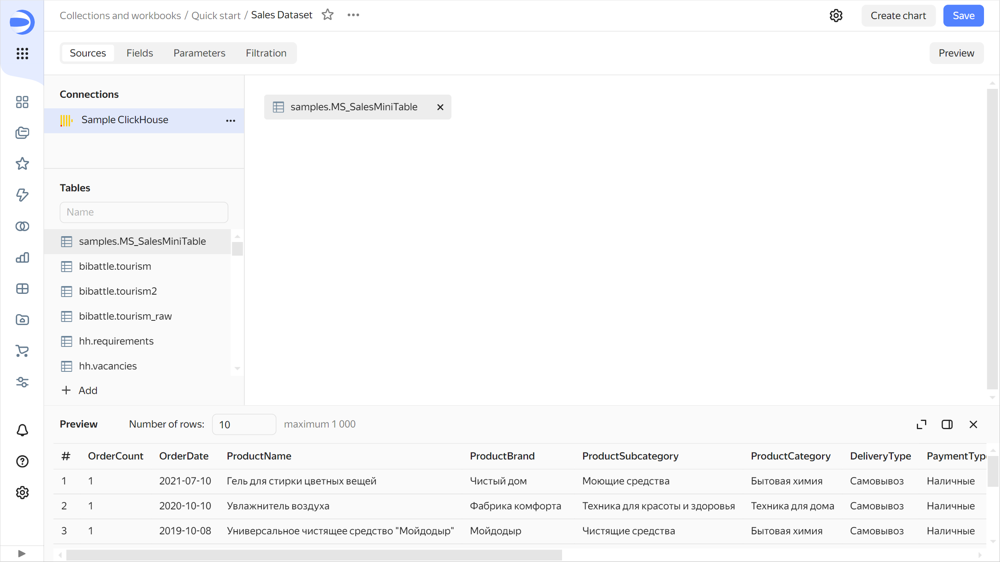

1. Go to the **Fields** tab.

1. Create a measure for the order amount. To do this, select **Sum** for the `Sales` field in the **Aggregation** column.

   

1. Create a measure for the number of orders:

   1. Rename the `OrderID` field as `OrderCount`: click the field name, delete the current name, and enter the new one.
   1. Select **Number of unique** for the `OrderCount` field in the **Aggregation** column.

1. Change the data type for the `ShopAddressCoord` field: select **Geopoint** in the **Type** column.

   

1. Save the dataset:

   1. In the top-right corner, click **Save**.
   1. Enter `Sales Dataset` for the dataset name and click **Create**.

      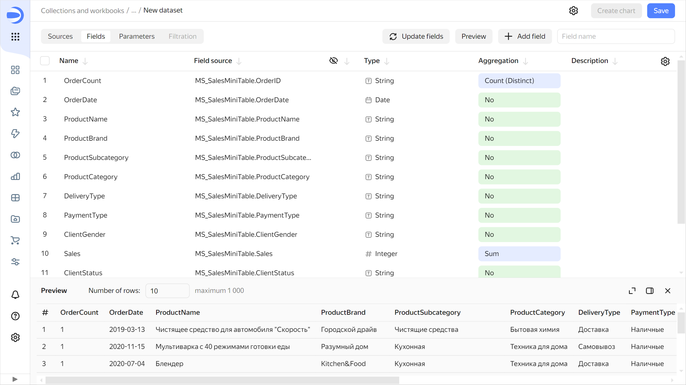

## Create a column chart {#create-column-chart}

[Charts](./concepts/chart/index.md) visualize the data from a dataset as tables, diagrams, or maps.

To create a chart based on `Sales Dataset`:

1. Click **Create chart** in the top-right corner of the dataset page.
1. Add the product subcategory to the chart. To do this, drag the `ProductSubcategory` field from **Dimensions** to the **X** section.
1. Add a sales measure to the chart. To do this, drag the `Sales` field from **Measures** to the **Y** section.
1. Sort the chart by sales in descending order by dragging the `Sales` field from **Measures** to the **Sorting** section.
1. Save the chart:

   1. In the top-right corner, click **Save**.
   1. In the window that opens, enter the `Sales by subcategory` name for the chart and click **Save**.

      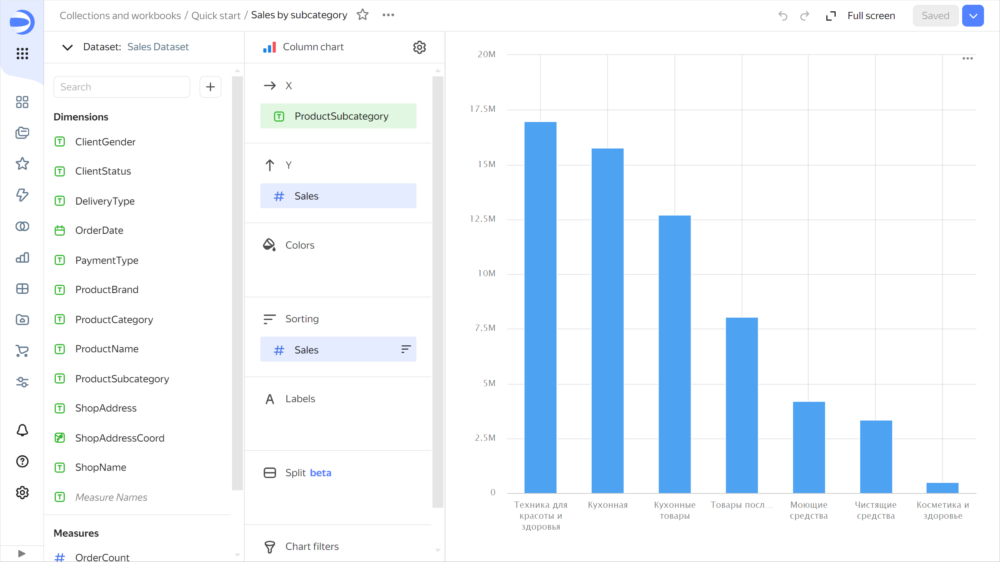

## Create a stacked area chart {#create-area-chart}

1. Copy the chart you created in the previous step:

   1. In the top-right corner, click  → **Save as copy**.

      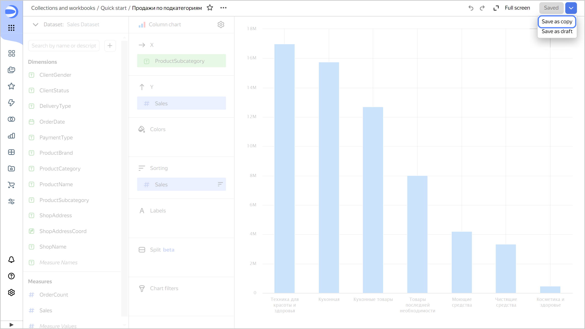

   1. In the window that opens, enter the `Sales by week` name for the new chart and click **Save**.

1. Select **Stacked area chart** as the visualization type.

   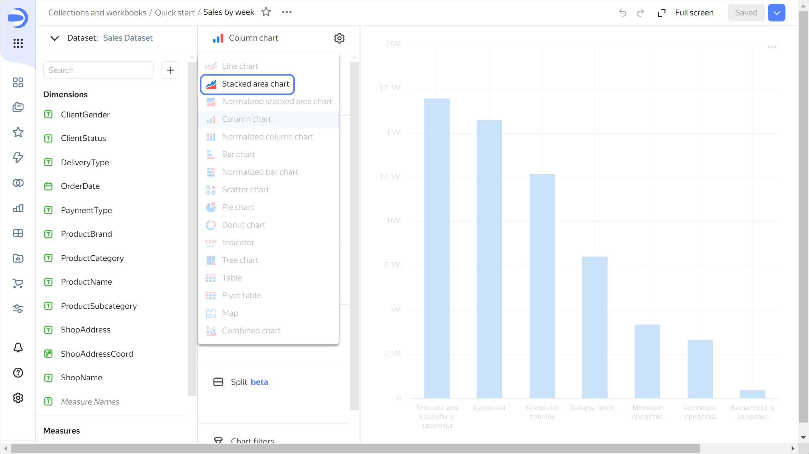

1. Replace the product subcategories with the order date on the X-axis. To do this, drag the `OrderDate` field from **Dimensions** to the **X** section and hold it over the `ProductSubcategory` field until the latter turns red.
1. Add the product category to the chart. To do this, drag the `ProductCategory` field from **Dimensions** to the **Colors** section.
1. Display a week by week chart:

   1. Click the calendar icon next to the `OrderDate` field in the **X** section.
   1. In the **Grouping** field, select **Rounding** → **Week**.

      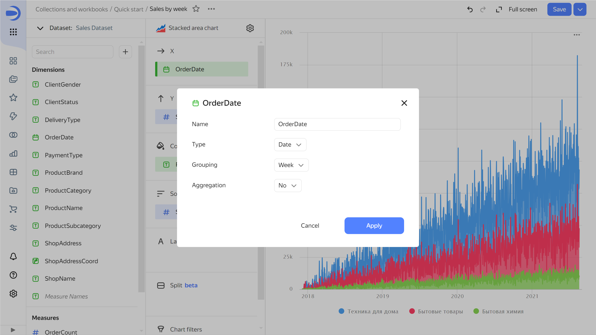

   1. Click **Apply**.

1. Remove sorting by sales: click  (the icon appears when you hover over the field) next to the `Sales` field in the **Sorting** section.
1. In the top-right corner, click **Save**.

   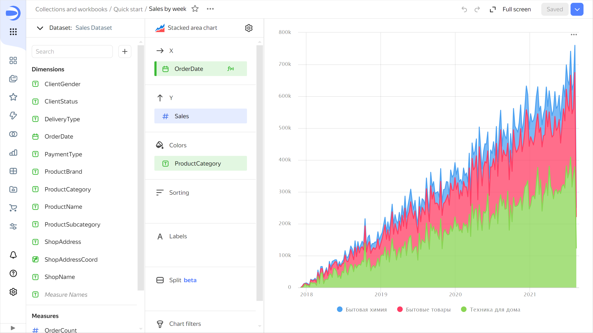

## Create a map chart {#create-map-chart}

1. Copy the chart you created in the previous step:

   1. In the top-right corner, click  → **Save as copy**.
   1. In the window that opens, enter the `Sales map` name for the new chart and click **Save**.

1. Select the **Map** visualization type.
1. Add the coordinates of the points of sale to the map. To do this, drag the `ShopAddressCoord` field from **Dimensions** to the **Points (Geopoints)** section.
1. Change the point size based on the number of orders. To do this, drag the `OrderCount` field from **Measures** to the **Point size** section.
1. Change the point color based on the sales measure. To do this, drag the `Sales` field from **Measures** to the **Colors** section.
1. Add the following fields to the **Tooltips** section:

    * `ShopAddress`
    * `ShopName`
    * `Sales`
    * `OrderCount`

1. In the top-right corner, click **Save**.

   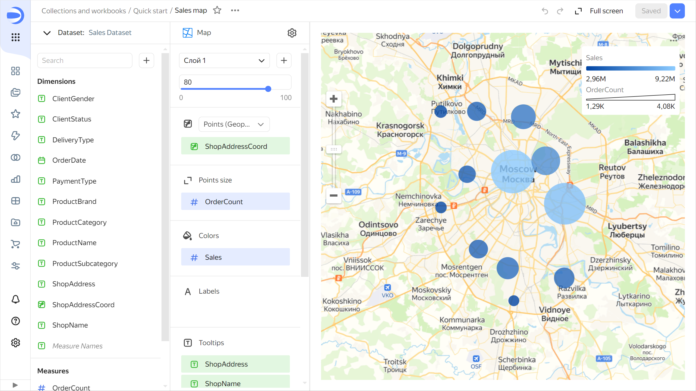

## Create a dashboard and add charts to it {#create-dashboard}

A [dashboard](./concepts/dashboard.md) is a page or multiple pages that contain widgets. It allows you to group your charts in the same place and add [captions](./dashboard/widget.md#text) and [titles](./dashboard/widget.md#title) to them.

To create a dashboard:

1. Go to the `Quick start` workbook by clicking its name in the chart path.

   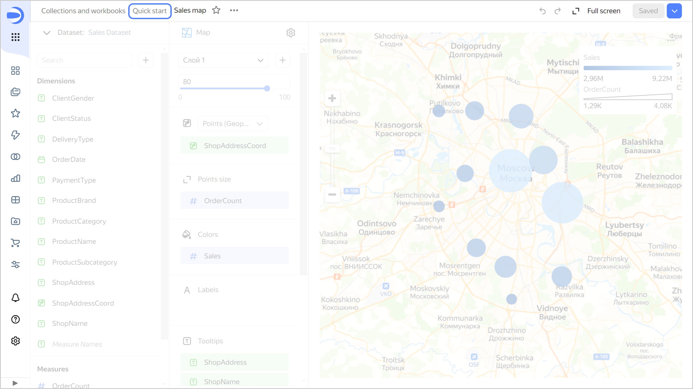

1. In the top-right corner, click **Create** →  **Dashboard**.

1. In the panel at the bottom of the page, select **Chart**.
1. In the window that opens, click **Select**.
1. Select the `Sales map` chart.

   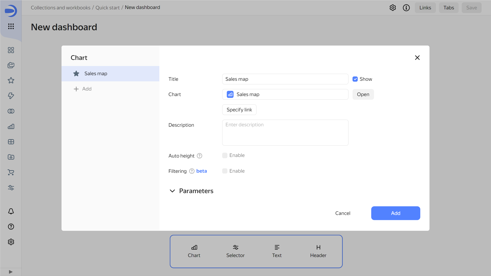

1. Click **Add**.
1. Repeat steps 3 through 6 to add the `Sales by subcategory` and `Sales by week` charts.
1. Adjust the size of the charts with your mouse and place them on the dashboard as you prefer.

   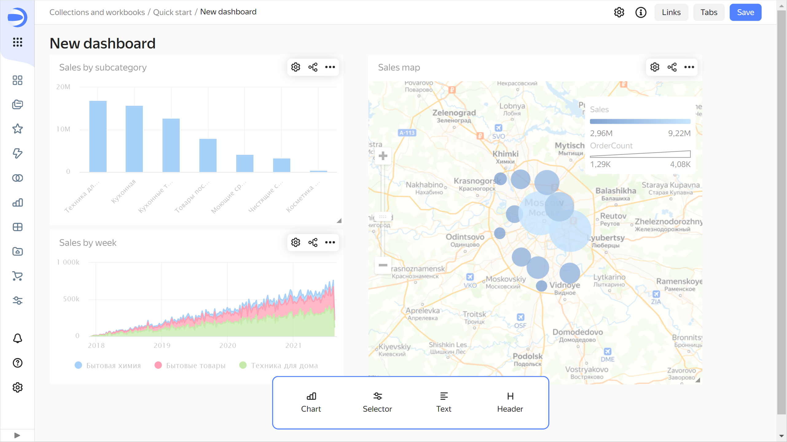

## Set up chart filtering {#add-chart-chart-filtration}

Add [filtering](./dashboard/chart-chart-filtration.md) by the `Sales map` chart to the dashboard to filter other charts:

1. Click  in the top-right corner of the `Sales map` chart.

   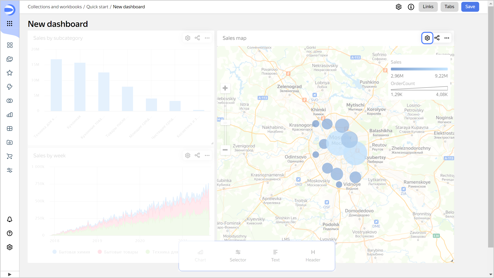

1. Enable the **Filtering** option.

   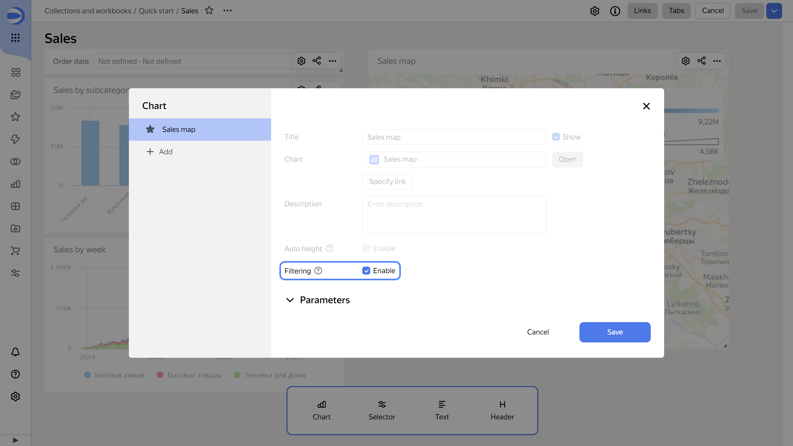

1. Click **Save**.

By default, the chart used for filtering filters data in all charts on the current dashboard tab that share the same dataset.

## Add a selector to the dashboard {#add-selectors}

[Selectors](./dashboard/selector.md) are filters that affect the results of queries in the linked widgets.

To add a selector to a dashboard:

1. In the panel at the bottom of the page, choose **Selector**.
1. Add the calendar selector for the order date:

   1. Select `Sales Dataset`.
   1. Select the `OrderDate` field.
   1. In the **Header** field, enter `Order date`.
   1. Enable **Range**.

      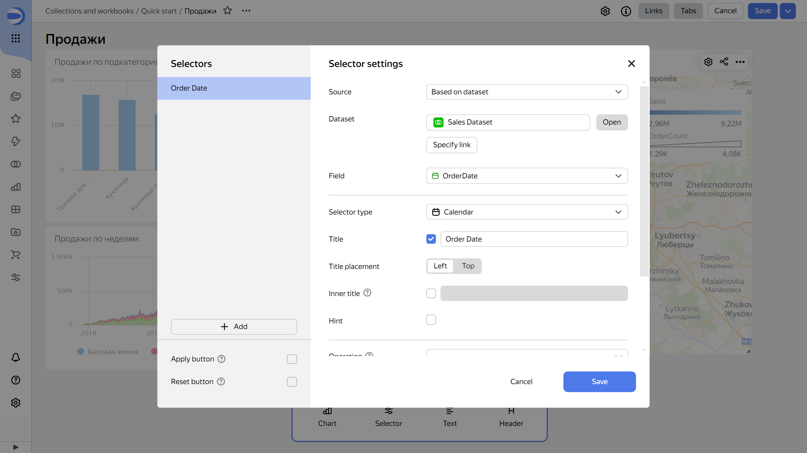

   1. Click **Save**.

1. Position the selector on the dashboard wherever you like.
1. Save the dashboard:

   1. In the top-right corner of the dashboard, click **Save**.
   1. Enter `Sales` for the dashboard name and click **Create**.

      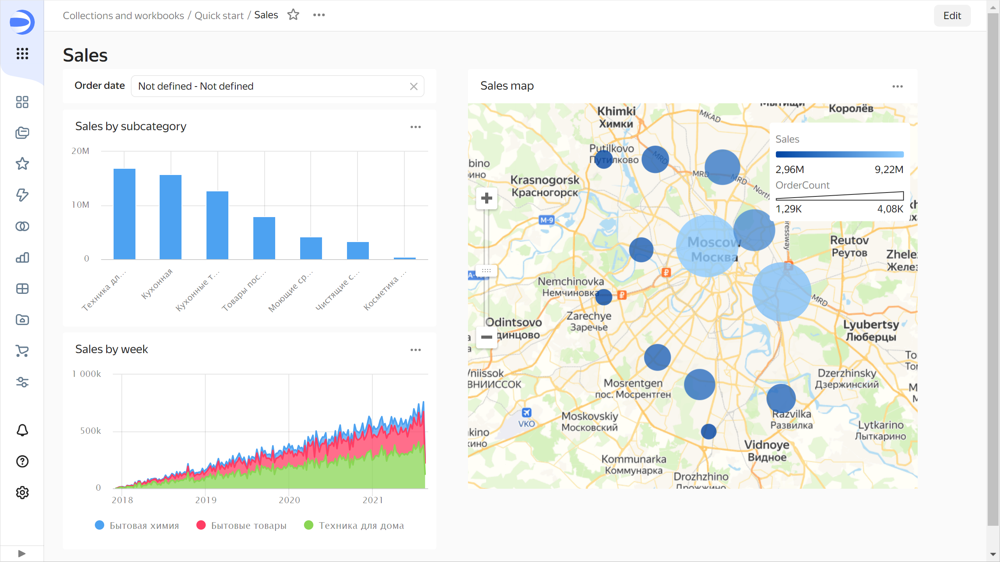

## Learn how a dashboard works {#dashboard-work}

1. Apply cross-chart filtering on the dashboard:

   1. Click a point on the map in the `Sales map` chart. This will filter the linked charts by the selected dimension.

      

   1. Clear chart filtering by clicking the selected point once more or  in the top-right corner of the chart.

1. Use the `Order date` selector:

   1. In the `Order date` selector, enter the period start and end dates: `01.01.2019 - 31.01.2019`.
   1. This will filter data by the `OrderDate` field in all charts on the current tab that share the same dataset.

      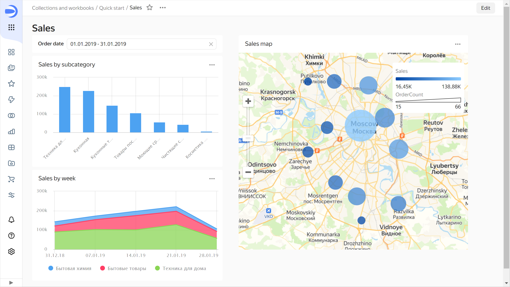

   1. Clear selector filtering by clicking  in the right corner of the selector.

## Share the dashboard {#share}

You can grant access to your dashboard to other users:

1. [Add](./security/add-new-user.md) users with a Yandex account to {{ datalens-short-name }}:

   1. In the left-hand panel, select  **Service settings**.
   1. Under **Manage users**, click **Invite users**.

      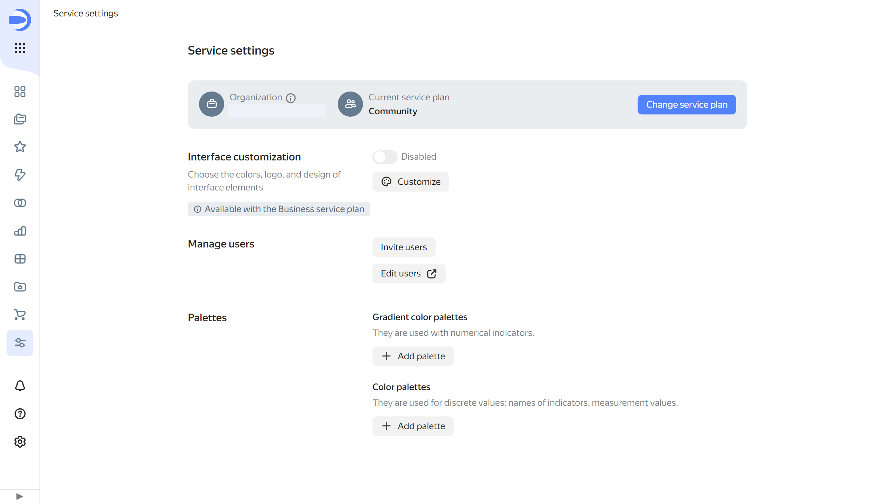

   1. Enter the email addresses of the users you want to invite, e.g., `{{ login-example }}`.

      You can send invitations to any email address. Invited users will be able to select the appropriate Yandex account once they accept the invitation.

   1. Click **Send invitation**.

   Once the user accepts the invitation and selects the account for login, they can log in to your organization and start using {{ datalens-short-name }}. The user will get the `{{ roles-datalens-creator }}` role in the organization with the current {{ datalens-short-name }} instance.

1. [Configure access permissions](./workbooks-collections/security.md) for a workbook:

   1. In the left-hand panel, select  **Collections and workbooks**.
   1. Click  next to the `Quick start` workbook and select **Access**.

      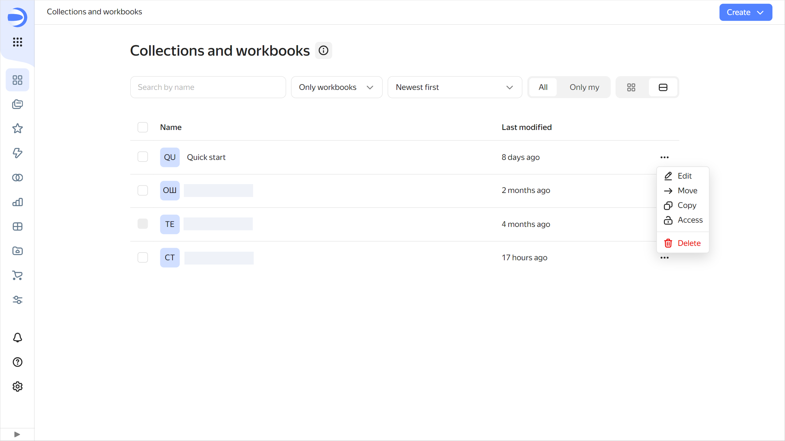

   1. Click **Add user**.

      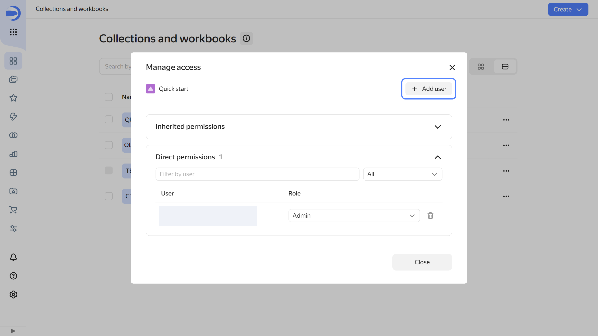

   1. In the window that opens, select a user or user group, specify the appropriate permission, and click **Save**. The user or user group will be granted permissions to this object.

You can make the charts and dashboards you create [publicly available](./concepts/datalens-public.md), so any user can follow a link to view a published object without logging in. You can [embed](./security/embedded-objects.md) published dashboards and charts into your website or app using `iframe`.

## What's next {#whats-next}

* See the [tutorials](tutorials/index.md) with {{ datalens-short-name }} usage examples.
* Read about [service concepts](./concepts/index.md).
* View an [example of a ready-to-use dashboard](https://datalens.yandex/9fms9uae7ip02).


