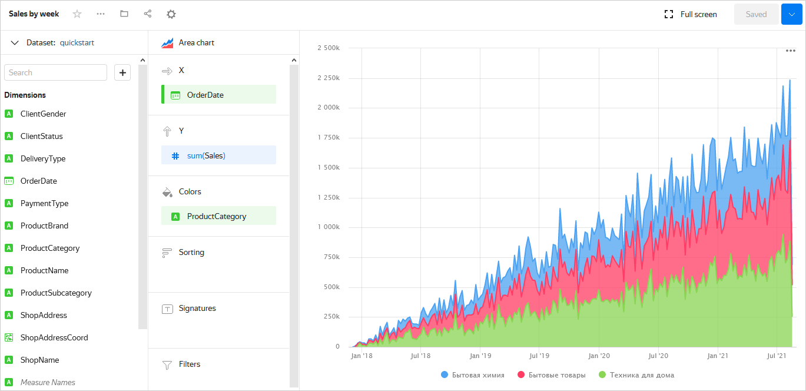

# Getting started with {{ datalens-short-name }}



In this tutorial, you'll create your first [dataset](concepts/dataset/index.md), build several [charts](concepts/chart/index.md) to visualize data, and place them on a [dashboard](concepts/dashboard.md).













## Create a connection {#create-connection}



## Create a dataset {#create-dataset}

1. In the upper-right corner, click **Create dataset**.
1. Drag the **MS_SalesMiniTable** table to the workspace.

   

1. Go to the **Fields** tab.
1. In the **Aggregation** column, select **Sum** for the **Sales** field.
1. Create a measure for the number of orders.
   1. Rename the **OrderID** field to **OrderCount**.
   1. Change the aggregation type to **Number of unique**.
1. For the **ShopAddressCoord** field, change the data type to **Geopoint**.
1. Click **Save** in the upper-right corner to save the dataset.
1. Enter the dataset name and click **Create**.

   

## Create a column chart {#create-column-chart}

1. In the upper-right corner, click **Create chart**.
1. For the visualization type, choose **Bar chart**.
1. Add the product subcategory to the chart. To do this, drag the **ProductSubcategory** field from the **Dimensions** section to the **X** section.
1. Add a sales measure to the chart. To do this, drag the **Sales** field from the **Measures** section to the **Y** section.
1. Sort the chart in descending order of sales measure. Drag the **Sales** field from the **Measures** section to the **Sorting** section.
1. Save the chart.
   1. In the upper-right corner, click **Save**.
   1. In the window that opens, enter the **Sales by subcategory** name for the chart and click **Save**.

   

## Create a stacked area chart {#create-area-chart}

1. In the created chart, select **Stacked area chart** as the visualization type.
1. Replace the product subcategories with the order date on the X-axis. To do this, drag the **OrderDate** field from the **Dimensions** section to the **X** section and hold it over the **ProductSubcategory** field until it turns red.
1. Add the product category to the chart. To do this, drag the **ProductCategory** field from the **Dimensions** section to the **Colors** section.
1. Display the chart by week.
   1. Click the calendar icon next to the **OrderDate** field in the **X** section.
   1. In the drop-down list of grouping options, select **Week** under **Grouping**.
   1. Click **Apply**.
1. Save the chart.
   1. Click the down arrow next to the **Save** button in the upper-right corner.
   1. Choose **Save as**.
   1. In the window that opens, enter the **Sales by week** name for the new chart and click **Save**.

   

## Create a map {#create-map-chart}

1. In the created chart, select **Map** as the visualization type.
1. Add the coordinates of the points of sale to the map. To do this, drag the **ShopAddressCoord** field from the **Dimensions** section to the **Geopoints** section.
1. Change the point size based on the number of orders. To do this, drag the **OrderCount** field from the **Measures** section to the **Size** section.
1. Change the point color based on the sales measure. To do this, drag the **Sales** field from the **Measures** section to the **Colors** section.
1. Add the following fields to the **Tooltips** section:
   * ShopAddress
   * ShopName
   * Sales
   * OrderCount
1. Save the chart.
   1. Click the down arrow next to the **Save** button in the upper-right corner.
   1. Choose **Save as**.
   1. In the window that opens, enter the **Sales map** name for the new chart and click **Save**.

   

## Create a dashboard {#create-dashboard}

1. Go to the [{{ datalens-short-name }}]({{ link-datalens-main }}) homepage.
1. Click **Create dashboard**.
1. Enter a name for the dashboard and click **Create**.

## Add charts to the dashboard {#add-charts}

1. In the upper-right corner, click **Add** and choose **Chart**.
1. In the window that opens, click **Select**.
1. Select the **Sales map** chart. This will automatically fill in the **Name** field.
1. Click **Add**.
1. Repeat the steps to add the **Sales by subcategory** and the **Sales by week** charts.
1. Position the charts on the dashboard however you like.

   

## Add a selector to the dashboard {#add-selectors}

1. Click **Add** and choose **Selector**.
1. Add the calendar selector for the order date.
   1. Select the created dataset.
   1. Select the **OrderDate** field.
   1. This will automatically fill in the **Name** field. Click the **Show** checkbox next to the selector title.
   1. Select the **Calendar** type.
   1. Enable **Range**.
   1. Click **Add**.
1. Position the selector on the dashboard wherever you like.
1. Save the dashboard. To do this, click **Save** in the upper-right corner.

   





In this tutorial, you'll examine a ready-made [workbook](concepts/index.md#workbooks-and-collections) and learn about the main {{ datalens-short-name }} entities, such as a [dataset](concepts/dataset/index.md), [chart](concepts/chart/index.md), and [dashboard](concepts/dashboard.md). Also in this workbook, you will use a test database to create a dataset, several charts, and build a dashboard.

1. Go to the [management console]({{ link-console-main }}) and log in to {{ yandex-cloud }}.
1. Open the [{{ datalens-short-name }}]({{ link-datalens-main }}) homepage.
1. Click **Create** → **Add sample workbook**.
1. Enter a name for the workbook.
1. Click **Add**. The workbook appears in the list.

If you have a technical question about the service, please contact {{ yandex-cloud }} [support]({{ link-console-support }}).

## Take a look at the workbook contents {#about-workbook}

Open the workbook. It contains the following elements:
* : Your [connection](concepts/connection.md) to the test {{ CH }} database.
*  [Your dataset](concepts/dataset/index.md) that describes which data from the database you want to access.
*  [Chart](concepts/chart/index.md): Visualization of data from a dataset as a table, diagram, or map.
*  [Dashboard](concepts/dashboard.md): Page where you can put several charts to build a visual report.

You can open each of the items and see what they look like.

## Create a dataset {#create-dataset}

1. In the workbook, click **Create** → **Dataset** in the upper-right corner.
1. On the **Sources** tab under **Connections**, click **+ Add** and select connecting to a test **Sample ClickHouse** database.
1. Drag the **samples.orders** table to the workspace.

   

1. Go to the **Fields** tab.
1. In the **Aggregation** column, select **Sum** for the **quantity** field.
1. Create a measure for the number of orders.
   1. Rename the **order_id** field to **order_count**.
   1. Change the aggregation type to **Number of unique**.
1. For the **order_buyer_region_province_polygon** field, change the data type to **Geopolygon**.
1. Click **Save** in the upper-right corner to save the dataset.
1. Enter the dataset name and click **Create**.

   

## Create a column chart {#create-column-chart}

1. Use the navigation panel to go back to the workbook. Then, in the upper-right corner, click **Create** → **Wizard chart**.
1. Click **Select dataset**, then select the dataset that you created in the previous step, from the list.
1. For the visualization type, choose **Column chart**.
1. Add the product subcategory to the chart. To do this, drag the **category_name_level_1** field from the **Dimensions** section to the **X** section.
1. Add a sales measure to the chart. To do this, drag the **quantity** field from the **Measures** section to the **Y** section.
1. Sort the chart in descending order of the sales measure. Drag the **quantity** field from the **Measures** section to the **Sorting** section.
1. Save the chart.
   1. In the upper-right corner, click **Save**.
   1. In the window that opens, enter the **Sales by category** name for the chart and click **Save**.

   

## Create a stacked area chart {#create-area-chart}

1. In the created chart, select **Stacked area chart** as the visualization type.
1. Replace the product subcategories with the order date on the X-axis. To do this, drag the **order_creation_date** field from the **Dimensions** section to the **X** section and hold it over the **category_name_level_1** field until it turns red.
1. Add the product category to the chart. To do this, drag the **category_name_level_1** field from the **Dimensions** section to the **Colors** section.
1. Display the chart by week.
   1. Click the calendar icon next to the **order_creation_date** field in the **X** section.
   1. In the drop-down list of grouping options, select **Week** under **Grouping**.
   1. Click **Apply**.
1. Save the chart.
   1. Click the down arrow next to the **Save** button in the upper-right corner.
   1. Choose **Save as**.
   1. In the window that opens, enter the **Sales by week** name for the new chart and click **Save**.

   

## Create a map {#create-map-chart}

1. In the created chart, select **Map** as the visualization type.
1. Break the chart down into areas. To do this:
   1. In the wizard, select the **Polygons (Geopolygons)** type in the list.
   1. Drag the **order_buyer_region_province_polygon** field from the **Dimensions** section to the **Polygons (Geopolygons)** section.
1. To evaluate the number of orders from each area, drag the **order_count** field from the **Measures** section to the **Colors** section. Set up the color palette if needed.
1. To show the number of orders when hovering the cursor over an area, drag the **order_count** field to the **Tooltips** section.
1. Save the chart.
   1. Click the down arrow next to the **Save** button in the upper-right corner.
   1. Choose **Save as**.
   1. In the window that opens, enter the **Sales map** name for the new chart and click **Save**.

   

## Create a dashboard {#create-dashboard}

1. Use the navigation panel to go back to the workbook. Then, in the upper-right corner, click **Create** → **Dashboard**.
1. Enter a name for the dashboard and click **Create**.

## Add charts to the dashboard {#add-charts}

1. In the upper-right corner of the dashboard, click **Add** and choose **Chart**.
1. In the window that opens, click **Select**.
1. Select the **Sales map** chart. This will automatically fill in the **Name** field.
1. Click **Add**.
1. In a similar manner, add the **Sales by category** and **Sales by week** charts.
1. Position the charts on the dashboard however you like.

## Add a selector to the dashboard {#add-selectors}

[Selector](concepts/dashboard.md#selector) is the filter applied to charts on your dashboard. Let's add a selector for choosing an order period.

1. Click **Add** and choose **Selector**.
1. Add the calendar selector for the order date.
   1. Select the created dataset.
   1. Select the **order_creation_date** field.
   1. This will automatically fill in the **Name** field. To show the selector's name on the dashboard, enable the option next to the selector title under **Appearance**.
   1. Select the **Calendar** type.
   1. Enable **Range**.
   1. Click **Add**.
1. Position the selector on the dashboard wherever you like.
1. Save the dashboard. To do this, click **Save** in the upper-right corner.

   



## What's next {#whats-next}

* Review the [tutorials](tutorials/index.md) for examples of using the service.
* Read about [service concepts](concepts/index.md).
* See [step-by-step instructions](operations/index.md).
* View an [example of a ready-to-use dashboard](https://datalens.yandex/9fms9uae7ip02).
