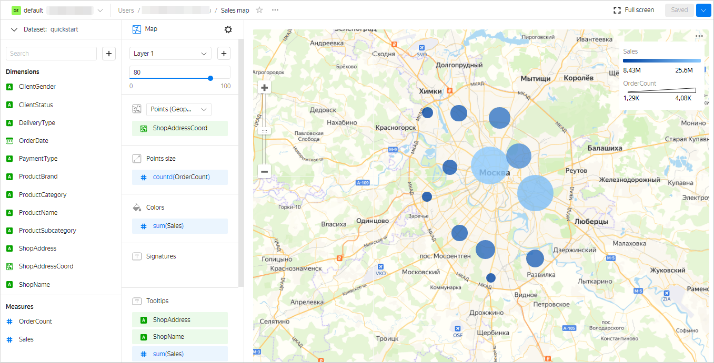

# Getting started with {{ datalens-short-name }}

In this tutorial, you will create your first [dataset](concepts/dataset/index.md), build several [charts](concepts/chart/index.md) to visualize data, and place them on a [dashboard](concepts/dashboard.md).



## Create a connection {#create-connection}



## Create a dataset {#create-dataset}

1. In the top-right corner, click **Create dataset**.

1. Drag the `MS_SalesMiniTable` table to the workspace.

   

1. Go to the **Fields** tab.

1. In the **Aggregation** column, select **Sum** for the `Sales` field.
1. Create a measure for the number of orders:

   1. Rename the `OrderID` field to `OrderCount`.
   1. Change the aggregation type to **Number of unique**.
1. For the `ShopAddressCoord` field, change the data type to **Geopoint**.
1. Save the dataset:

   1. In the top-right corner, click **Save**.
   1. Enter a name for the dataset and click **Create**.

   

## Create a column chart {#create-column-chart}

1. In the top-right corner, click **Create chart**.
1. Select the **Bar chart** visualization type.
1. Add the product subcategory to the chart. To do this, drag the `ProductSubcategory` field from **Dimensions** to the **X** section.
1. Add a sales measure to the chart. To do this, drag the `Sales` field from **Measures** to the **Y** section.
1. Sort the chart in descending order by sales by dragging the `Sales` field from **Measures** to the **Sorting** section.
1. Save the chart:

   1. In the top-right corner, click **Save**.
   1. In the window that opens, enter the **Sales by subcategory** name for the chart and click **Save**.

   

## Create a stacked area chart {#create-area-chart}

1. In the chart you created in the previous step, select **Stacked area chart** for the visualization type.
1. Replace the product subcategories with the order date on the X-axis. To do this, drag the `OrderDate` field from **Dimensions** to the **X** section and hold it over the `ProductSubcategory` field until it turns red.
1. Add the product category to the chart. To do this, drag the `ProductCategory` field from **Dimensions** to the **Colors** section.
1. Display a week by week chart:

   1. Click the calendar icon next to the `OrderDate` field in the **X** section.
   1. In the **Grouping** field, select **Rounding** → **Week**.
   1. Click **Apply**.

1. Save the chart:

   1. In the top-right corner, click  → **Save as copy**.
   1. In the window that opens, enter the **Sales by week** name for the new chart and click **Save**.

   

## Create a map {#create-map-chart}

1. In the chart you created in the previous step, select **Map** for the visualization type.
1. Add the coordinates of the points of sale to the map. To do this, drag the `ShopAddressCoord` field from **Dimensions** to the **Points (Geopoints)** section.
1. Change the point size based on the number of orders. To do this, drag the `OrderCount` field from **Measures** to the **Point size** section.
1. Change the point color based on the sales measure. To do this, drag the `Sales` field from **Measures** to the **Colors** section.
1. Add the following fields to the **Tooltips** section:

   * `ShopAddress`
   * `ShopName`
   * `Sales`
   * `OrderCount`
1. Save the chart:

   1. In the top-right corner, click  → **Save as copy**.
   1. In the window that opens, enter the **Sales map** name for the new chart and click **Save**.

   

## Create a dashboard and add charts there {#dashboard-create}

1. Go to the [{{ datalens-short-name }}]({{ link-datalens-main }}) home page.
1. In the left-hand panel, click  **Dashboards**.
1. Click **Create dashboard**.
1. In the panel at the bottom of the page, select **Chart**.
1. In the window that opens, click **Select**.
1. Select the **Sales map** chart. This will automatically fill in the **Name** field.
1. Click **Add**.
1. Repeat the steps to add the **Sales by subcategory** and the **Sales by week** charts.
1. Position the charts on the dashboard however you like.

   

## Add a selector to the dashboard {#add-selectors}

1. In the panel at the bottom of the page, choose **Selector**.
1. Add the calendar selector for the order date:

   1. Select the created dataset.
   1. Select the `OrderDate` field. This will automatically fill in the **Name** field.
   1. Enable **Range**.
   1. Click **Add**.

1. Position the selector on the dashboard wherever you like.
1. Save the dashboard:

   1. In the top-right corner of the dashboard, click **Save**.
   1. Enter a name for the dashboard and click **Create**.

   

## What's next {#whats-next}

* See the [guides](tutorials/index.md) with service usage examples.
* Read about [service concepts](./concepts/index.md).
* View an [example of a ready-to-use dashboard](https://datalens.yandex/9fms9uae7ip02).
