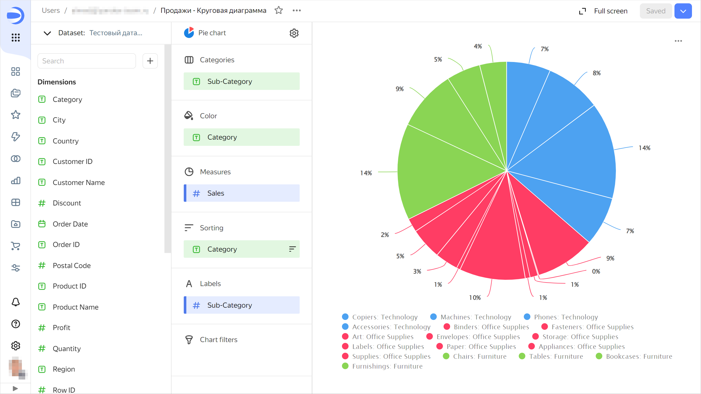

# {{ datalens-full-name }} release notes: February 2024

* [Updates](#top-news)
* [Fixes and improvements](#fixes)

## Updates {#top-news}

### _Categories_ section for pie and ring charts {#category-pie-ring-charts}

Added the **Categories** section for [pie](../visualization-ref/pie-chart.md) and [ring](../visualization-ref/ring-chart.md) charts. Now the **Categories** section is used to group data, and the **Color** section to color the chart segments.





### _Repeat_ button in widgets containing an error {#repeat-button}

Added the **Repeat** button for charts returning an error. Use this button to repeat you request to the source. The button is available for most error types.

### Opening anchor links in the current browser window {#link-target-self}

Implemented opening anchor links (starting with `#`) in the current browser window. Now, in text widgets, you can provide a link to the dashboard header from the table of contents. The page will scroll to that header as soon as you click the link.

### Drag-and-drop sorting in manual selectors {#drap-drop-params}

In the manual selector settings, you can now reorder the possible values using drag and drop.

## Fixes and improvements {#fixes}

### Applying custom palette colors in a combined chart {#user-palette}

Fixed an error with application of custom palette colors in a [combined](../visualization-ref/combined-chart.md) chart.

### Filling table cells with null values {#null-color-fill}

Fixed an error where [table](../visualization-ref/table-chart.md) cells with empty (`null`) values were not filled.

### Gradient filling of table columns {#gradient-fill-columns}

Fixed an error where tri-color gradient coloring was not working correctly in columns containing both negative and positive values.

### Displaying errors for dataset fields in a wizard {#error-message-field-ds}

Fixed an error where, after replacing a dataset, the chart still had fields with a link to the old dataset and the `Measurement not involved in dataset linking` error was displayed.

### Bar chart axis formatting {#bar-chart-format}

Fixed the percentage presentation of the [bar](../visualization-ref/bar-chart.md) chart axis. To have axis labels displayed as a percentage:

1. Drag a numeric value from the dataset to the **X** section. Set **Format** to `Percentage`.
1. For the **X** section, set **Axis formatting** to `By first field on the X axis`. The X axis labels will appear as a percentage.

Similarly, you can configure the percentage display for the Y axis.

### Selecting a color for column chart null values {#column-chart-null-color}

Fixed the color selection error with [column](../visualization-ref/column-chart.md) chart `null` values.

### Chart sorting during split {#split-sorted}

Fixed chart sorting when using the **Split** section.

### Enabling/disabling sum display in QL chart tooltips {#ql-charts-summa}

Fixed an error where it was impossible to disable sum display in [QL chart](../concepts/chart/ql-charts.md) tooltips.

### Linking by chart parameters {#link-chart-params}

Fixed an issue where the dashboard link settings did not display a chart-level [parameter](../concepts/parameters.md) link between widgets.

