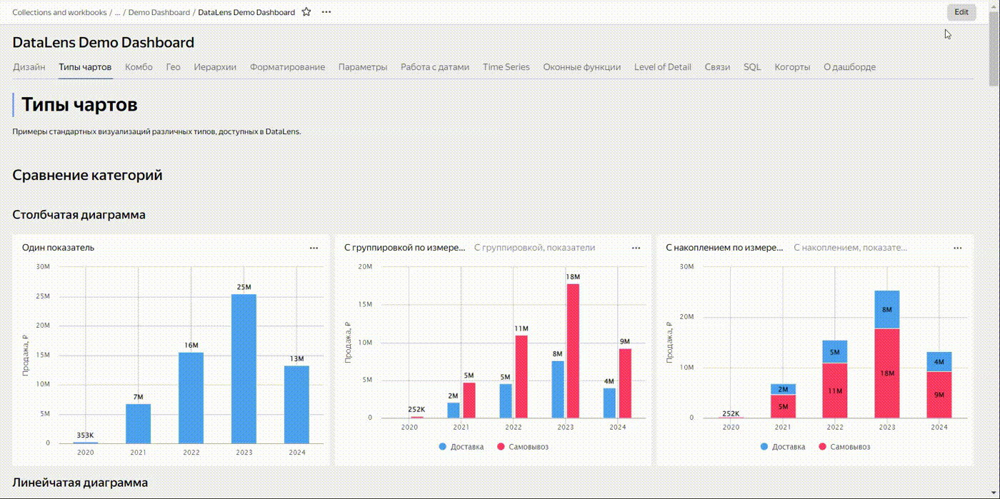

# {{ datalens-full-name }} release notes: May 2024

* [Changes in basic features](#base)
* [Changes available with the _Business_ service plan](#business)

## Changes in basic features {#base}

### Viewing dashboard access permissions {#view-dashboard-access}

To view access permissions for a dashboard with the [access error message](../operations/dashboard/add-access-message.md) enabled, the [{{ permission-write }}](../security/manage-access.md#permission-write) or [{{ permission-admin }}](../security/manage-access.md#permission-admin) permissions for this dashboard are now required.

Users with the [{{ permission-read }}](../security/manage-access.md#permission-read) permission cannot view the list of access permissions for this dashboard or request changing access to it via the {{ datalens-short-name }} interface.

### Displaying dashboard description when opening a dashboard {#dashboard-opened-info}

When opening a dashboard, you can now view its pop-up [description](../dashboard/settings.md#message-settings) (if provided). To enable this feature, add `_opened_info=1` to the dashboard's URL.

### Background for the _Text_ and _Heading_ widgets {#background-for-text-title}

You can now set the background for the [{#T}](../dashboard/widget.md#text) and [{#T}](../dashboard/widget.md#title) widgets. To do this, enable the **Background** option in the widget settings window and choose a color.

The available colors include the [Light Semantic](https://preview.gravity-ui.com/uikit/iframe.html?args=&id=colors--backgrounds&viewMode=story) palette from the [Gravity UI](https://gravity-ui.com/) design system.

### Disabling link optimization {#join-optimization-off}

Added the option to disable link optimization when using multiple tables in a [data source](../dataset/data-model.md#source). To do this, use the **Optimize link** option in the link settings.

The option is enabled by default for all links in the dataset: the `JOIN` operator is applied when a query accesses fields from two or more linked tables. You can disable the option for each individual link to make such link a required one. In this case, the `JOIN` operation will be performed even if you select fields from a single table.

### Images in tables {#table-image}

Added the [IMAGE](../function-ref/IMAGE.md) markup feature that allows you to add images in table cells.

### Dragging and dropping to add widgets to a dashboard {#drag-n-drop}

You can now drag and drop widgets directly to where you want them to be. This works for all objects you are creating or copying without affecting their size. The previous behavior based on clicking the panel is also supported.





### Tooltips in selectors and tables {#hint}

The new **Tooltip** feature allows you to add a text comment to a [selector](../operations/dashboard/add-selector.md) or [regular](../visualization-ref/table-chart.md#hint-column) and [pivot table](../visualization-ref/pivot-table-chart.md#hint-column) headers. By default, the tooltip text is taken from the field description in the dataset.

When the option is enabled, the  icon appears on the dashboard next to the selector or table column header.

### Selecting a widget in the link setup window {#link-settings-widget-select}

You can now select the widget you want to configure from the drop-down list in the [link](../dashboard/link.md) setup window on a dashboard.

### Link to a dataset in a selector {#selector-dataset-link}

You can now specify a link to a dataset when [adding](../operations/dashboard/add-selector.md) a dataset-based selector to a dashboard. To do this:

1. In the window with selector settings, click **Specify link**.
1. In the field below, enter the link to the dataset.
1. Click **OK**.

If the link is correct, the **Dataset** field will be filled automatically; otherwise, you will get an error message.

## Changes available with the _Business_ service plan {#business}

### Generating a color palette for the current theme only {#color-palette-for-current-theme-only}

You can now generate a color palette only for a selected theme and contrast combination when [customizing the UI](../settings/ui-customization.md). To do this, enable the **Current theme only** option in the main color selection window when generating the palette. If this option is disabled, the palette you generate will apply to all themes.

### Resetting UI customization {#customization-reset}

You can now reset a customized UI to {{ datalens-short-name }} system defaults. To do this:

1. In the UI customization window, click **Reset**.
1. Enable **Current theme and contrast only** to reset the selected theme only. If this option is disabled, all themes will be reset.
1. Click **Reset**.

