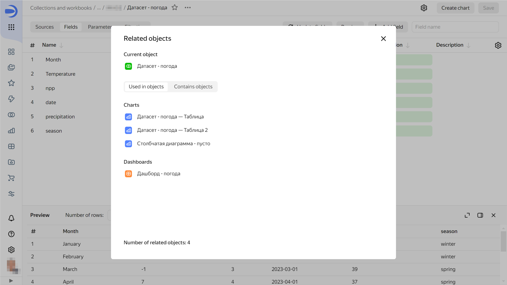
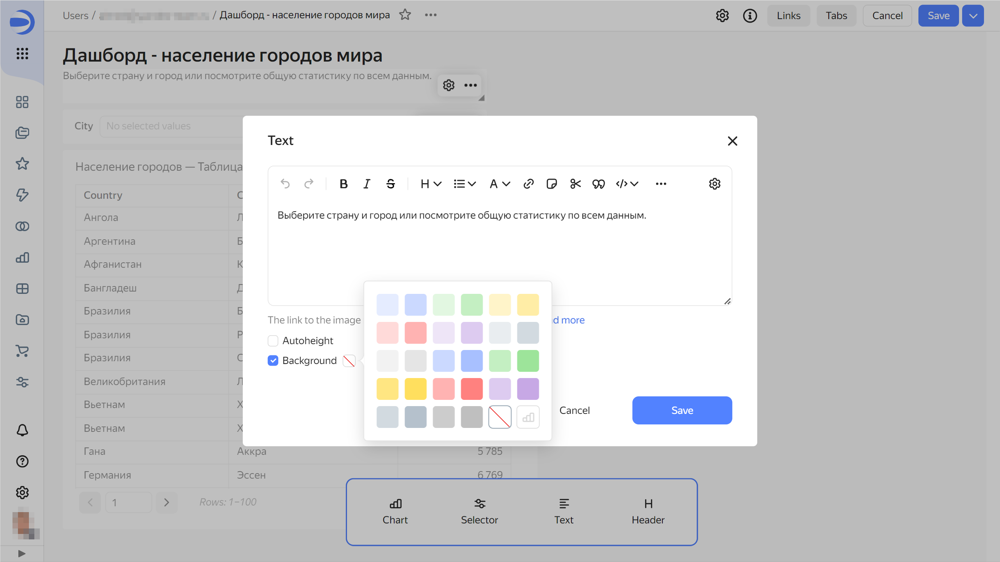
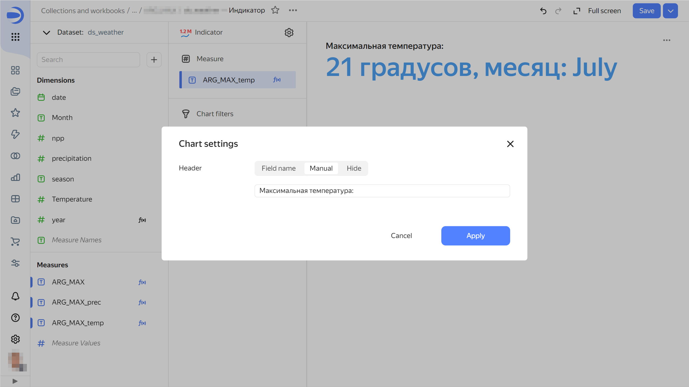

# {{ datalens-full-name }} release notes: June 2024

* [Updates](#updates)
* [Fixes and improvements](#fixes)
* [Mobile version updates](#mobile-version-changes)

## Updates {#updates}

### Viewing linked objects {#related-objects-view}

You can now see where an object is used or which objects it is using. To do this, click  → **Linked objects** on the navigation page or object editing window. For example, this can give you a clue as to the sources used to build a dashboard or the charts based on a certain dataset.





### Basic background color for widgets {#background-base-color}

Now you can set the same background color for the [Text](../dashboard/widget.md#text) and [Header](../dashboard/widget.md#title) widgets as for charts and selectors: white for the light interface theme and dark gray for the dark one. To do this, set the background color to  **Basic** in the widget settings window.





### Disabling default preview in a dataset {#preview-disable}

Now you can [disable](../dataset/settings.md#preview-default) default data preview at the dataset level. This is especially useful when editing datasets with large numbers of complex [calculated fields](../concepts/calculations/index.md).

### Displaying a header in the indicator {#indicator-title}

You can now customize header appearance in the [Indicator](../visualization-ref/indicator-chart.md) chart's [settings](../concepts/chart/settings.md#common-settings):

* `Field name`: Show field name in header.
* `Manually`: Rename header.
* `Hide`: Hide header.





### QL charts based on {{ ydb-name }} {#ydb-ql-chart}

Now you can create [QL charts](../concepts/chart/ql-charts.md) based on a [{{ ydb-name }} connection](../operations/connection/create-ydb.md).

### Undoing and redoing changes in the wizard {#undo-redo}

When editing a chart, you can now undo/redo any change introduced within the current version:

* To undo changes, click  in the top-right corner of the screen or press **Ctrl** (**Cmd**) + **Z**.
* To redo changes, click  or press **Ctrl** (**Cmd**) + **Shift** + **Z**.

## Fixes and improvements {#fixes}

### Pivot table sorting {#pivot-table-sorted}

Fixed a row sorting issue for the [pivot table](../visualization-ref/pivot-table-chart.md). The issue occurred after editing a [parameter](../concepts/parameters.md) in the [calculated field](../concepts/calculations/index.md) of a column or row.

### Date filtering in charts {#chart-date-filter}

Fixed the date filtering behavior in charts. Now, dashboard [filters](../concepts/chart/settings.md#filter) use by default the **Equals** comparison operation instead of **Belongs to range** for fields of the [Date](../dataset/data-types.md#date) and [Date and time](../dataset/data-types.md#datetime) types.

### Other fixes and improvements {#other-fixes}



- Fixes

  * Increased the number of dashboard tabs whose names are not truncated in the drop-down list.
  * Increased the width of the default value setting window for the **Calendar** type selector.
  * Fixed line sorting in descending order for negative values in tooltips.
  * Fixed an error where the chart saving option was not available after adding/removing a [tooltip](../visualization-ref/table-chart.md#hint-column) to/from a table field in the wizard.
  * Fixed a header display issue in **Indicator** type charts where the chart name was always substituted from the dataset field name.
  * Fixed an interface display issue in tables occurring on selecting a palette in a [linear indicator](../visualization-ref/table-chart.md#add-linear-indicator).
  * Fixed a value loading error for chart [color customization](../concepts/chart/settings.md#color-settings).
  * Fixed a pagination error in the [Pivot table](../visualization-ref/pivot-table-chart.md) type chart.
  * Fixed tooltip display in the **Checkbox** type selector.
  * Fixed incorrect chart rendering when the **Empty values (null)** parameter is set to `Do not show`.
  * Fixed an issue where empty charts were invisibly overlapping the space below them on the dashboard.
  * Fixed an error occurring on duplicating a dashboard from the navigation panel.
  * Now, if you change field visibility () in the dataset field editor, an attempt to close the page will prompt an unsaved changes warning.
  * Fixed the calculation of the [Text](../dashboard/widget.md#text) widget minimum height with **Auto height** enabled.
  * Fixed display of the tooltip input field in the selector settings window. It is now displayed only if the **Tooltip** option is enabled.

- Improvements

  * Added a panel for migrating legacy dashboard configurations.
  * Modified the navigation interface. Now, when you select multiple items from the navigation list for a bulk action, the  icon at the top of the window gets hidden.



## Mobile version updates {#mobile-version-changes}

* The new menu at the top of the screen allows you to switch between navigation pages (**Charts**, **Dashboards**, and **Collections and workbooks**), change settings (language, theme), and contact support.
* You can now open a chart preview from the new **Charts** navigation page.
* Improved the **Collections and workbooks** navigation page.
* Improved the appearance of pages and windows with bigger font sizes and interface elements.
* Added a table of contents for dashboards.
* Clicking the **Share** button now opens the link settings window.

