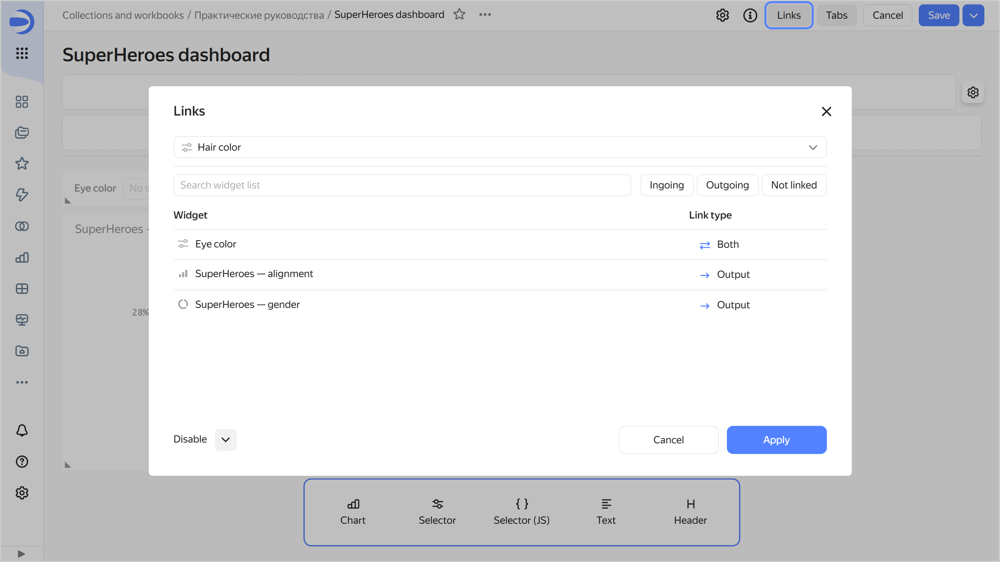
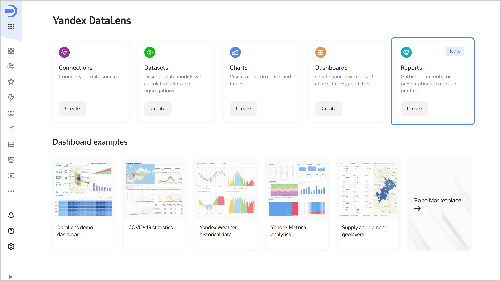

# {{ datalens-full-name }} release notes: March 2025

* [Changes in basic features](#base)
* [Changes available with the _Business_ service plan](#business)

## Changes in basic features {#base}

### Dashboard links {#dashboard-link}

In dashboard edit mode, updated the modal window for setting up widget [links](../dashboard/link.md).





### Fixes in charts {#charts-fixes}

* Fixed an issue where the [hierarchy](../operations/chart/add-hierarchy.md) in the **Colors** section was not working in [tree diagrams](../visualization-ref/tree-chart.md).
 
* Adjusting colors by text [measure](../concepts/chart/settings.md#indicator-settings) is no longer available. Now, when you add a text measure to the **Colors** section,  is not displayed. Previously, the settings window displayed the `Failed to load filter values` error.
* Hid the **Labels** section in [QL charts](../concepts/chart/ql-charts.md) that use the [Gravity yagr](https://github.com/gravity-ui/yagr) library.

### Markup for string fields {#markup-chart-setting}

Added a [setting](../concepts/chart/settings.md) for selecting a markup type for string fields in certain visualizations. The possible values are `HTML`, `Markdown`, or `None`.

### Support Center menu {#support-menu}

Updated the **Support Center** menu structure in the side navigation.

## Changes available with the _Business_ service plan {#business}

### Changes in reports {#reports-changes}

* Added a section for [reports](../reports/index.md) to the {{ datalens-short-name }} [home page]({{ link-datalens-main }}).

  

  

  

### File connections in secure embeddings {#files-secure-embeddings}

The following connections are now supported for [embedding private objects](../security/private-embedded-objects.md):

* [Files](../operations/connection/create-file.md) (CSV and `xsls` from Excel).
* [Yandex Documents](../operations/connection/create-yadocs.md).
* [Google Sheets](../operations/connection/create-google-sheets.md).

