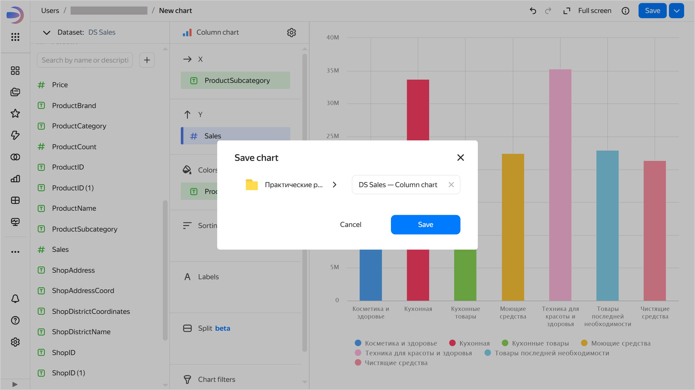
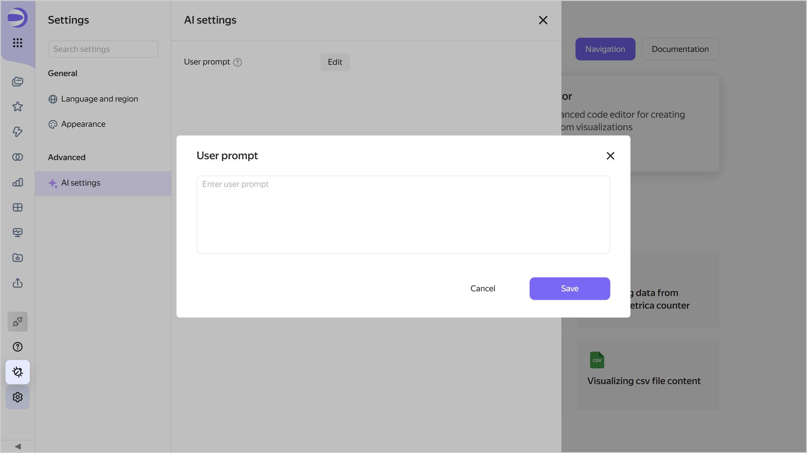

# {{ datalens-full-name }} release notes: October 2025

* [Changes in basic features](#base)
* [Fixes and improvements](#fixes)
* [Changes available with the _Business_ service plan](#business)

## Changes in basic features {#base}

* Added [connection versioning](../concepts/connection/versioning.md). You can now view a list of previously saved connection changes and roll back to a previous version.
  The following restrictions apply:

  * Versioning is not available for the following connections: [Files](../operations/connection/create-file.md), [Yandex Documents](../operations/connection/create-yadocs.md), and [Google Sheets](../operations/connection/create-google-sheets.md).
  * Sensitive connection data, such as passwords and tokens, is not versioned.
  * Connection versions do not contain the source data changes (rows added, updated, or deleted in the data source).
  * You can only get change history for the last three months.

* Added the option to [set up](../dataset/create-dataset.md#setup-fields) field display in the dataset. For dimensions, you can choose a color and set a display format for numeric types; for measures, you can only set a display format for numbers. These settings apply when you use these fields in charts built based on this dataset.

  

  

  

* Added the ability to [select a default palette](../operations/chart/create-palette.md#default-palette) in the chart color settings.

* The chat with support can now be opened directly from the {{ datalens-full-name }} interface. To open the chat, click  on the sidebar and select  **Open chat** under **Support**.

* New works available in [{{ datalens-gallery }}]({{ link-datalens-main }}/gallery). For more information, see the [{{ datalens-short-name }}](https://t.me/YandexDataLens/28631/140855) Telegram chat.

### Changes in the interface {#interface-changes}

* The confirmation button was made more visible in the dialog box for creating, saving, and duplicating entities in folder navigation.

  

  

  

* Added contrast to the background color of the dashboard and [widget pinning](../dashboard/settings.md#widget-fixation) area.

* For [private object embedding](../security/private-embedded-objects.md), highlighted the info that the functionality is available in the _Business_ [service plan](../concepts/service-plans-comparison.md) to the settings window.

  

  

  

### Mobile version updates {#mobile-version-changes}

* Added a widget pinning area to the dashboard.
* Viewing dashboard contents and descriptions, as well as the  button, are now available in the panel at the bottom of the screen.

## Fixes and improvements {#fixes}

* Implemented the `_autoupdate` parameter for [private embedding](../security/private-embedded-objects.md), which allows you to manage the auto-update of charts and dashboards.
* For charts and dashboards, fixed the issue of opening the [embedding settings](../security/private-embedded-objects.md#how-to-private-embed) in the side navigation. To open the settings, click  **Charts** or  **Dashboards** in the sidebar and click  → **Embedding settings** in the row with the object.
* Fixed the display of totals in the Waterfall chart tooltip ([Gravity UI Charts](../charts/editor/widgets/chart.md)).

* Fixed an error when [exporting data from a chart](../concepts/chart/data-export.md) to an `XLSX` file, where the `Date and time` column displayed the export date instead of the **Total**.

### Fixes in charts {#chart-fixes}

* Disabled sorting for [multi-dataset charts](../concepts/chart/multidataset-chart.md).
* Fixed the [undo changes](../concepts/chart/settings.md#undo-redo) button operation when changing chart type to [combined chart](../visualization-ref/combined-chart.md).
* In the [table](../visualization-ref/table-chart.md#set-field-color) and [pivot table](../visualization-ref/pivot-table-chart.md#set-field-color), fixed the colors of fields with the default palette.
* Fixed the display of an [indicator](../visualization-ref/indicator-chart.md), which uses [markup functions](../function-ref/markup-functions.md) along with some other functions.
* In the [pivot table](../visualization-ref/pivot-table-chart.md#set-field-color), fixed the display of [markup functions](../function-ref/markup-functions.md) in the totals.
* For [tables with trees](../dataset/data-types.md#how-to-use-tree), fixed the display of query info in the [inspector](../concepts/chart/inspector.md).

### Fixes in workbooks {#workbook-fixes}

* Added sorting by creation date and name in the object selection dialog in the [workbook](../workbooks-collections/index.md), when adding a chart or selector to a dashboard.
* When [importing a workbook](../workbooks-collections/export-and-import.md#import-workbook), the list of workbooks is now updated after you close the progress window.
* Added the option to delete a workbook during its creation (a workbook with the `Importing` status). In which case the workbook creation page will display an error.

### Error handling {#errors}

* Fixed the `Minified error` that occurred when using the dashboard in some browsers.
* Fixed an error that occurred when editing a [calculated field](../concepts/calculations/index.md#how-to-create-calculated-field) formula in a chart with grouping already added.
* Fixed the display of validation errors when creating a [connection](../concepts/connection/index.md).

* The error when attempting to create a workbook or collection with an existing name is now displayed more clearly and in the language configured by the user.
* Added a handling action for the error when attempting to deploy a workbook with invalid data from the gallery. Now you get a message with a recommendation to contact support.

## Changes available with the _Business_ service plan {#business}

* Fixed incorrect collapsing of the AI chat in the Safari browser.

### Setting up an AI prompt {#ai-promt-setting}

Now you can set up a custom AI prompt. To do this, follow these steps:

1. Click  **Settings** in the left part of the navigation panel to open the settings.
1. Go to the **AI settings** tab.
   
   

   

   

1. Click **Edit**.
1. Enter a prompt in the text field and click **Save**. Text length: up to 2,000 characters.

With each request to the AI, the custom prompt will be added to the {{ datalens-short-name }} system prompt.



* For the subject area:
  `Note that this data is related to food production`
* For the user role:
  `Answer me as a marketing expert`
* For interpretation of measures and data:
  `MAU: Always counted by the number of unique users, not client companies`


