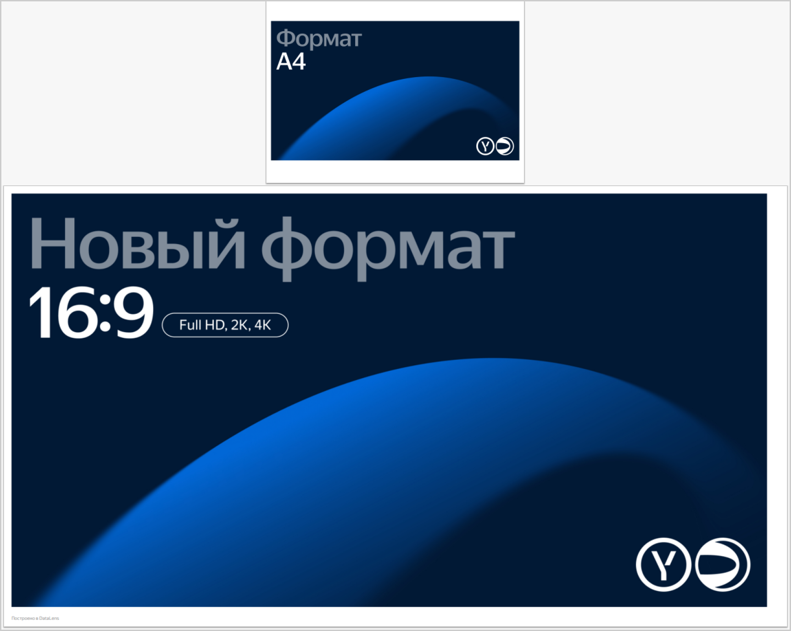

# {{ datalens-full-name }} release notes: March 2026

* [Changes in basic features](#base)
* [Fixes and improvements](#fixes)

## Changes in basic features {#base}

* New works available in [{{ datalens-gallery }}]({{ link-datalens-main }}/gallery). For more information, see the [{{ datalens-short-name }}](https://t.me/YandexDataLens/28631/148518) Telegram chat.

* When you [copy](../operations/dashboard/add-selector.md#copy-paste) a selector from one tab and paste it into another tab of the current dashboard, you can now link it to the original selector or create a new independent selector.
* Added the ability to customize [line width](../concepts/chart/settings.md#forms-settings) as well as line cap and junction style on [line charts](../visualization-ref/line-chart.md#wizard-sections).

  This new line setup option allows you to:

  * Focus on the main point.
  * Build a visual hierarchy.
  * Make the multi-line chart easier to read.
  * Improve adaptability for the mobile version and other non-standard cases.

* For [background data export from a chart](../concepts/chart/data-export.md#background-export), we added support for export in `XLSX` format:
  
  * You can use background export for [tables](../visualization-ref/table-chart.md) in the [wizard](../concepts/chart/dataset-based-charts.md).
  * [Pagination](../concepts/chart/settings.md#common-settings) must be on in the table settings, and more than one page must be displayed.
  * The maximum number of rows in the table is 1,000,000.
  * The maximum file size is 1 GB.

  Learn more about background export [limitations](../concepts/chart/data-export.md#restrictions).

* When [exporting and importing workbooks](../workbooks-collections/export-and-import.md), [{{ yq-full-name }}](../operations/connection/create-yandex-query.md) and [Yandex Monitoring](../operations/connection/create-monitoring.md) connections are now available.
 

### Improvements in reports {#report-changes}

* We added support for links in reports. In the [Text](../reports/report-operations.md#add-widget) widget, you can create a link:

  * `#title` type: To a title in the current report.
  * `#page-1` type: To a specific page in the current report.
  * Absolute link: To go to a page on the internet.

  

  

  

  You can use created links in reports in [preview](../reports/report-operations.md#report-preview) mode or in [exported](../reports/report-operations.md#report-export) PDF files.

* Added support for new formats in reports: `16:9 (Full HD)`, `16:9 (2K)`, and `16:9 (4K)`.

  

  

  
     
## Fixes and improvements {#fixes}

* For [Gravity UI Charts](../charts/editor/widgets/gravity-ui.md) and [Advanced charts](../charts/editor/widgets/advanced.md), added the ability to follow a link by clicking an element in the chart using `window.open` in the [Editor.wrapFn](../charts/editor/methods.md#wrap) method.

* In the Advanced chart, fixed the error of using args in the `Editor.wrapFn` method.

* Fixed the error where options used to create [aliases](../dashboard/link.md#alias) were not displayed in the link dialog for [JS selectors](../charts/editor/add-js-selector.md) built based on datasets.
* In [background export](../concepts/chart/data-export.md#background-export) from a chart, fixed the issue where field renaming at the chart level was disregarded and the names were taken from the dataset.
* The dataset-based selector now highlights the field if it was removed from the dataset.
* Made [mermaid diagrams](../dashboard/markdown.md#mermaid) more secure: now most HTML elements get filtered out, and the diagram is displayed without them.
* Sped up the `Editor.wrapFn` function and optimized the libraries provided in its arguments.

* Fixed the date in the sidebar [trial period](../pricing.md#trial) countdown indicator. Previously, the indication was one day up.
* Fixed the alignment of icons in the workbook object list.
* In {{ datalens-gallery }}, renamed the `Product management` category to `Product`.

### Fixes in connections {#connection-fixes}

* Connection settings now automatically expand the fields that have failed validation when attempting to create or save a connection.
* Removed the **Edit** button from connections that are not editable.
* Fixed some errors when connecting to a [file](../operations/connection/create-file.md).

### Fixes in datasets {#dashboard-fixes}

* When going to the [dataset creation](../dataset/create-dataset.md) page from the side navigation, an _unsaved changes_ warning will now be displayed if the user is already on this page and the form contains unsaved changes.
* Now you cannot create or save a dataset if there are no tables in the workspace.
* In the [dataset field](../dataset/create-dataset.md#setup-fields) color settings window, long elements in the left column are now correctly truncated with ellipses.
* Fixed the selection of tables in the list after deleting them from the workspace.
* The undo (**Ctrl** (**Cmd**) + **Z**) and redo (**Ctrl** (**Cmd**) + **Shift** + **Z**) hotkeys are now blocked if the settings window is open in the dataset.

### Fixes in charts {#chart-fixes}

* Fixed incorrect display of:

  * Chart icons, which you could see from time to time in the [link settings](../operations/dashboard/dashboard-links.md) window.
  * Modeling icons when adding trend and smoothing lines to a chart in Safari.

  * Load indicator when entering values ​​in the chart's [filter](../concepts/chart/settings.md#filter) settings.

* Fixed a chart execution error due to special data values ​​in the **Colors** section.

* Fixed [saving chart as an image](../operations/chart/save-as-image.md) on mobile devices with screen resolution of 1600 x 720 pixels.

### Dashboard changes {#dashboard-fixes}

* Implemented a switch back from a newly added tab to the first existing one after you cancel the edit.
* Full text of the chart title is now displayed on hover.

