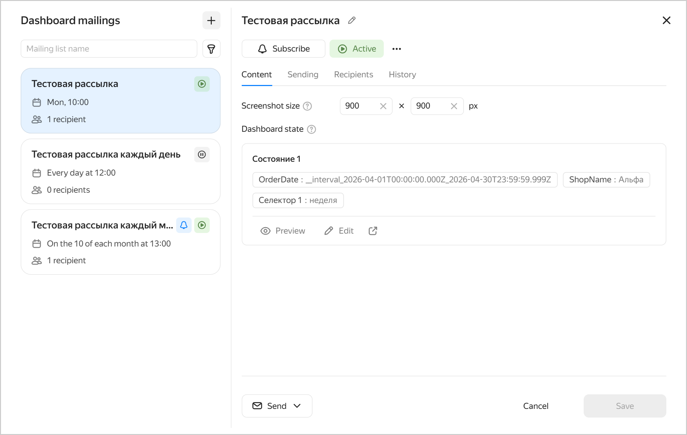

# {{ datalens-full-name }} release notes: May 2026

* [Changes in basic features](#base)
* [Fixes and improvements](#fixes)

## Changes in basic features {#base}

* New user-created dashboards are available in [{{ datalens-gallery }}]({{ link-datalens-main }}/gallery). For more information, see our [{{ datalens-short-name }} chat](https://messenger.360.yandex.ru/#/join/01a309da-b9a8-4167-9892-b72f1ec1bff0/1778684386173061) in {{ messenger-full-name }}.
* Check out our video digest on what we improved in {{ datalens-full-name }} over the last six months. You can watch it on:

  * [YouTube](https://youtu.be/NphWrA3TFWs)
  * [VK Video](https://vkvideo.ru/video-200452713_456240432?list=ln-yghSH3nJwSMTzT5WVh)
  * [RuTube](https://rutube.ru/video/7af10c515697b698319c7f2b76b6fc3e/)

* New [{{ SR }} connector](../operations/connection/create-starrocks.md) allowing you to create a connection through a direct link.

* New form for [dashboard mailing lists](../dashboard/settings.md#maillists).
  
  You can now schedule dashboard email delivery to {{ datalens-short-name }} user email addresses.
  
  When configuring it, note that:
  
  * Mailing lists are only available for dashboards located in [workbooks](../workbooks-collections/index.md).
  * To add or update a mailing list, you need the `{{ roles-datalens-admin }}` role.
  * For each mailing list, you can configure dashboard state by picking the appropriate tabs and selector values.

  

  

  

* Revised the dialog for assigning access permissions. The permissions setup window displays the effective role for the current object (collection or workbook) for each subject (user or group).
  
  Optionally, you can open a window with an individual user’s permissions settings to view details, including roles inherited from parent collections.

* New [roles for collections](../security/workbooks-access-basic.md#collection-roles):

  * `Collection visitor`: Enables you to view information about the collection without accessing its nested objects.
  * `Creator in collection`: Enables you to view a collection and create objects inside it without accessing the existing ones.
  
  Previously, when a user had access to a workbook but did not have one to the parent collections, they could access the workbook in question only through a direct link or the list of available objects. Now, you can assign permissions to visit the appropriate collections, as well as to creating objects inside them without access to the existing objects.

* Access configuration through [common objects](../security/workbooks-access-advanced.md). Common objects are connections and datasets you can re-use and link to multiple workbooks for different teams.
  
  When linking a common object, you can either:
  
  * **Delegate access permissions**, which means access permissions to the common object (either connection or dataset) will not be checked within the workbook; that is, anyone with access to the workbook the connection is linked to will also have access to the object.
  * **Not delegate access permissions**, which means, for users to access the object (either connection or dataset) from the workbook, they must be granted access to the original, i.e., common object.

  To link a workbook, you need to have the appropriate permissions to common objects. With this in mind we added two new roles:

  * `Links without delegation`: Assigned for a common object, it enables you to link it to workbooks without delegating access permissions.
  * `Links with delegation`: Assigned for a common object, it enables you to link it to workbooks with or without delegating access permissions.

* Configuring early [cache invalidation](../dataset/cache-invalidation.md) in a dataset:

  * With cache invalidation, you can reduce the number of requests to the source and enable more efficient cache utilization on the {{ datalens-short-name }} side.
  * To specify cache invalidation conditions, use dataset settings.
  * There are two [invalidation modes](../dataset/cache-invalidation.md#modes) available: through SQL or by formula.

  {{ datalens-short-name }} caches query results from data sources to accelerate chart and dashboard rendering. By default, the cache is refreshed only after its TTL (cache time-to-live in seconds) expires. If the data is updated regularly but infrequently, and you want to see fresh data, the issue is that cache refreshing depends on TTL.
  
  This issue is addressed by cache invalidation. The system regularly sends an invalidation query to the data source and checks whether the data has changed. If the query returns a different result, the cache refreshes immediately without waiting for TTL expiration.

* Updated the color picker tool by improving both the palette and visual display in the report [widget background settings](../reports/report-operations.md#widget-background), [chart color settings](../concepts/chart/settings.md#color-settings), [dataset field color settings](../dataset/create-dataset.md#setup-fields), and global settings when changing [appearance](../settings/appearance.md).

* You can now [hide or show](../operations/dashboard/dashboard-hide-tabs.md) tabs on a dashboard, whether all or selected. Hidden tabs are not visible by default when you open the dashboard, but you can see them if you use a link to a hidden tab to open the dashboard. Hidden tabs are also shown in the editor mode.

  Here is how you can use hidden tabs:

  * Hide archived tabs before removing them.
  * Hide new tabs that are not ready yet before showing them to all users.
  * Hide the details tab which can only be accessed through clicking an object on another chart.

## Fixes and improvements {#fixes}

* Enabled license search by `userId`.

* Fixed a [background export](../concepts/chart/data-export.md#background-export) issue where cells with special characters were exported incorrectly.

### Connection fixes {#connection-fixes}

* Fixed an issue where connections to [Google Sheets](../operations/connection/create-google-sheets.md) could persist despite an outdated state.

### Report fixes {#report-fixes}

* Fixed [report export](../reports/report-operations.md#report-export) issues, including:
  
  * Incorrect display of the comment icon in text widgets.
  * Failure of loading images in Safari.
  * Incorrect text hyphenation in the **Header** widget with the font size smaller than the one required to place the entire text.
  
* Faster report page loading in the preview area in Safari.

### Dashboard fixes {#dashboard-fixes}

* Restricted the impact of selectors visible across multiple tabs. Previously, selectors included in such a group could affect tabs where they were not visible by applying their default values.
* Fixed a group selector copying error.

  Previously, pasting a group selector with a group-wide setting caused the tab to malfunction if each individual selector was set to `Current tab`.

  Now, if you paste a selector with a group-wide setting into another tab and select **Edit settings**, the new settings will apply both to the group and each of its selectors (provided they are visible on the original tab).

### Chart fixes {#chart-fixes}

* Added support for additional [trend and smoothing lines](../dashboard/trends-and-smoothing.md) on public dashboard charts.

* Fixed a drill-down issue in [bar charts](../visualization-ref/bar-chart.md).
* Fixed the rendering of trailing zeros for [normalized column chart](../visualization-ref/normalized-column-chart.md) tooltips.

