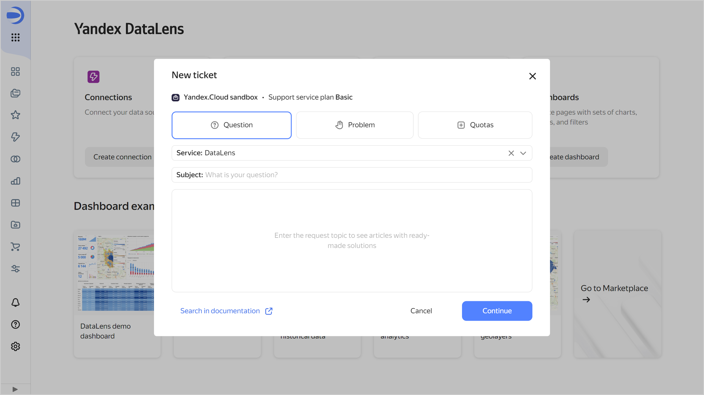

# {{ datalens-full-name }} release notes: August 2024

* [Changes in basic features](#base)
* [Changes available with the _Business_ service plan](#business)

## Changes in basic features {#base}

### Searching by fields in the wizard and dataset {#search-in-wizard}

In the wizard and dataset, added the ability to search not only by name but also by field description.

### List of published objects {#public-objects-list}

The {{ datalens-short-name }} instance [admin](../security/roles.md#datalens-admin) can [view a list](../concepts/datalens-public.md#public-objects-list) of all published objects.

### Support ticket creation form {#support-form}

Updated the support ticket creation form.

### Position of selector title {#selector-title-position}

Added a selector setting that allows you to specify the position of the title: `Left` (default) or `Top`.

### **Selector** widget improvements {#group-selectors-fix}

Fixed these group selector related errors:

* Widget failed to regain its original height after canceling the edits made in the selector.
* Dashboard stopped working correctly on canceling selector deletion in a widget with two selectors and auto update.
* Navigation window reopened after a dataset was selected in the widget.
* Widget width went incorrect after other selectors were added to the widget's group.

### Displaying a tooltip next to the selector title {#selector-tooltips}

Fixed the error that caused the system tooltip next to the selector title to remain visible when hovering over .

### Tooltip text in the selector {#selector-hint-text}

In the selector's **Tooltip** setting, fixed an error where the text from the dataset field description was not added to the selector's tooltip text field.

### Auto update of selectors on a public dashboard {#selector-auto-update}

Fixed the error that interrupted a public dashboard's operation upon enabling a selector's **Dependent selector auto update** setting on that dashboard.

### SQL source name in a dataset {#dataset-sql-source-name}

Fixed the error that caused an SQL source name to reset to default after each subquery edit in the dialog box for [adding the SQL source](../dataset/create-dataset.md#add-data) in a dataset.

### Display of heat map charts {#heat-map-fix}

Fixed the display of [heat map](../visualization-ref/heat-map-chart.md) charts in the wizard.

### Documentation link in the migration section {#migrate-link}

Fixed the [documentation](../concepts/organizations.md#migration) link in the description of the section about migration from a folder to an organization.

### Usernames in {{ datalens-short-name }} Usage Analytics Light {#usage-analytics-light-user-name}

Fixed the display of usernames in [{{ datalens-short-name }} Usage Analytics Light](../operations/connection/create-usage-tracking.md#light-dash).

## Changes available with the _Business_ service plan {#business}

### Object publishing prohibition {#publication-disable}

Added the ability to [prohibit publishing](../concepts/datalens-public.md#publication-disable) charts and dashboards at the {{ datalens-short-name }} instance level.

### Embedding private objects {#private-embedded-hints}

Improved the interface for [embedding private objects](../security/private-embedded-objects.md):

* In the **Embedding keys** dialog box, added tooltips about embedding a private object with links to the relevant documentation.
* In the **Create embedding** dialog box, the **Key** field is blocked if the workbook does not contain any available keys for the object.
* In the **Embedding settings** dialog box:

  * Added tooltips about embedding a private object with links to the relevant documentation.
  * In the table with the list of embeddings:

    * When hovering over a row, you will now see buttons for copying the embedding ID and name.
    * A click on a row now opens an information window about the embedding in view mode.
    * Changed the color of dependent objects and parameters.
    * Parameters and dependent objects displayed in the button now also state the number of objects that did not fit (when there are more than three of them).

