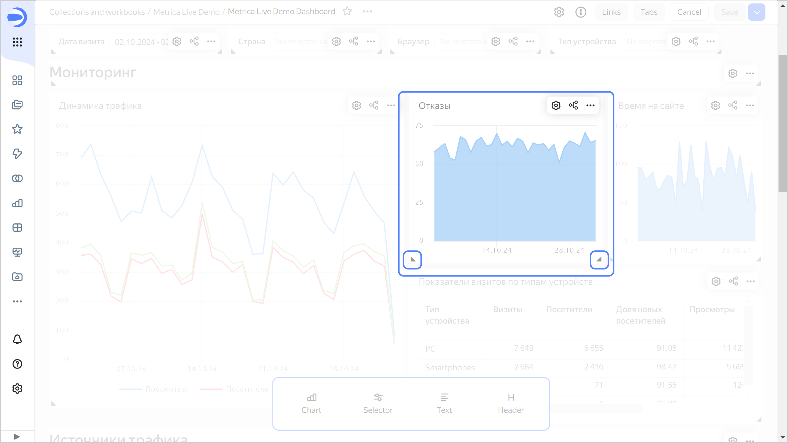

# {{ datalens-full-name }} release notes: October 2024

* [Changes in basic features](#base)
* [Changes available with the _Business_ service plan](#business)

## Changes in basic features {#base}

### Copying links together with a widget {#widget-links-copy}

Now a widget you copy retains its links if you paste it to the same dashboard tab. This option is not available when adding a selector to a group.

### Widget size on a dashboard {#dashboard-widget-resize}

You can now resize widgets on a dashboard by dragging their bottom corners.

### Chart tooltips {#tooltips}

* Added the **Tooltip** [setting](../concepts/chart/settings.md#common-settings) in charts which enables and disables on-hover tooltips for chart elements.
* Added settings for customizing tooltip display in [maps](../visualization-ref/map-chart.md).

### Disabling links on a dashboard {#dashboard-links-off-error}

Fixed an issue where clicking `Disable` → `all`/`charts`/`selectors` would reset link parameters not yet applied.

### Dashboard auto-scroll {#autoscroll-dashboard}

* Fixed page auto-scroll when dragging dashboard items in edit mode.
* Fixed the dashboard auto-scroll issue in mobile `Safari` browsers when switching from chart view mode back to the dashboard.

### Fixes in workbooks {#workbook-errors-fix}

* Hid the malfunctioning **Request permissions** button for objects in workbooks the user has no access to.
* Fixed an error where the workbook window displayed connections instead of charts, and vice versa.

### Selector comparison operations {#selector-compare-operations}

Added such comparison operations as `Greater than`, `Less than`, `Greater than or equal to`, and `Less than or equal to` for the `Input field` selector that filters by dataset text field.

### Displaying X and Y axes in charts {#axis-visible-chart-settings}

Added the **Axis on chart** [setting](../concepts/chart/settings.md#axis-settings) enabling users to hide all elements associated with the X and Y axes. This feature is available for [wizard charts](../concepts/chart/dataset-based-charts.md) and [QL charts](../concepts/chart/ql-charts.md).

### Line chart improvements {#line-chart-improves}

The following features are now available in [line charts](../visualization-ref/line-chart.md):

* Continuous axis.
* Sorting by measure when the **Colors** section specifies a dimension.

### Point coloring in scatter charts {#scatter-chart-color}

Fixed the issue with point coloring in [scatter charts](../visualization-ref/scatter-chart.md) after renaming fields.

### Fixes in _indicator_ QL charts {#ql-charts-indicator}

* Fixed QL chart rendering issues when updating the list of fields.
* Fixed an error where the selection list in the dashboard link creation window showed invalid aliases for QL charts.

### Displaying layers in maps {#old-maps-layers}

Fixed an error where layers in older or outdated maps were displayed incorrectly.

### Fixes in tables {#table-fixes}

Fixed the following errors in [tables](../visualization-ref/table-chart.md):

* Incorrect application of color and gradient fill in null table cells.
* Incorrect rendering of QL chart tables with no data.
* Errors in calculating column width for tables with a large number of rows.
* Errors in calculating column width for cells with [markup functions](../function-ref/markup-functions.md).
* Incorrect sorting of dates with null values.
* Table display errors when [pinning](../visualization-ref/table-chart.md#column-fixation) more than one column.
* Browser freezing when scrolling a table.
* Duplicate table content when selecting the whole page.

### Disabling row sorting in pivot tables {#pivot-table-sorting-off}

Added the option to disable row sorting in [pivot tables](../visualization-ref/pivot-table-chart.md).

### Displaying linear indicators {#table-line-indicator}

Fixed linear indicator display issues:

* In manually scaled tables.
* In tables with column fill.

### Displaying combined charts with a hierarchy {#chart-as-table}

Fixed the rendering of [combined charts](../visualization-ref/combined-chart.md) with a hierarchy and continuous axis.

### Changes in the text toolbar {#text-toolbar}

In the toolbar of the text editing window:

* Fixed the display of commands when pressing `/`.
* Restored the display of buttons for adding formulas.
* Added the **Mermaid** button for `Markdown markup` mode.

## Changes available with the _Business_ service plan {#business}

### Changes in reports {#report-changes}

* Improved [report](../reports/index.md) export:

  * Exported report files now have the same names as objects in {{ datalens-short-name }}.
  * Optimized the size of exported `pdf` files.
  * Pages of exported `pdf` files are now sized to the `А3`/`A4` dimensions.
  * Fixed rendering issues for exported `pdf` files.
  * Fixed the order of layers in `pdf` files.

* Added a confirm box when exiting the report editing interface with unsaved changes.
* Updated the minimum dimensions for the `Image` widget.
* Report and dashboard options are now listed next to each other in the object creation menu on a workbook page.
* Added the option to migrate a report to a workbook.
* Fixed an error where the preview area did not display chart background changes.
* Fixed the text in the report creation menu.

### Changes in private embeddings {#embedded-changes}

* Improved readability of token and dependent object error messages in [private embeddings](../security/private-embedded-objects.md). They now describe the possible causes of the error.
* `Outdated embedding settings` error message is now displayed correctly for widgets in private embeddings of dashboards.
* Fixed an error on mobile devices where embedded dashboard selector values were reset after clicking a chart.

