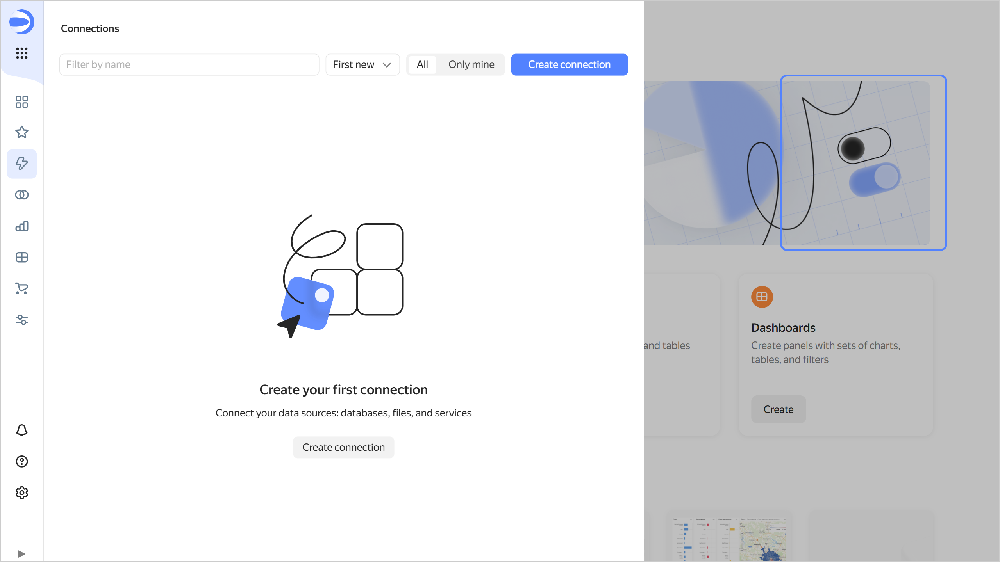

# {{ datalens-full-name }} release notes: April 2025

* [Changes in basic features](#base)
* [Mobile version updates](#mobile-version-changes)
* [Changes available with the _Business_ service plan](#business)

## Changes in basic features {#base}

### UI changes {#interface-changes}

* Added the ability to copy ID for all object types in one of the following ways:
  
  * Click  → **Copy ID** on the navigation page or in the object editing window.
  * In the **Linked objects** window, click  → **Copy ID** next to the object.
  
* Fixed an issue where a new page opened on clicking  **Notifications**. Now the {{ datalens-short-name }} message window opens.
* Updated the appearance of the empty object list that opens via the navigation bar on the left.

  

  

  

### Changes in connections {#connection-changes}

Added a [connection to {{ speechsense-full-name }}](../operations/connection/create-speechsense.md).

### Fixes in datasets {#dataset-changes}

Now when you [create a dataset](../dataset/create-dataset.md#create), the **Sources** tab opens, and when you edit it, the **Fields** tab opens.

### Fixes in charts {#charts-fixes}

* You can show a particular area on the [map](../visualization-ref/map-chart.md) using the **Center** and **Scale** [settings](../concepts/chart/settings.md#common-settings).
* Fixed an issue where sorting on the layer with a [line chart](../visualization-ref/line-chart.md) was not working in a [combined chart](../visualization-ref/combined-chart.md).
* In the [wizard](../concepts/chart/dataset-based-charts.md), fixed an issue where the date format was reset after changing the field type [setting](../concepts/chart/settings.md#field-settings) from `Date` to `Date and time` or back.
* In charts with [hierarchy](../operations/chart/add-hierarchy.md), fixed incorrect operation of filter query on clicking a value with quotes.
* Fixed incorrectly built [polylinear map](../visualization-ref/polyline-map-chart.md) with empty (`null`) values.
* Optimized rendering time in [pivot tables](../visualization-ref/pivot-table-chart.md) when using [chart filtering by charts](../dashboard/chart-chart-filtration.md).
* Fixed misalignment of text in [table](../visualization-ref/table-chart.md) cells if using [locked columns](../visualization-ref/table-chart.md#column-fixation) without pagination.
* Fixed incorrect display of [table](../visualization-ref/table-chart.md) with [locked columns](../visualization-ref/table-chart.md#column-fixation) and scroll.
* Added quotes for values when exporting a chart in CSV format.

### Versioning changes {#versioning-changes}

* [Chart](../concepts/chart/versioning.md), [dashboard](../dashboard/versioning.md), and report versioning is available only to users with editing rights for these objects. The draft alert is also available only to users with the right to edit the object.
* If there is a draft version of the chart, you can open it right away if you add the `unreleased=1` parameter to the URL.

### Tooltip in markup {#tooltip-add}

Added the ability to use the [TOOLTIP](../function-ref/TOOLTIP.md) markup function to add a small tooltip to text or the result of other [markup functions](../function-ref/markup-functions.md).

### Dashboard changes {#dashboard-changes}

* Fixed incorrect operation of the `state` parameter in the URL for [public](../concepts/datalens-public.md) dashboards.
* Changed the appearance of the [widget pinning](../dashboard/settings.md#widget-fixation) area:
  
  * The background of the pinning area and the button used to hide/show the bottom area have become more visible.
  * The pinning area is not displayed if there are no widgets in it.
  * The upper area has the same width as the rest.
  * You can pin widgets of any height in the upper area (previously only single-line widgets could fit there).

* Fixed an issue where the order of [headings](../dashboard/widget.md#title) in the table of contents was broken if you placed a heading in the widget pinning area.

### Changes in {{ datalens-full-name }} settings {#settings-changes}

Hid some [{{ datalens-full-name }} settings](../settings/ui-customization.md) for users without the `datalens.admin` [role](../security/roles.md#datalens.admin):

* Changing your [service plan](../settings/service-plan.md).
* [Customization settings](../settings/ui-customization.md).
* Adding and editing color palettes.
* [Disabling navigation through directories](../settings/disable-folder-navigation.md).
* [Enabling workbooks](../workbooks-collections/index.md#enable-workbooks).
* [Managing the ability](../concepts/datalens-public.md#publication-disable) to configure public access.

Service plans and color palettes can be viewed by any user without making any changes.

## Mobile version updates {#mobile-version-changes}

Fixed an issue where the chart [legend](../concepts/chart/settings.md#common-settings) would not scroll in the mobile version.

## Changes available with the _Business_ service plan {#business}

### Changes in Editor {#editor-changes}

* Fixed an issue that occurred when opening a chart for editing in [Editor](../charts/editor/index.md) with the `_embedded` parameter in the URL. Previously, if the `_embedded=1` parameter was present in the URL, the chart would not display the contents of the tabs.
* Switched Editor to UTC time zone. This will allow users to get a predictable result from the `new Date()` function.
* In the [Editor.wrapFn](../charts/editor/methods.md#wrap) function, removed the nesting restriction for custom arguments.
* Fixed an error of processing non-string parameters in Editor.

### Changes in reports {#reports-changes}

* In [reports](../reports/index.md), added auto-scrolling of the selectors section when adding a widget.
* For the [Community](../settings/service-plan.md) service plan in the [workbook](../workbooks-collections/index.md) interface, the display of the **Create report** button has been corrected on the **All objects** tab.

