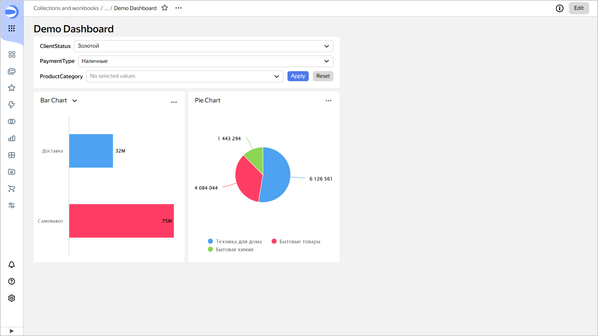
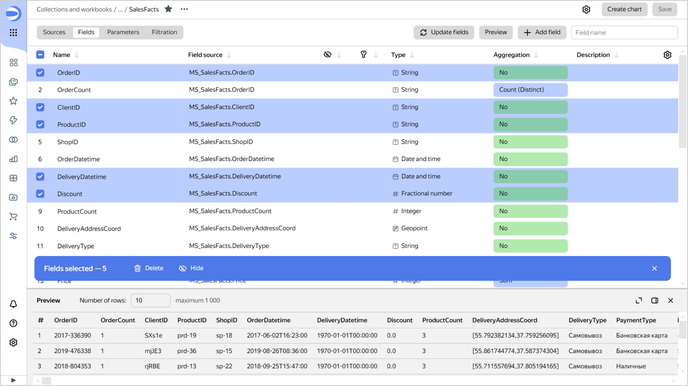

# {{ datalens-full-name }} release notes: July 2024

* [Updates](#updates)
* [Fixes and improvements](#fixes)

## Updates {#updates}

### Grouping selectors on dashboards {#group-controls}

You can now group multiple [selectors](../dashboard/selector.md) within a single widget on the dashboard.

You can configure additional control buttons for widgets with one or more selectors:

* **Apply button**: Applies the values of all selectors in the widget. The selector values are not applied until you click the button.
* **Reset button**: Resets the values of all selectors in the widget to their defaults.

For a widget with multiple selectors, you can configure their order and layout. You can set the width of each selector in pixels or as a percentage of the widget's total width. Specifying `100%` for each selector will create a vertical group. For more information, see [{#T}](../operations/dashboard/add-selector.md).

### Bulk operations with fields in a dataset {#bulk-changes}

You can now select multiple [dataset](../concepts/dataset/index.md) fields at once to delete, hide, or display them.

## Fixes and improvements {#fixes}

### Line shape for measures in the Y2 section {#y2-forms}

In the [line](../visualization-ref/line-chart.md) and [combination](../visualization-ref/combined-chart.md) charts, you can now customize the line shape for measures from the **Y2** section.

### Setting color for null values {#zero-colors}

Fixed the issue in [pivot tables](../visualization-ref/pivot-table-chart.md) where color settings did not apply to null measure values.

### Displaying a tooltip in maps {#map-tooltips}

Fixed the tooltip display error on [maps](../visualization-ref/map-chart.md) in the wizard.

### Searching for values in list selectors {#list-search}

Fixed an error when searching for values ​​in **List** type selectors.

### Adding possible selector values {#selector-values}

For possible selector values ​​entered manually:

* Set up placing the cursor directly into the input field for you to start typing.
* Enabled adding the values you enter by pressing **Enter**.

### Public dashboard label layout {#public-dash-footer}

Improved label layout in [public dashboards](../concepts/datalens-public.md): long labels no longer overlap widgets.

### Displaying tooltips of embedded charts in the mobile version {#mobile-tooltips}

In the mobile version, tooltips for embedded public and private charts are now always located below the chart.

### Warning when deleting keys for embedding {#delete-keys-warning}

Added a warning pop-up window when deleting keys for [embedding private charts](../security/private-embedded-objects.md) or actual embeddings.

### Displaying group selectors in the old link interface {#group-selectors-displaying}

Fixed an error where widgets with a selector group were not displayed in the old [link](../dashboard/link.md) setup interface.

### Height of the _Linked objects_ dialog window {#linked-objects}

Increased the height of the **Linked objects** dialog window.
