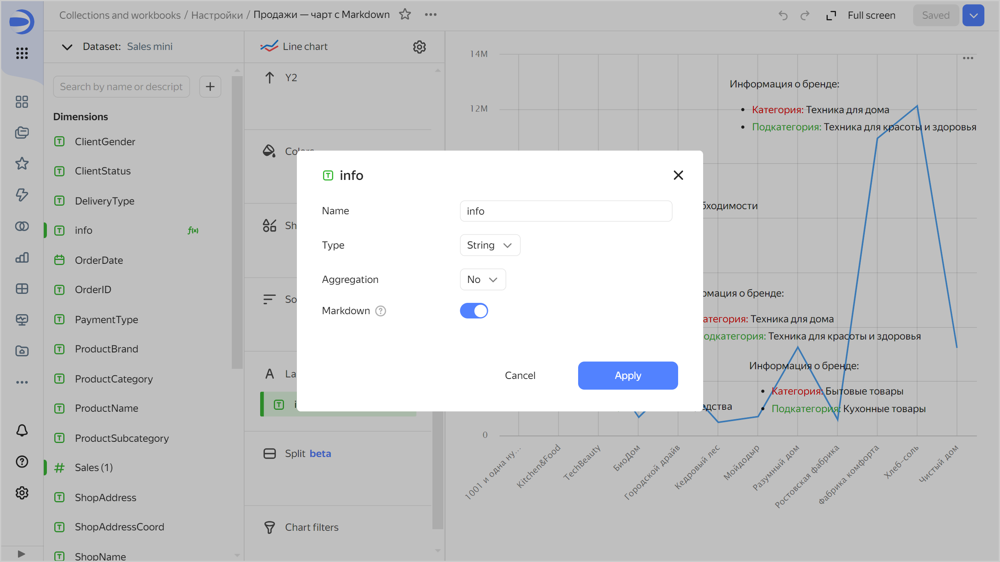
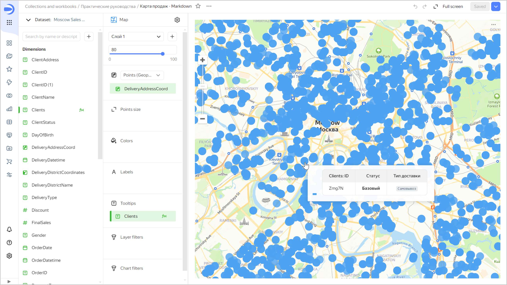

# {{ datalens-full-name }} release notes: September 2024


* [Changes in basic features](#base)
* [Changes available with the _Business_ service plan](#business)

## Changes in basic features {#base}


### Special FQDNs in connections {#special-fqdns}

In connections to [{{ CH }}](../operations/connection/create-clickhouse.md), [{{ PG }}](../operations/connection/create-postgresql.md), [{{ MY }}](../operations/connection/create-mysql.md), or [{{ GP }}](../operations/connection/create-greenplum.md), now you can select a special FQDN that points to the current master host or the least lagging replica.

For standard FQDNs, now you can specify multiple hosts for connection.

### Integration with {{ connection-manager-name }} {#dash-link-settings}

Added integration with [{{ connection-manager-name }}](../../metadata-hub/concepts/connection-manager.md) for the following connections:

* [{{ CH }}](../operations/connection/create-clickhouse.md)
* [{{ PG }}](../operations/connection/create-postgresql.md)
* [{{ MY }}](../operations/connection/create-mysql.md)


### Pinning widgets {#widget-fixation}

Now you can [pin (i.e. lock the position of) a widget](../dashboard/settings.md#widget-fixation) in dedicated lock areas at the top of the dashboard. These areas stay locked as you scroll the page, and the widgets pinned on them keep their position.

### Freezing table columns {#column-fixation}

Added the ability to freeze one or more columns in [regular](../visualization-ref/table-chart.md#column-fixation) and [pivot](../visualization-ref/pivot-table-chart.md#column-fixation) tables. Once frozen, these columns stay in place as you scroll horizontally.

### New bulk operations with fields {#bulk-changes}

Added new bulk operations with marked fields in a [dataset](../dataset/index.md). Now you can change their types or aggregation.


### Support for markup functions in charts {#markup-support}

In charts, now you can use [markup functions](../function-ref/markup-functions.md) in labels.

For example, under **Labels**, you can add a field with this formula:

```markdown
MARKUP(
    COLOR(STR([OrderCount]), IF ([OrderCount] < 7000) THEN 'red' ELSE 'green' END),
    BR(),
    IF(LEN([ProductSubcategory]) > 15) THEN LEFT([ProductSubcategory],15) +'...' ELSE [ProductSubcategory] END
)
```


### Using Markdown in chart and map tooltip labels {#markdown-sign-map-tooltips}

In chart and [map tooltip](../concepts/chart/settings.md#map-settings) [labels](../concepts/chart/settings.md#sign), now you can configure the formatting for the `String` type fields using the basic [Markdown](../dashboard/markdown.md) syntax. To do this, click the icon before the field name and enable **Markdown**.













### Configuring RLS for user groups {#group-rls}

Added the ability to configure [RLS for user groups](../security/row-level-security.md#group-rls) in a dataset.

### Filtering charts by other charts for maps {#chart-chart-map-filtration}

Now you can [filter charts by other charts](../dashboard/chart-chart-filtration.md) in [maps](../visualization-ref/map-chart.md). Clicking a map element applies filtering by all the dimensions used in the chart except the coordinates themselves.


### Field tooltips in a chart {#hint-fields}

Fixed the error that caused field tooltips to disappear after changing a dataset in a chart.

### Dataset access denied error {#dataset-access-error}

Fixed the issue where an incorrect error type was displayed instead of the _dataset access denied_ message.

### Displaying charts as tables {#chart-as-table}

Fixed the display of charts as tables. To open your chart as a table, click  →  **Open as a table** in the top-right corner of the chart.

### Fixes in tables {#table-fix}

Fixed these table related errors:

* Old dates were displayed incorreclty.
* Colors failed to apply to a table correctly after updating filters.
* **Totals** row was displayed incorrectly.
* In a table with a hierarchy and enabled pagination, only the first rows were displayed and there was no navigator to move through the pages.

### **Heat map** chart display {#heat-map-fix}

Fixed the display of [Heat map](../visualization-ref/heat-map-chart.md) chart in the wizard.


### Dashboard link settings {#dash-link-settings}

When configuring an access link for a dashboard, now you can save the state of selectors and share the link with the federation:

1. At the top of your dashboard, click  and select  **Share**.
1. In the window that opens:

   * Set the menu language, theme, and appearance.
   * (Optional) Save the selector values.
   * (Optional) If you set up an [identity federation](../../organization/concepts/add-federation.md), save the federation to share your link with the federation users.

1. Copy the link with the selected appearance settings by clicking **Copy and close**.

## Changes available with the _Business_ service plan {#business}

### Reports {#reports}

Now {{ datalens-short-name }} support [reports](../reports/index.md), i.e., multi-page documents that you can export to PDF and print. You can add charts, text blocks, headers, and images to report pages.

### Restrictions on embedding private objects {#private-embedded-connections}

Now you cannot create a [private embedding](../security/private-embedded-objects.md) for an object if it has dependent objects that based on the following connections:

* [Google BigQuery](../operations/connection/create-big-query.md)
* [Snowflake](../operations/connection/create-snowflake.md)
* [Metrica](../operations/connection/create-metrica-api.md)
* [AppMetrica](../operations/connection/create-appmetrica.md)
* [{{ yandex-cloud }} Billing](../operations/connection/create-cloud-billing.md)
* [{{ datalens-short-name }} Usage Analytics](../operations/connection/create-usage-tracking.md)

### Embedding settings {#private-embedded-setings}

Now you can edit embeddings for private objects. To open the settings, in the row with the object in your workbook, click  and select **Embedding settings**.

