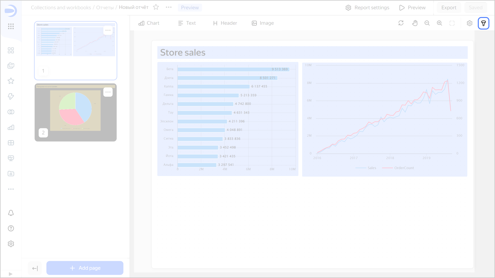
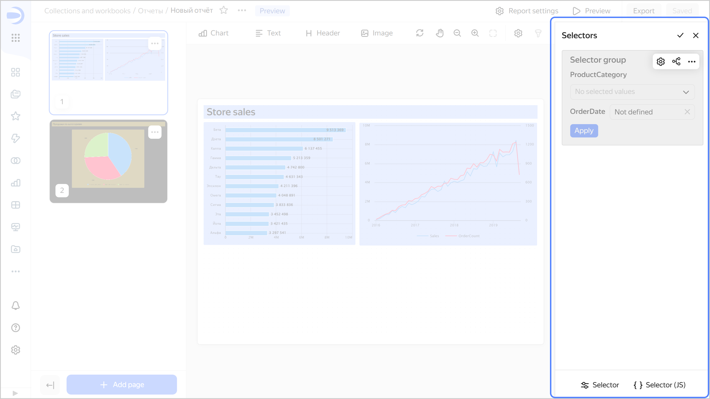
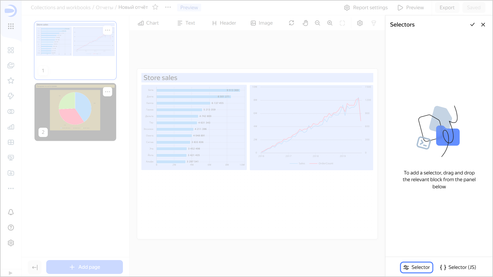
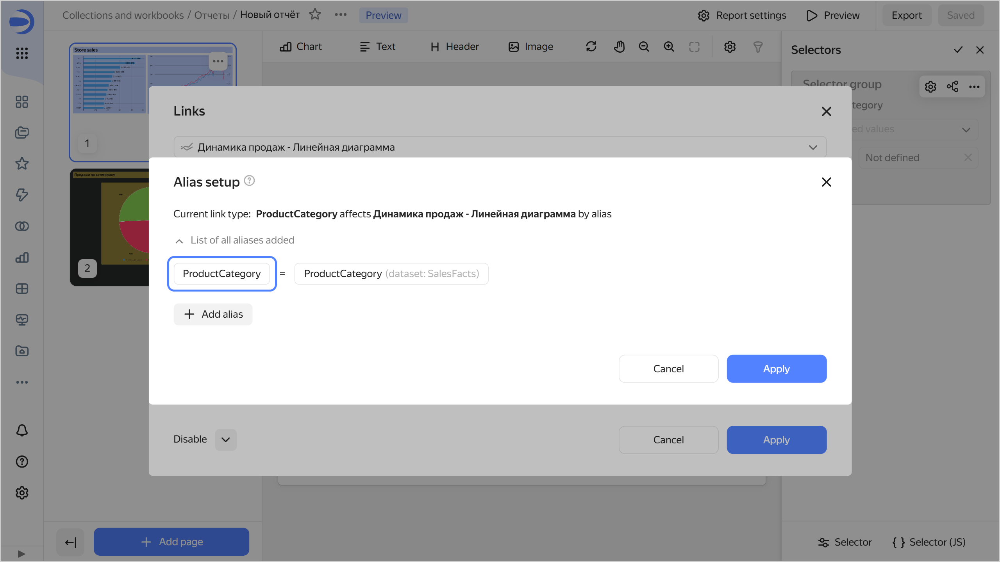
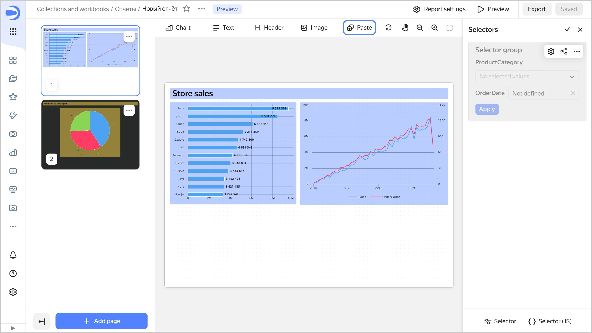
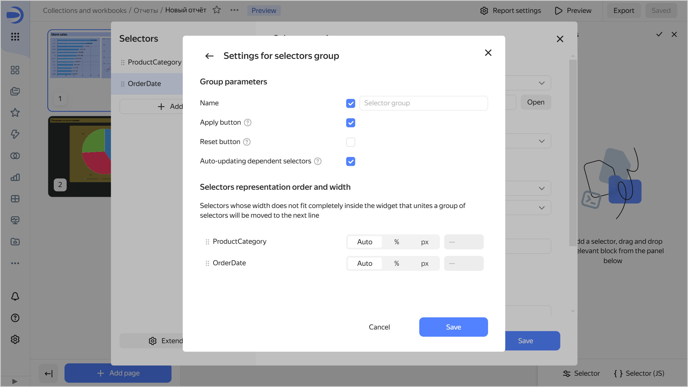
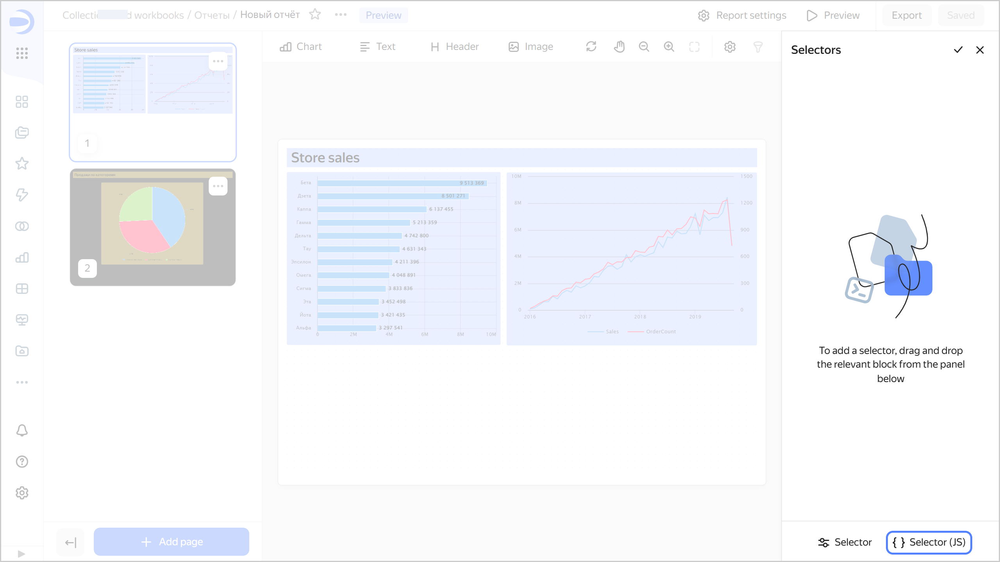
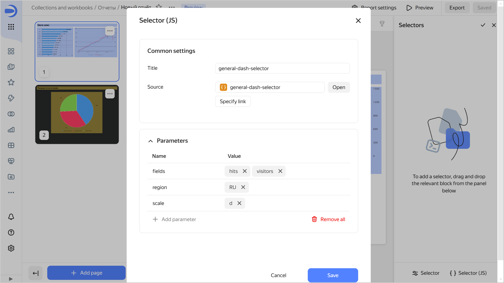

# Selectors in reports

[Selectors](../dashboard/selector.md) are filters that affect the results of queries in the linked widgets.

You can [add](#add-selector), [set up, or delete](#selector-edit) a selector in your report.

You can also [add a JS selector](#add-js-selector) to a report.

Before adding a selector, make sure you have the `{{ permission-write }}` or `{{ permission-admin }}` access to the report. For more information, see [{#T}](../security/manage-access.md).

To start working with [selectors](../dashboard/selector.md):

1. Open the report with the required selector in one of the following ways:

   

   - Workbook

     1. Go to the [page with workbooks and collections]({{ link-datalens-main }}/collections).
     1. Open the [workbook](../workbooks-collections/index.md) with the report you need and select it.
 
   - Navigation bar

     1. Go to the {{ datalens-short-name }} [home page]({{ link-datalens-main }}).
     1. In the left-hand panel, select  **Reports** and select the report.

   

1. At the top right, click .

   

   The **Selectors** window will open on the right:

   * To enter edit mode, click .
   * To get back to filter mode, click .
   * To hide the **Selectors** window, click .

   

   

   

   

   

   

## Adding a selector {#add-selector}

To add a [selector](../dashboard/selector.md) to a report:

1. Open the **Selectors** window. To do this, click  at the top right.
   If your report already has selectors, switch to edit mode. To do this, click .
1. From the panel below, drag the **Selector** widget to the **Selectors** section.
   
   
     
   
     
   

1. Under **Selector settings** choose the source and specify the selector parameters:

   

   - Based on dataset

     * **Dataset**: Dataset with data for the selector. You can choose a dataset from the list of objects or provide a link. This is a required field.
     * **Field**: Dataset field with selector values. It can be either a dimension or a measure (for more information, see [{#T}](../dataset/data-model.md#field)). This is a required field.
     * **Selector type**: Drop-down list, input field, calendar, or checkbox.

       

       * **Calendar** is only available for fields of the `Date` or `Date and time` type.
       * **Checkbox** is only available for fields of the `Boolean` type.
       * Measure selectors can only have the **Input field** type.

       

     * **Operation**: Comparison operation by which the selector filters the chart values (e.g., **Equal to**, **Greater than**, or **Less than**). If the field is left blank, the selector will filter by the **Equal to** operation by default. The list of available operations depends on the field type. Do not specify an operation if the selector filters the QL chart.
     * **Multiple choice**: Allows choosing several values in the selector. Only available for the **List** selector type.
     * **Range**: Allows setting a time interval in the selector. Only available for the **Calendar** selector type.
     * **Required field**: Sets the selector value as a required parameter. When enabled, `*` is added to the end of the selector name. Not available for the **Checkbox** selector type.
     * **Default value**: Applied initially when you open the report. This is a required field if the **Required field** option is enabled.

     * **Header**: Used to pick a selector when establishing a link with other widgets. By default, when you add a selector, the header text is substituted from the field title in the [dataset](../dataset/index.md). This is a required field.
       
       Select the header location below: `Left` (default), `Top`, or `Hidden` to hide it from the report selector settings window. It is not available for the **Checkbox** selector type.

     * **Inner title**: Allows specifying text inside a selector. For example, you can use it to display an operation inside a selector. Not available for the **Checkbox** selector type.
     * **Coloring**: Allows you to highlight important selectors. It is not available for the **Checkbox** selector type.
     * **Tooltip**: This option allows adding a text comment to the selector. By default, with this option enabled, the tooltip text is taken from the field description in the dataset. You can edit the tooltip text using the visual editor or [Markdown](../dashboard/markdown.md). When you change the dataset field description, the text is not automatically updated.

       When the option is enabled, you will see the  icon next to the selector in the report selector settings window. Hover over the icon to bring up the tooltip.

   - Manual input

     * **Field or parameter**: Field name you can use to link the selector with other widgets in the [alias](../dashboard/link.md#alias) configuration window. This is a required field.

       

     * **Selector type**: Drop-down list, input field, calendar, or checkbox.

       

       * **Calendar** is only available for fields of the `Date` or `Date and time` type.
       * **Checkbox** is only available for fields of the `Boolean` type.
       * Measure selectors can only have the **Input field** type.

       

     * **Operation**: Comparison operation by which the selector filters the chart values (e.g., **Equal to**, **Greater than**, or **Less than**). If the field is left blank, the selector will filter by the **Equal to** operation by default. The list of available operations depends on the field type. Do not specify an operation if the selector filters the QL chart.
     * **Required field**: Sets the selector value as a required parameter. When enabled, `*` is added to the end of the selector name. Not available for the **Checkbox** selector type.
     * **Multiple choice**: Allows choosing several values in the selector. Only available for the **List** selector type.
     * **Possible values**: List of values to select. Only available for the **List** selector type.
     * **Range**: Allows setting a time interval in the selector. Only available for the **Calendar** selector type.
     * **Time**: Allows specifying time. Only available for the **Calendar** selector type.
     * **Default value**: Applied initially when you open the report. This field must be set for the **List** type; otherwise, no value will be available in the selector. This is a required field if the **Required field** option is enabled.

     * **Header**: Used to pick a selector when establishing a link with other widgets. This is a required field.
       
       Select the header location below: `Left` (default), `Top`, or `Hidden` to hide it from the report selector settings window. It is not available for the **Checkbox** selector type.

     * **Inner title**: Allows specifying text inside a selector. For example, you can use it to display an operation inside a selector. Not available for the **Checkbox** selector type.
     * **Coloring**: Allows you to highlight important selectors. It is not available for the **Checkbox** selector type.
     * **Tooltip**: This option allows adding a text comment to the selector. By default, with this option enabled, the tooltip text is taken from the field description in the [dataset](../dataset/index.md). You can change the tooltip text. When you change the dataset field description, the text is not automatically updated.

       When the option is enabled, you will see the  icon next to the selector in the report selector settings window. Hover over the icon to bring up the tooltip.

   

   In [QL charts](../concepts/chart/ql-charts.md), you can control [selector parameters](../operations/chart/create-sql-chart.md#selector-parameters) from the **Parameters** tab in the chart editing area and use the **Query** tab to specify a variable in the query itself in `not_var{{ variable }}` format.

1. (Optional) Add another selector to the widget. To do this, on the left side under **Selectors**, click  **Add selector** and repeat the actions from the previous step. You can also duplicate the new selector or copy it to the clipboard. To do this, under **Selectors**, click  next to the selector and select:

   * **Duplicate**: This will add a new selector with the same parameters to the widget.
   * **Copy to clipboard**: You can paste the selector you copied into a different widget using the **Paste** button in the **Selectors** section or to a report using the **Insert** button on the bottom panel of the report page.
   
     
     
     
     
     

1. (Optional) Click  **Advanced settings** and specify widget settings:

   * **Name**: If you enable this option, the `Selector group` name will be displayed at the top of the widget. In the field on the right, you can enter your own name.
   * **Apply button**: Adds a widget button which applies the values of all selectors in the widget. The selector values are not applied until you click the button.
   * **Reset button**: Adds a widget button which resets the values of all the widget selectors to their defaults.
   * **Dependent selector autoupdate**: Enables dependent selectors to influence one another before you click the **Apply** button. Available for widgets with multiple selectors and the **Apply button** option enabled.
   * (Optional) For a widget with multiple selectors, customize the selector arrangement. To do this, arrange the selectors as needed by dragging them and adjust the width of each one:

      * `Auto`: Automatic selector width.
      * `%`: Selector width as a percentage of the widget's total width.
      * `px`: Selector width in pixels.

   Click **Save**.

   

1. Click **Save**. The widget will appear in the **Selectors** window. The selectors section will automatically scroll to the added widget.
1. Optionally, add another widget to the report. To do this, repeat steps 4-7.
1. Return to filter mode. To do this, click .
1. In the top-right corner, click **Save**.

You can now control filtering in a report by choosing values in selectors.



If you add a field selector to a report, filters added at the chart level will no longer apply to the chart in the report.



## Adding a JS selector{#add-js-selector}

To add a [JS selector](../charts/editor/widgets/controls.md) to a report:

1. Open the **Selectors** window. To do this, click  at the top right.
   If your report already has selectors, switch to edit mode. To do this, click .
1. From the panel below, drag the **Selector (JS)** widget to the **Selectors** section.
   
   
   
   
     
   

1. Under **Selector settings** choose the source and specify the selector parameters:

   * **Header**: Used to pick a selector when establishing a link with other widgets. By default, when you add a selector, the header text is substituted from the object name. This is a required field.
   * **Source**: Sets the selector created in Editor. Choose a selector:

     

     - From the list of objects

       Click **Select** and choose a selector from the list of objects. If you have already done so, you can proceed to edit the selector. To do this, click **Open** to the right of the selector.

     - Via a link

       Click **Specify link**. Paste the selector URL into the input field and click **OK** below.

     

   * **Parameters**: Sets a list of selector parameters and their default values. For the widget to work correctly, specify here the selector parameters listed on the [Params](../charts/editor/tabs.md#params) tab.

   

1. Click **Save**. The widget will appear in the **Selectors** window. The selectors section will automatically scroll to the added widget.

## Setting up and deleting a selector {#selector-edit}

1. Open the report in which you want to change the selector settings.
1. Open the **Selectors** window. To do this, click  at the top right.
1. Go to edit mode. To do this, click .
1. To the right of the widget, select:
   
   * : Widget settings. The available perameters are the same as when [adding](#add-selector) a selector.
   * : [Link](../dashboard/link.md) settings.
   * : Copying or deleting a widget. You can paste the copied widget into this or another report or dashboard using the **Insert** button on the widget panel.

1. Return to filter mode. To do this, click .
1. In the top-right corner of the report, click **Save**.

## Limitations {#restrictions}

* You can only add selectors to a separate report area.
* Selectors filter data across all report pages.
* For measure selectors, only one type is available: **Input field**.
* We recommend that you always make your measure selectors independent from other selectors. To do this, set their [link](../dashboard/link.md) type to **Not linked** to other selectors in the **Links** section when editing the selector widget.
