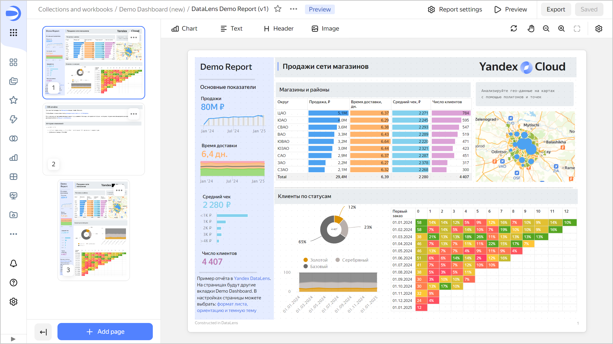
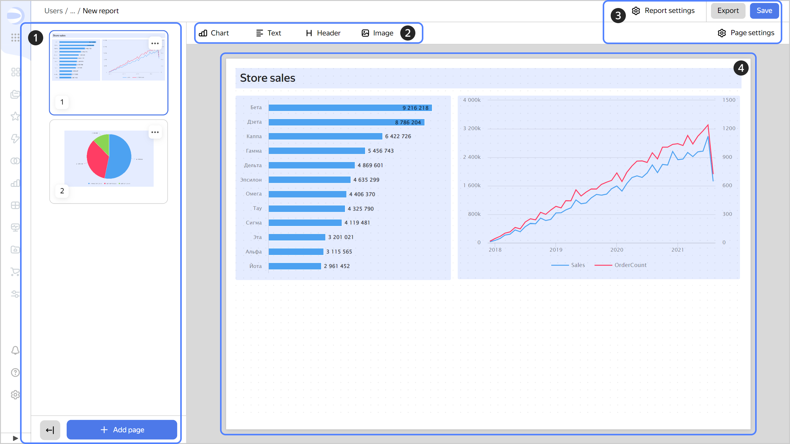

# Reports in {{ datalens-name }}



A _report_ is a multi-page document in a specified format you can use as an interactive presentation or export to PDF and print. You can add [charts](../concepts/chart/index.md), [text blocks](../dashboard/widget.md#text), [headers](../dashboard/widget.md#title), and images to report pages.

To see a report example, expand the [demo dashboard](https://datalens.yandex.cloud/marketplace/f2eui5ar8omalpcg1j3r) from {{ datalens-short-name }} {{ marketplace-short-name }}. You will see the report example in the expanded notebook. Join [our Telegram community](https://t.me/YandexDataLens/113821/117093) to explore more reports.

The report builder has these structural elements:

1. Report page preview area. Here you can manage the report pages: [add, move, or delete them](./report-operations.md#report-pages). To collapse the preview area, click . Instead of pages, their sequence numbers will be displayed. Click  to expand the preview area and display the pages.
1. Panel for [adding widgets](./report-operations.md#add-widget) to the report.
1. Basic controls:

   *  **Report settings**: Opens the [report settings](./report-operations.md#report-settings) window.
   *  **Preview**: Opens a full-screen view of the report as document or presentation.
   * **Export**: Exports the report in `.pdf`.
   * **Save**: Saves the report.
   * : Refreshes the report charts with applied parameters on the current page only.
   * : Moves the report page around the screen. When clicked again, returns you to move widget mode.
   * : Zooms out on the report.
   * : Zooms in on the report.
   * : Resets the report display scale and centers it on the screen.
   * : Opens the [current page settings](./report-operations.md#page-settings) window.
   * : Opens the report [selector settings](./report-operations.md#add-selector) window.

1. Area for working with the contents of the current report page.

   

## Report widget features {#report-widget-features}

The behavior and settings of report widgets are different compared to [dashboard](../dashboard/widget.md) widgets:

* Widget height is set in the report editing window. Auto height adjustment is not supported.
* You can overlap widgets, [move them to the foreground or background](./report-operations.md#move-widget-front-or-back).
* You can set a background for any widget.
* When you paste a widget copied from a dashboard, it gets the default settings.
* Charts do not support tabs and filtering.

#### What's next {#see-also}

* [{#T}](./report-operations.md)
