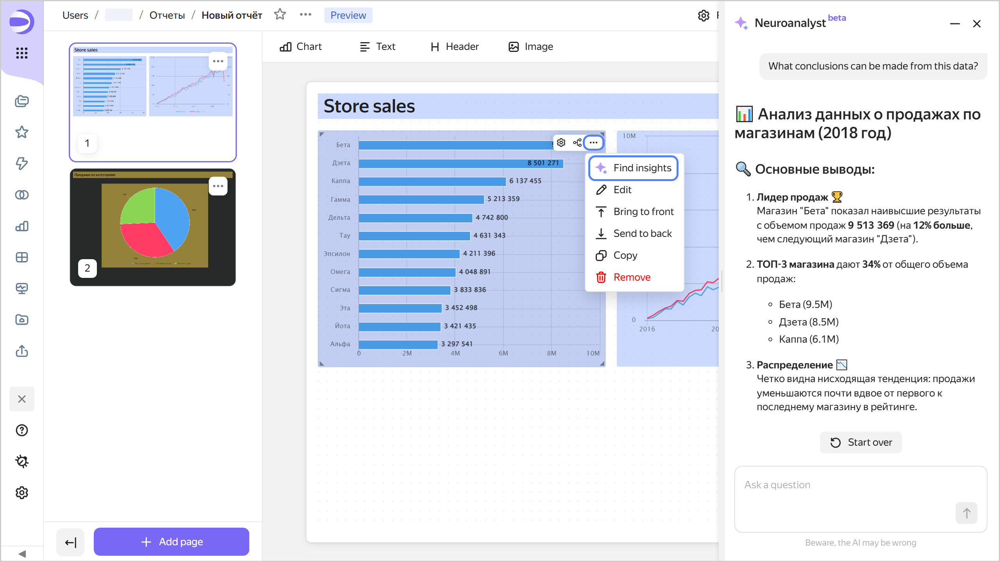

# Neuroanalyst in report



This feature is at the Beta testing stage.





Neuroanalyst in report is a tool that analyzes the selected report chart, generates findings based on its data, and allows you to ask follow-up questions. This data is complemented by the report's description and its chart title. For all charts, the chart description and tooltip will also be added, if any.

To enable Neuroanalyst, click  → **Find insights** in the top right corner of the report chart.





All your queries to Neuroanalyst are private: logs are neither stored nor used for further fine-tuning or research.

## Limitations {#restrictions}

* So far the tool can only analyze data from a particular chart.
* The analysis can take quite a while.
* Chart description and tooltip are not added for tables.