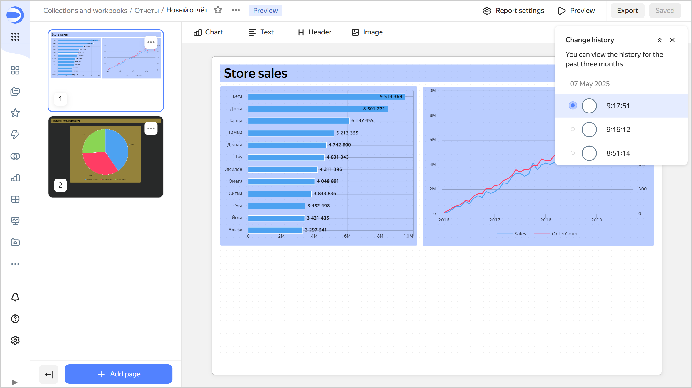
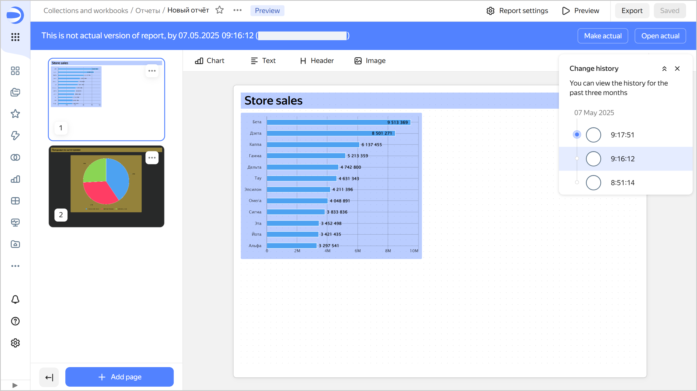
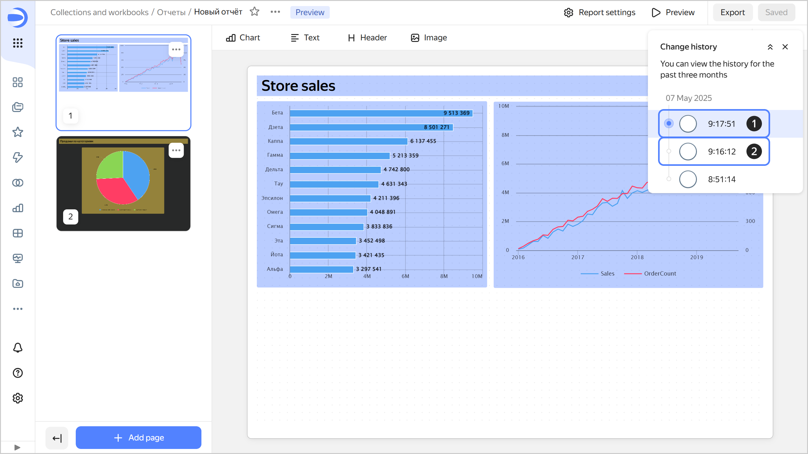

# Versioning



Report versioning means storing the history of report configuration changes through versions. A list of versions is available to users with the lowest edit permission for the report.

To go to the list of versions, click  at the top of the screen and select  **Change history**.

To select a version from the list, click it. The version number will be displayed in the `revId` parameter in the report address string. Click a link with the version number in the `revId` parameter to open the relevant version of the report.

Unsaved changes in the current version are reset:

* When refreshing the page.
* When saving a report.
* When switching to another version.

## Version types {#version-types}

All versions fall into the following types:

1. **Current**: This is the most recently saved version of a report.

   The version is displayed:
   
   * To all users on dashboards.
   * When navigating to a report.
   * When opening a report in a workbook.
   * When using the dashboard context menu to open a report for editing.
   
   A report can only have one current version.

   A user with **{{ permission-write }}** permissions can make any report version current.
  
   
  
   When you update any version, except a draft, a new report version is created.

   
  
1. **Outdated**: This version is no longer current.  
   When you open an outdated version, a panel appears at the top indicating the version type, creation date and time, and login of the version author. There are buttons in the right-hand panel:

   * **Make current**: Turns an outdated version into the current one. The version current at the time will become outdated.
   * **Open current**: Opens the current version.

   

   

   



You can share any report version by adding the `revId` parameter to the report link, e.g., `?revId=zac5m4edoaqqr`.



## Creating a new version {#version-create}

A new version is automatically created:

* In the current/outdated report version edit mode, after you click **Save** (which creates a new current version).
* In outdated report version view mode, after you click **Make current**.

You will also get a new version if you change report configuration as follows:

* Edit [report settings](./report-operations.md#report-settings).
* Edit report [page settings](./report-operations.md#page-settings).
* [Add](./report-operations.md#add-widget), edit or [remove](./report-operations.md#delete-widget) widgets.
* [Move](./report-operations.md#move-widget-front-or-back) a widget to the foreground or background.
* Add, delete, or edit selector settings.

## Editing versions {#version-edit}

You can edit any version of a report.

### Editing a current version {#actual-version-edit}

Editing a report opens its current version by default. To save your changes, click **Save** at the top right. This will create a new current version, making the previous one outdated.

### Editing an outdated version {#current-version-edit}

To edit an outdated version, select it from the list of versions. To save your changes to an outdated version, click **Save** at the top right. This will create a new current version, making the previous one outdated.

## Limitations {#restrictions}

* The change history only contains a list of report versions and indicates the version type, save date and time, and the user who made the change.
* Report versions do not include changes to access permissions; this operation is performed separately from report edits.
* Versions do not display a list of changes. You can only view the saved status of the report configuration.
