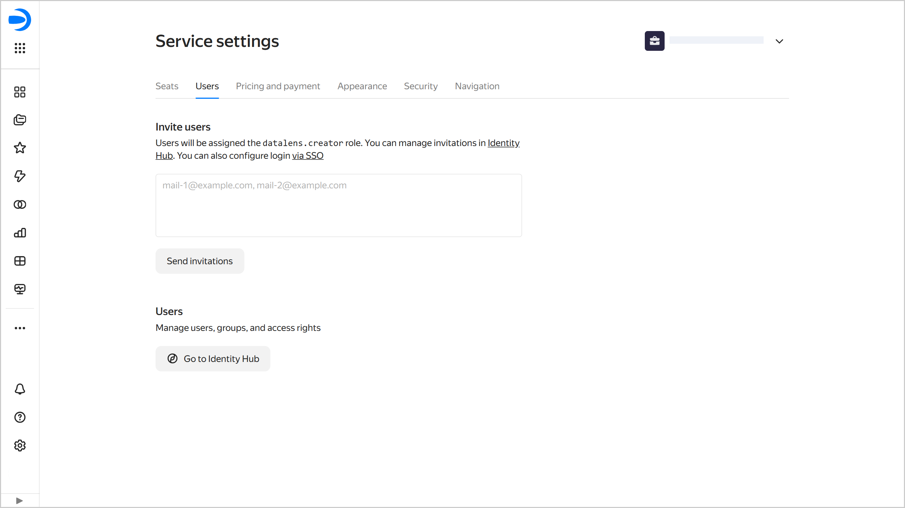

# Users

There are several ways to add a user to {{ datalens-short-name }}:

1. [Via {{ datalens-short-name }}](#dl-user): If the user is not planning to use other {{ yandex-cloud }} services. This method allows you to add users with a Yandex account. If the user asks for other {{ yandex-cloud }} services later on, you can [assign them an additional role](../../organization/security/index.md#add-role) in the organization with the current {{ datalens-short-name }} instance.

1. [Via {{ org-full-name }}](#org-user): If the user is planning to use other {{ yandex-cloud }} services. In which case you can invite to the organization [Yandex account users](#passport-user) or add [federated](#federated-user) and [local](../../organization/operations/add-account.md#local) users.



Users can be added or invited by the organization administrator (the `organization-manager.admin` role) or owner (the `organization-manager.organizations.owner` role).



### Adding a user via {{ datalens-short-name }} {#dl-user}

To add a user in {{ datalens-short-name }}:

1. Go to the {{ datalens-short-name }} [home page]({{ link-datalens-main }}).
1. In the left-hand panel, select  **Service settings**.
1. Select the **Users** tab.
1. Under **Invite users**, do the following:

   1. Enter the email addresses of the users you want to invite, e.g., `{{ login-example }}`.

      You can send invitations to any email address. Invited users will be able to select the appropriate Yandex account once they accept the invitation.
      
   1. Click **Send invitations**.

The user will receive a {{ datalens-short-name }} invitation email. Once the user accepts the invitation and selects the account for login, they can log in to your organization. The user will get the `{{ roles-datalens-creator }}` role in the organization with the current {{ datalens-short-name }} instance. To log in to {{ datalens-short-name }}, the user will need a [seat](../settings/seats.md).

### Adding a user via {{ org-full-name }} {#org-user}

#### Inviting a user with a Yandex account {#passport-user}

To invite a user with a Yandex account, follow [this guide](../../organization/operations/add-account.md#useraccount) from the {{ org-full-name }} documentation.



Users can only use {{ datalens-short-name }} if they have a role that enables access to the service. To ensure they have access, wait for them to accept the invitation to your organization and [assign](../../organization/security/index.md#add-role) them the `{{ roles-datalens-visitor }}` role.



#### Adding a federated user {#federated-user}

If you set up an [identity federation](../../organization/concepts/add-federation.md), follow [this guide](../../organization/operations/add-account.md#add-user-sso) to add a new federated user. After that, make sure to [assign](../../organization/security/index.md#add-role) them the `{{ roles-datalens-visitor }}` role.


