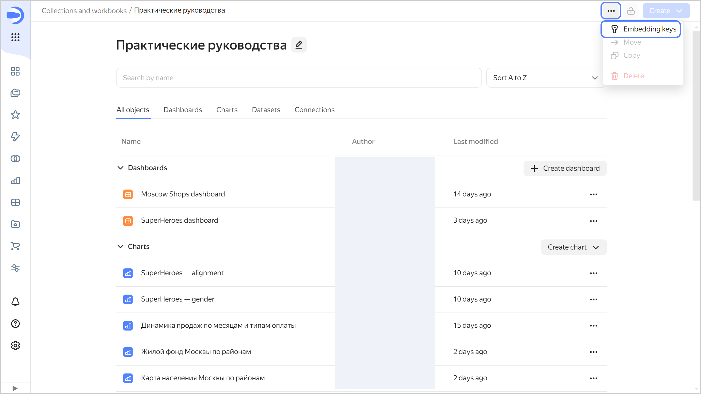
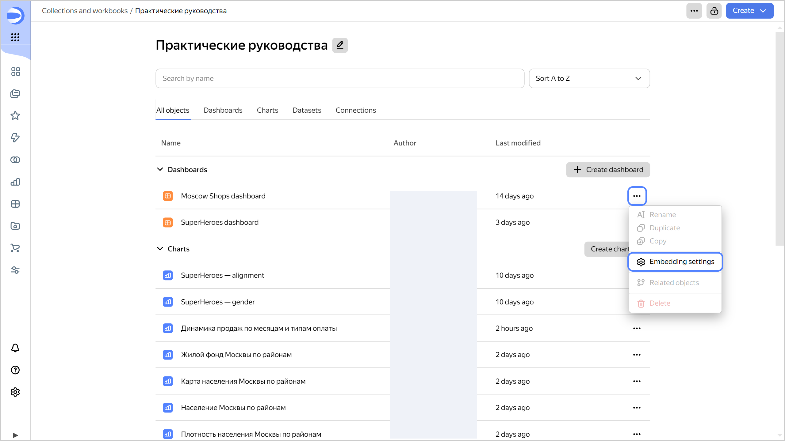

# Embedding private objects



You can securely embed private [charts](../concepts/chart/index.md) or [dashboards](../concepts/dashboard.md) into a website or app using special [JWT token](https://en.wikipedia.org/wiki/JSON_Web_Token) links.

Embedding private objects only works in the new {{ datalens-short-name }} object model at the [workbook](../workbooks-collections/index.md) level and is only available to the workbook [administrator](./roles.md#datalens-workbooks-admin).



## How to embed a private object {#how-to-private-embed}

1. Create a key for embedding:

   

   You can use one key to embed multiple objects.

   

   1. Go to the {{ datalens-short-name }} [home page]({{ link-datalens-main }}).
   1. In the left-hand panel, select  **Collections and workbooks**.
   1. Open the workbook with the object you want to embed.
   1. At the top of the screen, click  and select  **Keys for embedding**.

      

   1. In the window that opens:

      1. Click  **Create key**.
      1. Enter the key name and click **Create**.
      1. At the bottom, click **Download key file** or copy the key value.

         

         After you close the window, all data from it will be lost.

         

         The new key for embedding will appear in the list.

1. Configure the embedding for a private object:

   

   You can configure multiple embeddings for each object.

   

   1. In the row with the object, click  and select **Embedding settings**.

      

   1. In the window that opens, click  **New embedding**.
   1. In the settings window, specify:

      

      - For a chart {#chart}

        * **Name**: Enter a name for the embedding.
        * **Key**: Select a previously created key for embedding.
        * Select **Default parameters**:

          * **Enable all** (default): All the [unsigned parameters](#unsigned-parameters) are enabled, unless explicitly disabled.
          * **Disable all**: All the unsigned parameters are disabled, unless explicitly enabled.

          These restrictions do not apply to signed parameters from the token.

        * (Optional) **Disabled parameters**: Specify the names of unsigned parameters you want disabled when embedding a chart. Available in **Enable all** mode.
        * (Optional) **Enabled parameters**: Specify the names of unsigned parameters that can be provided in the embedding link. Any parameters not specified in the list will be ignored when attempting to provide them in the embedding link. Available in **Disable all** mode.
        * (Optional) **Allow data export**: Enable the display of the menu that allows you to export the chart data. To export data, click  →  **Save as** in the top-right corner of the chart and select the format: `XLSX`, `CSV`, or `Markdown`.

      - For a dashboard {#dashboard}

        * **Name**: Enter a name for the embedding.
        * **Key**: Select a previously created key for embedding.
        * (Optional) **Disabled parameters**: Specify the names of [unsigned parameters](#unsigned-parameters) you want disabled when embedding a dashboard. These restrictions do not apply to signed parameters from the token. By default, any parameters [specified](../operations/dashboard/add-parameters.md) in the dashboard settings can be provided in the embedding link.

          

          If there are selectors with restricted parameters on the dashboard, those will not be available when embedding.

          

        * (Optional) **Allow data export**: Enable the display of the menu that allows you to export the chart data. To export data, click  →  **Save as** in the top-right corner of the chart and select the format: `XLSX`, `CSV`, or `Markdown`.

      

   1. Click **Create**. In the **ID** column, copy the ID of the object to embed, and then click **Close**.

1. Create a token:

   1. Prepare a payload for the token, i.e., information about the object to embed. The payload contains the following fields:

      * `embedId`: ID of the object to embed.
      * `iat`: JWT issue time in [Unix Timestamp](https://en.wikipedia.org/wiki/Unix_time) format.
      * `exp`: Token expiration time in Unix Timestamp format.

        

        Tokens with more than 10 hours between `exp` and `iat` are invalid.

        

      * `dlEmbedService`: Service ID string constant, `YC_DATALENS_EMBEDDING_SERVICE_MARK`.
      * (Optional) `params`: Signed chart parameters provided as part of the token. They cannot be changed without regenerating the token.

        

        The generated token is transmitted as part of the network request header, so its maximum size is limited to 30 KB. Keep this in mind when using signed parameters.

        

        Here is an example:

        ```json
        {
          "embedId": "ieez7********",
          "iat": 1516239022,
          "exp": 1516240822,
          "dlEmbedService": "YC_DATALENS_EMBEDDING_SERVICE_MARK",
          "params": {
            "param1": "value1",
            "param2": "value2"
          }
        }
        ```

   1. To create a JWT token, sign the prepared payload with the private key you got earlier when creating the key for embedding.

      

      Use the `PS256` algorithm when creating the JWT.

      

      To create a JWT token, use these code samples:

      

      - Python {#python}

        Install `cryptography` for working with `PS256`:

        ```bash
        pip3 install cryptography
        ```

        Run the following code:

        ```python
        import time
        import jwt
        import json
        ​
        private_key = b"""<private_key>"""
        ​
        now = int(time.time())
        payload = {
           'embedId': "<embed_object_ID>",
           'dlEmbedService': "YC_DATALENS_EMBEDDING_SERVICE_MARK",
           'iat': now,
           'exp': now + 360,
           "params": {  }}
           ​
        # JWT generation.
        encoded_token = jwt.encode(
           payload,
           private_key,
           algorithm='PS256',
           )

        print(encoded_token)
        ```

      - Node.js {#node}

        Install the [jsonwebtoken](https://github.com/auth0/node-jsonwebtoken) package using [npm](https://www.npmjs.com/):

        ```bash
        npm install jsonwebtoken
        ```

        Run the following code:

        ```js
        const privateKey = `<private_key>`;

        const now = Math.floor(Date.now() / 1000);
        const payload = {
        embedId: '<embed_object_ID>',
        dlEmbedService: 'YC_DATALENS_EMBEDDING_SERVICE_MARK',
        iat: now,
        exp: now + 360,
        params: {},
        };

        const jwt = require('jsonwebtoken');

        const encodedToken = jwt.sign(payload, privateKey, {
        algorithm: 'PS256',
        });

        console.log(encodedToken);
        ```

      - Go {#go}

        Install the [jwt-go](https://github.com/golang-jwt/jwt) package:

        ```bash
        go install github.com/golang-jwt/jwt/v5@latest
        ```

        Run the following code:

        ```golang
        
        package main

        import (
          "fmt"
          "time"

          "github.com/golang-jwt/jwt/v5"
        )

        func main() {
          privateKey, err := jwt.ParseRSAPrivateKeyFromPEM([]byte(`<private_key>`))

          now := time.Now().Unix()
          payload := jwt.MapClaims{
              "embedId":        "<embed_object_ID>",
              "dlEmbedService": "YC_DATALENS_EMBEDDING_SERVICE_MARK",
              "iat":            now,
              "exp":            now + 360,
              "params":         map[string]interface{}{},
          }

          token := jwt.NewWithClaims(jwt.SigningMethodPS256, payload)
          signedToken, err := token.SignedString(privateKey)
          if err != nil {
              fmt.Println("Error generating token:", err)
              return
          }

          fmt.Println(signedToken)
        }
        ```

      

   1. Generate an embedding link:

      

      - For a chart {#chart}

        ```bash
        {{ link-datalens-main }}/embeds/chart#dl_embed_token=<token>
        ```

        Where `<token>` is the JWT.

      - For a dashboard {#dashboard}

        ```bash
        {{ link-datalens-main }}/embeds/dash#dl_embed_token=<token>
        ```

        Where `<token>` is the JWT.

      

1. Add an embedding link to your website or app, e.g.:

      

      - For a chart {#chart}

        ```html
        <iframe src="{{ link-datalens-main }}/embeds/chart#dl_embed_token=<token>" width="600" height="400" frameborder="0"></iframe>
        ```

        Where:

        * `src`: Embedding URL.
        * `<token>`: JWT.
        * `width`: Chart width.
        * `height`: Chart height.
        * `frameborder`: Chart border (yes or no).

      - For a dashboard {#dashboard}

        ```html
        <iframe src="{{ link-datalens-main }}/embeds/dash#dl_embed_token=<token>" width="600" height="400" frameborder="0"></iframe>
        ```

        Where:

        * `src`: Embedding URL.
        * `<token>`: JWT.
        * `width`: Dashboard width.
        * `height`: Dashboard height.
        * `frameborder`: Dashboard border (yes or no).

      

## Updating a token without losing your filter states {#token-update}

Replacing a JWT in an embedding link resets filters on the embedded dashboard to their default values.

To update the embedding link without losing filter states, use the [postMessage](https://developer.mozilla.org/en-US/docs/Web/API/Window/postMessage) method.

To update a JWT in a link, send an object of the following type to `iframe` using the `postMessage` method:

```js
{
    type: 'SECURE_EMBEDDING_TOKEN_UPDATE',
    token: <updated_token>
}
```

Where `<updated_token>` is your updated JWT.

As a result, queries from your dashboard or chart will be signed with the new token. The dashboard or chart will automatically get updated if you changed the signed parameters in your new token.

Here is an example:

```js
const iframe = document.getElementById('ID_IFRAME');

iframe.contentWindow.postMessage({
    type: 'SECURE_EMBEDDING_TOKEN_UPDATE',
    token: 'NEW_TOKEN'
}, 'https://datalens.yandex.cloud/');
```

When updating a token, keep in mind its expiration time.

## Unsigned parameters {#unsigned-parameters}

By default, any parameters, except those explicitly disabled, can be provided in the embedding link. They should be specified in the URL before the token hash. This allows you to change some widget/dashboard parameters on the client side without recreating the token.

For example, where a chart or dashboard employs the `from` and/or `to` parameters to filter values by time, you can provide these parameters in the embedding link before the token hash:



- For a chart {#chart}

  ```html
  <iframe src="{{ link-datalens-main }}/embeds/chart?from=2022-01-01&to=2023-02-05#dl_embed_token=<token>" width="600" height="400" frameborder="0"></iframe>
  ```

  Where:

  * `src`: Embedding URL.
  * `<token>`: JWT.
  * `from=2022-01-01&to=2023-02-05`: Unsigned parameters.

- For a dashboard {#dashboard}

  ```html
  <iframe src="{{ link-datalens-main }}/embeds/dash?from=2022-01-01&to=2023-02-05#dl_embed_token=<token>" width="600" height="400" frameborder="0"></iframe>
  ```

  Where:

  * `src`: Embedding URL.
  * `<token>`: JWT.
  * `from=2022-01-01&to=2023-02-05`: Unsigned parameters.



In the embedding link, any unsigned parameters are ignored if:



- For a chart {#chart}

  * The parameter is listed among the parameters disabled in **Enable all** mode.
  * The parameter is not listed among the parameters enabled in **Disable all** mode.

- For a dashboard {#dashboard}

  The parameter names are in the list of disabled parameters.



## Recommendations {#recommendations}

When embedding private objects, follow these guidelines:

* Default values should be provided in the link parameters.
* Note that any parameter in the link will override any signed parameter with the same name.
* To block changes to a parameter value:

  

  - For a chart {#chart}

    1. Add a signed parameter with a required value into the token.
    1. In chart embedding settings:

       * In **Enable all** mode, add the parameter to the disabled list.
       * In **Disable all** mode, do not add the parameter to the enabled list.

  - For a dashboard {#dashboard}

    1. Add a signed parameter with a required value into the token.
    1. In the dashboard embedding settings, add the parameter to the disabled list.

  

## Things to consider when embedding dashboards {#dash-embed-specialties}

When embedding dashboards, consider the following:

* Embedded dashboards can only be opened in view mode. Their navigation bar and, by default, the  menu for charts are hidden. Enable **Allow data export** in embedding settings for your charts to display the  menu, which allows exporting the chart data.
* When you open a dashboard, its [settings](../dashboard/settings.md) apply.
* For any embedded dashboard, only the parameters [specified in the dashboard settings](../operations/dashboard/add-parameters.md) are enabled.
* You cannot provide the state of filtered charts in the `state` parameter.
* The embedding link may not contain a dashboard header.
* In the embedding link, use `tab` to specify the tab to open the dashboard on.
