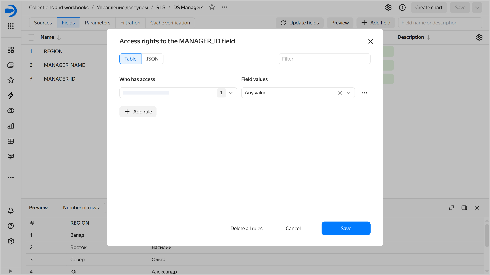
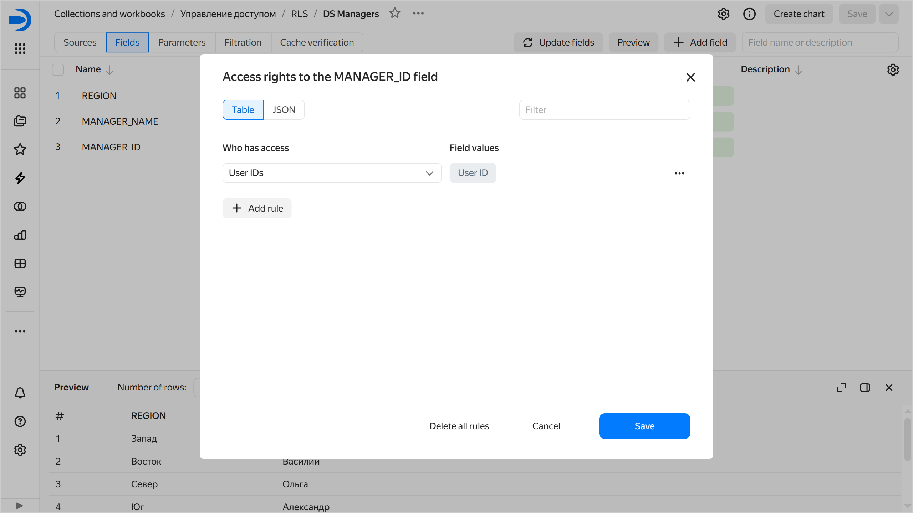

# Row-level security (RLS)

RLS (_row-level security_) enables you to restrict data access for users or [user group]({{ link-docs }}/organization/concepts/groups) within a single dataset. For example, you can introduce data access control for different customers.



You can introduce row-level access control either in a [dataset](#dataset-rls) or a [data source](#datasource-rls).

## Configuring RLS at the dataset level {#dataset-rls}

You can control access to any dataset dimension. Each [user](#user-rls) or [user group](#group-rls) can be granted permissions for an unlimited number of measure values.

With RLS, a query to a dataset passes through the following filter:

```sql
where dimension in (value_1, value_2 ... value_N)
```

You can configure access to rows from the interface or set the configuration in JSON format:



- Interface {#interface_datalens}

  1. Open the dataset and go to the **Fields** tab.
  1. For the field you need to configure access to, click  or  → **Access permissions**.
  1. In the window that opens, on the **Table** tab, click **Add rule** and specify:

     * Who gets the access:
      
       * `Users and groups`: Grant access to the specified users and groups. You can use search by name, login, or email.
       * `All users`: Grant access to all users.
       * `User IDs`: Control access at [data source level](#datasource-rls).

     * Field value. Grant access to all rows with the specified field value.

     
    
     

     

  1. To add another rule, repeat the previous step.
  1. Click **Save**.  
  1. Save the dataset.

- JSON {#json}

  1. Open the dataset and go to the **Fields** tab.
  1. For the field you need to configure access to, click  or  → **Access permissions**.
  1. In the window that opens, set the RLS configuration in JSON format on the **JSON** tab:

     ```json
     [
       {
         "allowed_value": "sp-21",
         "pattern_type": "value",
         "subject": {
           "subject_id": "ssxiy********",
           "subject_name": "user:ssxiy********",
           "subject_type": "user"
         }
       }
     ]
     ```

     Where:

     * `allowed_value`: Grant access to all rows with specified field value. You need to specify the value only if `pattern_type` is set to `value`; otherwise, it takes the `null` value.
     * `pattern_type`: How to grant the access:
      
       * `value`: For the specific field value from the `allowed_value` field.
       * `all`: For any field values. In this case, `allowed_value` must be `null`.
       * `userid`: Control access at [data source level](#datasource-rls).

     * `subject`: Description of the subject getting the access:

       * `subject_id`: ID of the user or group to grant access to. Specify `*` if `subject_type` is set to `all` or an empty value if it is set to `userid`.
       * `subject_name`: Name of the user to grant access to. Specify `*` if `subject_type` is set to `all` or the `userid` value if it is set to `userid`.
       * `subject_type`: Who will get the access:

         * `user`: Grant acces to a specific user. In this case, you need to specify the user ID and username in `subject_id` and `subject_name`, respectively.
         * `group`: Grant access to a user group. In this case, you need to specify the group ID and group name in `subject_id` and `subject_name`, respectively.
         * `all`: Grant access to all users. In which case you need to specify `*` in `subject_id` and `subject_name`.
         * `userid`: Control access at [data source level](#datasource-rls).

     You can set multiple rules by describing each one in an object with the specified fields.

  1. Click **Save**.
  1. Save the dataset.



## Configuring RLS at the data source level {#datasource-rls}

Configuring RLS at the dataset level requires editing the datatset every time the RLS settings change.

To avoid this, you can move the row-level security logic to the data source side:

1. Add a new field for storing the {{ datalens-short-name }} user ID to the source data. All requests to the source will be filtered by this field.

   
   
   Use [this link]({{ link-my-account }}profile) to look up your ID. If you need another user's ID, ask them to open the link and send you the ID.


1. For each source data row, specify the ID of the {{ datalens-short-name }} user who should get access to this row. If multiple users must have access to the same row, you can move the access control logic to a separate table and [join](../dataset/settings.md#multi-table) it to the main table at the dataset level.

1. In the dataset, configure access to the field containing user IDs:

   

   - Interface {#interface_datalens}

     1. In the RLS settings window, on the **Tables** tab, click **Add rule**.
     1. Select **User IDs** for the `Who has access` parameter.
     
        
        
        

        

     1. Click **Save**.
   
   - JSON {#json}
   
     1. In the RLS configuration window, set the RLS configuration in JSON format on the **JSON** tab:

        ```json
        [
          {
            "allowed_value": null,
            "pattern_type": "userid",
            "subject": {
              "subject_id": "",
              "subject_name": "userid",
              "subject_type": "userid"
            },
          }
        ]
        ```

     1. Click **Save**. Access will be granted to users whose IDs are specified in the field.

   

1. Save the dataset.



You can transfer the RLS logic to the source side for sources where the data structure can be changed. In Yandex Metrica and AppMetrica, the data structure is closed, so this method is not available.



## How to change permissions to a row in a dataset {#how-to-manage-rls}

To configure access permissions to data rows:


