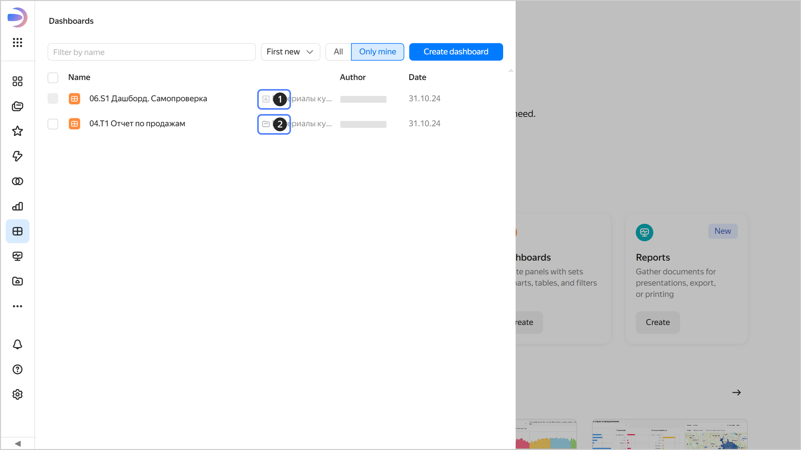

# Access permissions in workbooks and collections

This section describes how access management works for objects stored inside workbooks and collections, as well as access to the workbooks and collections themselves. If an object is stored in a folder, access to it is configured differently; for details, see [{#T}](./manage-access.md).



[Workbooks and collections](../workbooks-collections/index.md) are the primary navigation model in {{ datalens-name }}.

* A workbook contains connections, datasets, charts, and dashboards, and is the main unit for managing access permissions.
* A collection is used to group workbooks and other collections.

Some older {{ datalens-name }} instances still have folder-based navigation. We recommend [switching from folders to workbooks](../workbooks-collections/index.md#enable-workbooks) to gain more convenience and features, including copying and exporting/importing workbooks, assigning access permissions to groups, and sending newsletters.





To find the location of an object (in a workbook, collection, or folder), select the section with the object type you need (connections, datasets, charts, dashboards) on the left panel and find the object in the list. Optionally, use the name filter.

1. : Object in a workbook.
1. : Object in a collection.
1. : Object in a folder.



Access to connections, datasets, charts, and dashboards is configured at the level of the workbooks and collections that store those objects. By granting access to a workbook or collection, you give the same access to all objects inside that workbook or collection: this is the [basic setup](./workbooks-access-basic.md) of access permissions.

[Advanced setup](./workbooks-access-advanced.md) allows you to create _shared objects_ (connections and datasets) whose originals can be attached to multiple workbooks so that different teams can use them. Access to the original objects is managed by special permissions.

