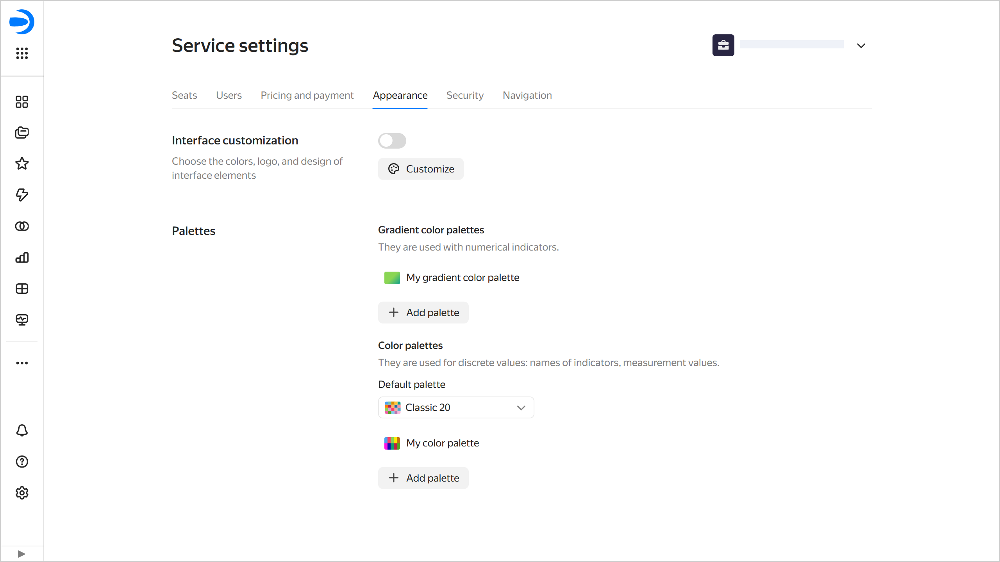
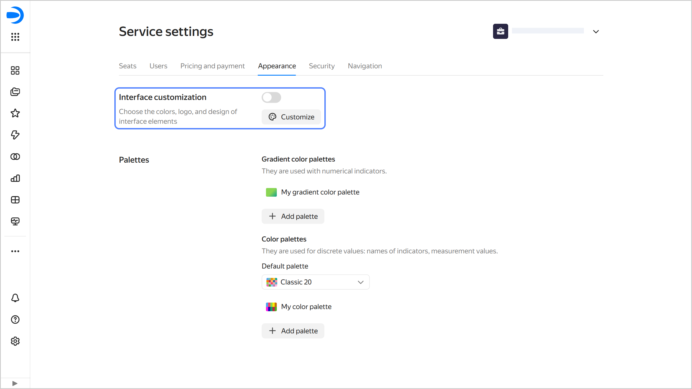

# Appearance settings in {{ datalens-full-name }}

Appearance settings allow you to change how the interface looks for the entire organization:

* [Customizing the UI](#ui-customization).
* Add, edit, or delete chart [color palettes](#palette-settings).

These settings can be edited by the {{ datalens-short-name }} instance [administrator](../security/roles.md#datalens-admin) (the `{{ roles-datalens-admin }}` role).

To access the appearance settings:

1. In the left-hand panel, select  **Service settings**. If the panel does not feature , first select  **More**, then  **Service settings**.
1. Select the **Appearance** tab.

   

## UI customization {#ui-customization}

With UI customization, you can achieve a custom {{ datalens-short-name }} look by editing colors, logo, and redesigning individual elements.

The customization settings can be edited by the {{ datalens-short-name }} instance [administrator](../security/roles.md#datalens-admin) (the `{{ roles-datalens-admin }}` role).

For UI customization:

1. Go to the {{ datalens-short-name }} [home page]({{ link-datalens-main }}).
1. In the left-hand panel, select  **Service settings**.
1. Select the **Appearance** tab.
1. In the **UI customization** section, click  **Configure**.

   

   

   

1. Customize the design:

   * **UI theme**: Select the UI theme for which you want to set the color palette.
   * **Contrast**: Select the contrast for which you want to set the color palette.
   * **Color palette**: Select colors for the UI theme and contrast. You can customize a unique palette for each combination of theme and contrast.

     You can set the colors manually or generate them:

     

     - Manually

       * **Main color**: Used as a background for buttons and controls: switches, checkboxes, and selectors. Additionally, the main color is used as a theme for tooltips.
       * **Main color on hovering the cursor**: When manually customized, you can select any color. When generating a palette, a darker shade of the main color is set automatically.
       * **Page background**: Page background color. For a light theme, white is the most commonly used color. Dark themes have more options, from neutral gray shades to warm or cool colors.
       * **Additional color**: Used as a background for cards and other elements placed on top of the page background.
       * **Selected elements**: Color for selected elements, e.g., clicked buttons, selected rows, or selected text.
       * **Selected items when hovering the cursor**: Color for selected items (e.g., clicked buttons or selected rows) when hovering over them.
       * **Text on selected items**: Text color on selected items. Set it to contrast with the color of the selected elements.
       * **Lines and outlines**: Color of the active card or tab, as well as the color of the loading indicator.
       * **Link**: Link text color.
       * **Link on hover**: Link text color when the cursor hovers over it.

     - Generate

       Click  **Generate palette** and select the main color. Other colors will be automatically generated based on it. If required, edit the color settings manually.

     

   * **Contrasting color**: Select a color for the text on the button.
   * **Logo and favicon**: To replace the logo and favicon, [upload](../../storage/quickstart.md#upload-files) a 1:1 aspect ratio SVG file to {{ objstorage-full-name }}. Then copy the link to the file in the storage and paste it into this field. Click **Apply** next to the field.
   
   * **Rounding**: Sets the rounding of the corners of UI elements.

    

    The preview area displays how the UI elements will look like with the specified settings.

    

1. At the top right, click **Save**.
1. To apply the customized UI, enable the corresponding option under **UI customization**.

## Managing a chart color palette {#palette-settings}

In {{ datalens-full-name }}, you can [create](#create-palette), [edit](#edit-palette), and [delete](#delete-palette) color palettes, as well as [set the default color palette](#default-palette).

### Creating a color palette {#create-palette}



### Changing a color palette {#edit-palette}



### Deleting a color palette {#delete-palette}



### Setting the default color pallete {#default-palette}



