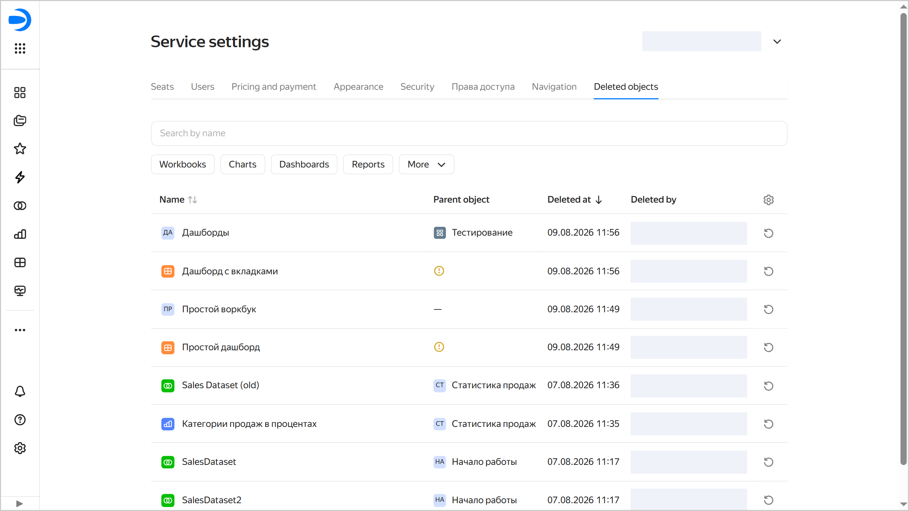

# Deleted objects in {{ datalens-full-name }}



* An administrator (user with the `{{ roles-datalens-admin }}` role) can view the list of deleted objects (connections, datasets, charts, dashboards, reports, and HTML pages) and workbooks and restore them.
* Objects deleted from folders are not displayed in the list. They cannot be restored.



To view and restore deleted objects and workbooks, go to the **Deleted objects** tab in the settings. To open it:

1. Go to the {{ datalens-short-name }} [home page]({{ link-datalens-main }}).
1. In the left-hand panel, select  **Service settings**.
1. Select the **Deleted objects** tab.

This tab gives the administrator access to information on all objects and workbooks that were deleted:

* **Name**: Name of the workbook or object.
* **Parent object**: Name of the collection or workbook from which the workbook or object was deleted. If the workbook did not have a parent object, the column will feature a dash. If the parent object was deleted, the column will feature the  sign.
* **Deletion at**: Date and time the workbook or object was deleted.
* **Deleted by**: Name of the user who deleted the workbook or object.

You can sort the list by name or deletion date.

You can also search by object name or switch between tabs with object types: `Workbooks`, `Charts`, `Dashboards`, `Reports`, `More` → `Datasets` / `Connections` / `HTML pages`.

The administrator can [restore a deleted object or workbook](../workbooks-collections/collections-operations.md#restore-objects-workbooks).
