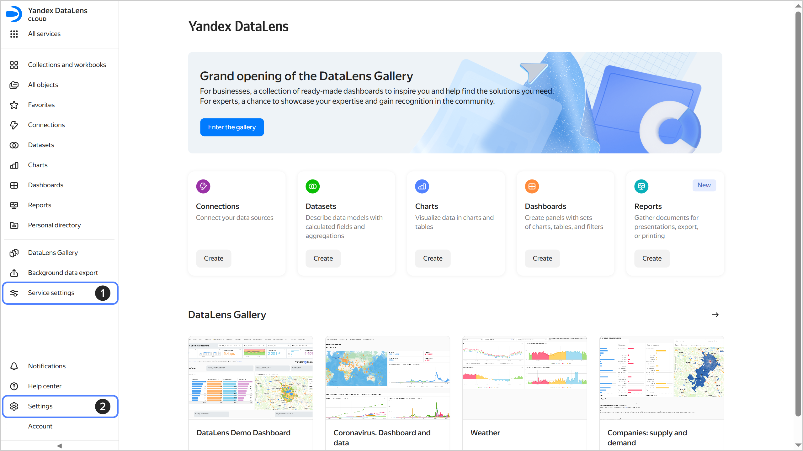
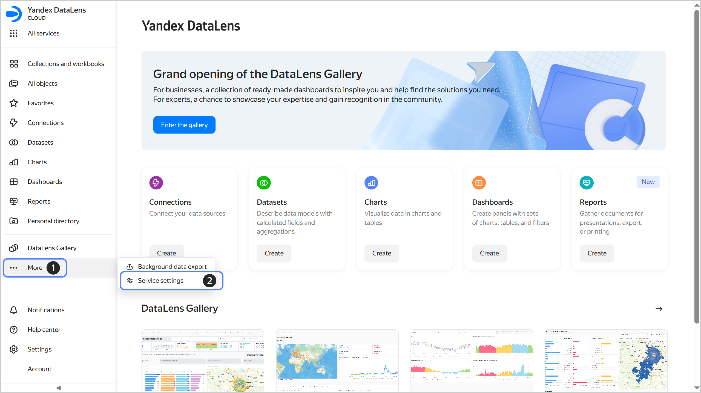

# Service settings in {{ datalens-full-name }}

There are two types of settings in {{ datalens-short-name }}:

1. [Service settings](#service-settings) are for the {{ datalens-short-name }} administrator and apply to the entire organization.
1. [{{ yandex-cloud }} settings](#user-settings) are there for every user and allow {{ yandex-cloud }} UI customization.

## Service settings {#service-settings}

The **Service settings** section is where you configure a {{ datalens-short-name }} instance. It allows the administrator to configure the service to meet the needs of the team and organization in terms of user access management, controlled use of resources, appearance and security setup.

These settings can only be edited by the {{ datalens-short-name }} instance [administrator](../security/roles.md#datalens-admin), i.e., user with the `{{ roles-datalens-admin }}` role. This role gives full access to all the settings sections and puts every aspect of the service's operation under control.

For your convenience, all settings are grouped into thematic tabs:

* [Seats](./seats.md): Here you can manage seats, which allow users to authenticate and work in {{ datalens-short-name }}.
* [Users](../security/add-new-user.md): This tab is where you invite users and manage the user list, groups, and access permissions. You can also configure integration with the corporate folder via SSO to streamline access management.
* [Service plans and payment](./service-plan.md): This section presents information about the current service plan and available resources, also offering some user settings.
* [Appearance](./appearance.md): Here you can customize the {{ datalens-short-name }} UI and configure color palettes for data visualization.
* [Security](./restrictions.md): An important section for complying with your company's information security policies. Here you can manage the use of the neuroanalyst and configure your publishing and export settings.
* [Navigation](./navigation.md): Here you can disable folder navigation and switch to workbooks and collections.

To access the service settings:

1. In the left-hand panel, select  **Service settings**. If  is not displayed on the pannel, first select  **More**, and then select  **Service settings**.
   
   

   

   

1. Select the tab you need.

The current [organization](../concepts/organizations.md) is displayed at the top of the settings page. Click  to the right of its name to see and copy its ID, the {{ datalens-short-name }} instance ID, or to navigate to the **organization's dashboard** in {{ support-center-name }}.

## {{ yandex-cloud }} settings {#user-settings}

To change the current user's settings, select  **Settings** on the left-hand panel and navigate to one of the following tabs:

* **Notifications**: Specify an email address, phone number, and Telegram account, and select the notification types you need.
* **Language and region**: Choose your interface language, time zone, and date and time format.
* **Appearance**: Select a UI theme and contrast level.
* **AI settings**: [Set up a custom AI prompt](../concepts/neuroanalyst.md#user-promt).

For more information, see [{#T}](../../console/operations/update.md).

