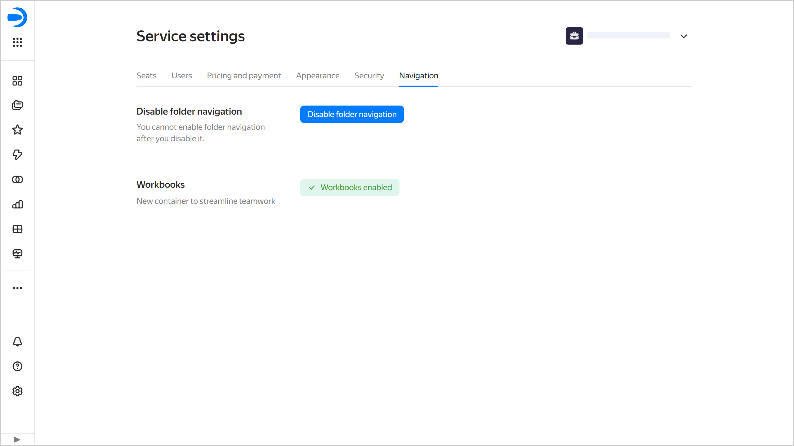

# Navigation settings in {{ datalens-full-name }}

Navigation settings allow you to manage object arrangement in {{ datalens-full-name }}. The administrator can disable folder navigation and switch to workbooks and collections.

* [Disabling folder navigation](#disable-folder-navigation)
* [Enabling workbooks and collections](#enable-workbooks)

To access the navigation settings:

1. In the left-hand panel, select  **Service settings**. If the panel does not feature , first select  **More**, then  **Service settings**.
1. Select the **Navigation** tab.

   

## Disabling folder navigation {#disable-folder-navigation}



## Enabling workbooks and collections {#enable-workbooks}

