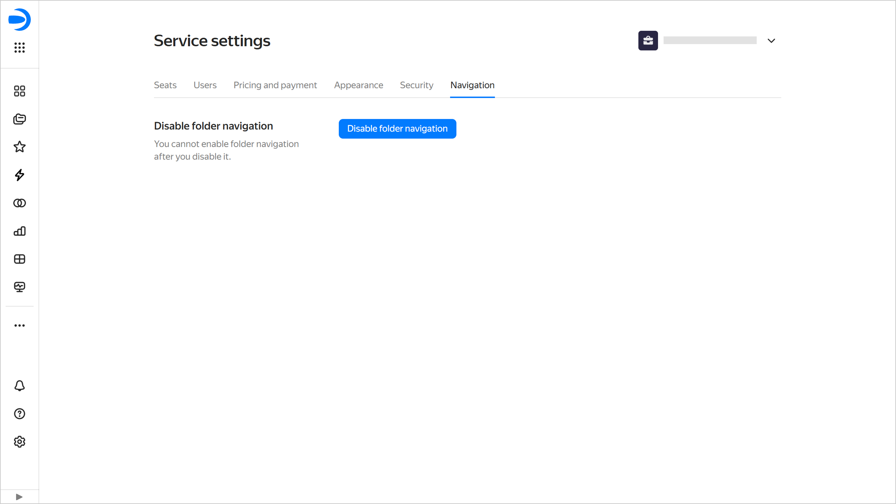

# Navigation settings in {{ datalens-full-name }}

Navigation settings allow you to manage object arrangement in {{ datalens-full-name }}. Administrators can disable folder navigation.

To access the navigation settings:

1. In the left-hand panel, select  **Service settings**. If the panel does not show , first select  **More**, then  **Service settings**.
1. Select the **Navigation** tab.

   

## Disabling folder navigation {#disable-folder-navigation}



