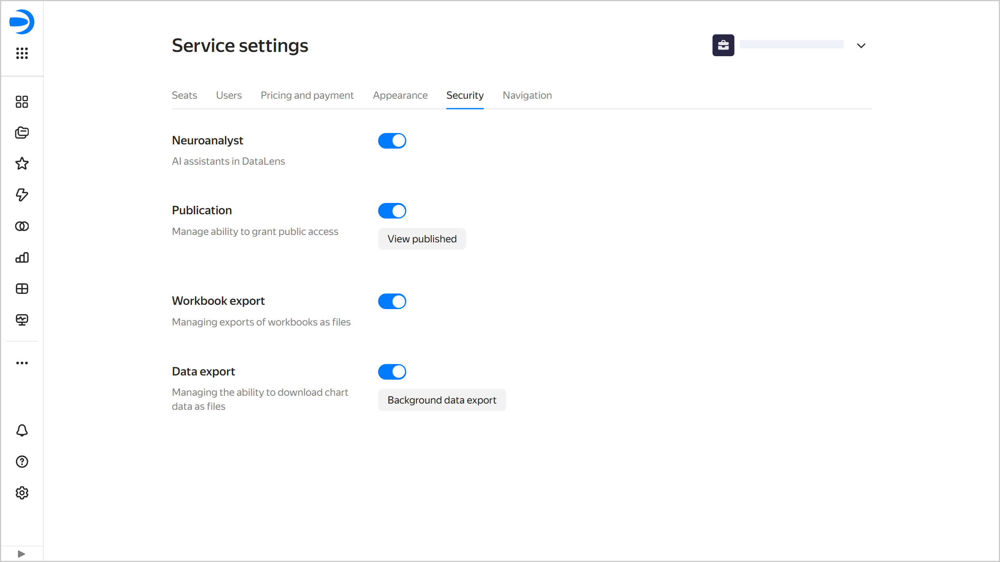

# {{ datalens-full-name }} security settings

The security settings allow you to restrict the use of some {{ datalens-name }} features at the instance level:

* [Neuroanalyst](../concepts/neuroanalyst.md#prohibit#prohibit): Restricts the use of Neuroanalyst.
* [Publishability](../concepts/datalens-public.md#publication-disable): Prohibits publishing charts and dashboards.
* [Workbook export](../workbooks-collections/export-and-import.md#workbooks-export-disable): Prohibits exporting workbooks as a file.
* [Data export](../concepts/chart/data-export.md#data-export-disable): Restricts downloading data from charts as files.

The security settings can be accessed only by the {{ datalens-short-name }} instance [administrator](../security/roles.md#datalens-admin) (user with the `{{ roles-datalens-admin }}` role).

To the access the security settings:

1. In the left-hand panel, select  **Service settings**. If the panel does not feature , first select  **More**, then  **Service settings**.
1. Select the **Security** tab.

   
