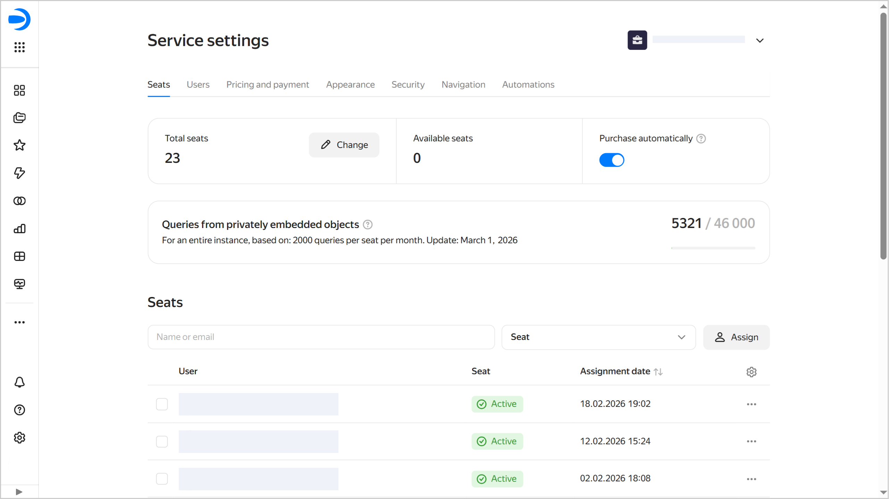

# Setting up seats in {{ datalens-full-name }}

Every {{ datalens-full-name }} user needs a _seat_ to log in and work with {{ datalens-name }}. The [cost of using {{ datalens-name }}](../pricing.md) depends on the number of seats in your instance.



An administrator (a user with the `{{ roles-datalens-admin }}` role) will be able to access {{ datalens-name }} settings and manage the list of seats at any time, even without a seat. However, other {{ datalens-name }} features will not be available to the administrator without a seat.



You can manage seats in the {{ datalens-name }} settings, on the **Seats** tab. To open it:

1. Go to the {{ datalens-short-name }} [home page]({{ link-datalens-main }}).
1. In the left-hand panel, select  **Service settings**.
1. Open the **Seats** tab. 

On this tab, the administrator can do the following:

* Manage seat [auto-purchasing](#purchase-automatically).
* [View the number of seats](#number-of-seats) in the instance, including available ones.
* [Increase or reduce the number of seats](#number-of-seats) in the instance.
* [View the list of users](#users-and-seats) with seats.
* [Reassign seats](#reassign) from user to user.
* [Manually assign seats](#manual-assignment).
* [Revoke seats](#revoke) from users who no longer need them.

## Seat auto-purchasing {#purchase-automatically}

Seats are issued automatically to all users upon first login to {{ datalens-name }}. First, new users get seats from among the available, i.e., unassigned ones.

By default, the **Purchase automatically** option is enabled for seats. Therefore, if an instance has no available seats left, a seat will be automatically purchased and assigned to every new user on their login to {{ datalens-name }}.

The administrator can disable this option if required. In which case the administrator becomes fully responsible for purchasing and assigning seats to new users: they can either [increase the number of seats](#number-of-seats) in an instance (to maintain the number of available seats) or [manually issue seats](#manual-assignment) to new users.

## Viewing and managing the number of seats {#number-of-seats}

The **Total seats** section displays the total number of seats in an instance, and the **Available seats** section displays the number of seats that have been purchased but not assigned to users.

To edit the number of seats:
1. Under **Total seats**, click  **Edit**.
1. Specify the required number of seats.
1. Click **Continue** and confirm the action.

The approaches to increasing and reducing the number of seats are different.

* Increasing the number of seats.

   Seats are purchased immediately and will be included in the current month's billing.
      
   These seats remain available until they get assigned to new users logging in to the instance.

* Reducing the number of seats.

   When you reduce the number of seats, the change will apply on the first day of the next month. Until then, you are charged for the initial number of seats. In the seat settings, you will see a banner reminding you of the scheduled seat reduction, which also has a button for cancelling the reduction in case you change your mind.
      
   The system will select seats to remove from among the available ones, and the rest, from those assigned to users. In the user list, such seats will have this status: `Until <date_of_seat_reduction>`. Their users will also see a warning in the interface. On the reduction date, the seat status will change to `Inactive`, and the users will be unable to access the {{ datalens-short-name }} interface. The administrator will be able to activate their seats. 

## Viewing the list of users with seats {#users-and-seats}

The **Seats** list shows {{ datalens-short-name }} instance users with seats. At the top, you will find filters for quick search.

Seats can have the following statuses:
* `Active`: Seat is assigned to a user.
* `Inactive`: Seat was removed when reducing the number of instance seats or because no billing account was added at the end of the trial period.
* `Until <date>`: Administrator has scheduled seat reduction; this seat will be removed from the instance on the specified date.
* `None`: Organization users without a seat. Theae users are not displayed in the list.

To open a seat’s settings, click . Here is the list of available actions:

*  **Activate seat**: Only for seats with the `Inactive` status.
*  **Reassign seat**: See [here](#reassign) for details.
*  **Copy the user ID**.
*  **Access diagnostics**: For diagnostics of user access to {{ support-center-name }}.
*  **Revoke seat**: See [here](#revoke) for details.

## Reassigning a seat between users {#reassign}

You can reassign a seat from a user with a seat to someone who does not have one. Proceed as follows:

1. Find the user in the **Seats** list and in the row with their name, click  → **Reassign seat**. You will see a list of organization users without a seat in {{ datalens-short-name }}.
1. Select the user you want to reassign the seat to. For convenience, use the search by name or email.
1. Click **Confirm**.

The seat will be reassigned immediately. The former user will disappear from the list of users with seats, replaced with the new user.

## Manual assignment of seats {#manual-assignment}

You can manually assign a seat to a user from your organization. If there are available seats, the new user will get one. Otherwise, you will have to confirm the purchase of a new seat.

To manually assign a seat to a user:
1. Click  **Assign**. You will see a list of organization users without a seat in {{ datalens-short-name }}.
1. Select one or more users who need a seat. For convenience, use the search by name or email.
1. Click **Assign**.

The users will appear in the list, and their seat status will be `Active`.

## Revoking a seat {#revoke}

To revoke a seat from a user:

1. Find the user in the **Seats** list and in the row with their name, click  → **Revoke seat**.
1. Confirm seat revocation. The user will lose access to the {{ datalens-name }} interface.

The revoked seat will become available: you will be able to manually assign it to a different user, or it will be automatically assigned to a new user when they log in to {{ datalens-name }}.
