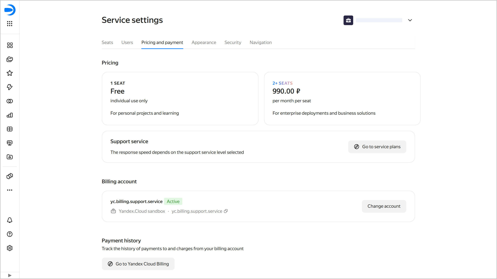

# Service plan and payment settings in {{ datalens-full-name }}



On December 1, 2025, the {{ datalens-name }} pricing rules changed. For details of the changes, see [this article](../pricing-changes.md). To see the new pricing policy, follow [this link](../pricing.md).



To access the service plan and payment settings:

1. In the left-hand panel, select  **Service settings**. If the panel does not feature , first select  **More**, then  **Service settings**.
1. Select the **Service plans and payment** tab.

This tab provides seat cost info, a link to support service plans, and allows you to manage your billing account.

## Pricing {#service-plans}

{{ datalens-short-name }} offers the unified [service plan](../pricing.md) which packs all the features available in {{ datalens-short-name }}. Your cost depends on the number of [seats](./seats.md) per instance; use that to control your consumption.

{{ yandex-cloud }} support offers [service plans](../../support/pricing.md#change-service-plan) of its own. You will find a link to [{{ support-center-name }}]({{ link-console-support }}) under **Support**. Follow this link to see what your service plan is and change it as needed.

## Billing account {#billing-account}

To pay for the services, you need a billing account. When registering a new {{ datalens-full-name }} instance, you do not need a billing account because your [trial period](../pricing.md#trial) is active. As soon as your trial period ends, you either reduce your consumption to one seat or add a billing account to pay for your seats. If you do not add a billing account, all the seats in your instance will go inactive except for one.

### Adding or changing a billing account {#add-billing-account}



Only users with a Yandex ID or Yandex 360 account can create new billing accounts. You cannot use a federated account for that.

To link a billing account, the user needs to following [roles](../security/roles.md#service-roles):

* `billing.accounts.editor` or higher for a billing account.
* `{{ roles-datalens-admin }}` or roles including its permissions, e.g., `{{ roles-organization-owner }}`, for an organization with {{ datalens-short-name }}.



To add a billing account:

1. Go to the {{ datalens-short-name }} [home page]({{ link-datalens-main }}).
1. In the left-hand panel, select  **Service settings**.
1. Select the **Service plans and payment** tab.
1. If you have not added a billing account in {{ datalens-short-name }} yet, click **Add account** under **Billing account**. If you already have one, click **Change account**.
1. If you have billing accounts linked to your [organization](../concepts/organizations.md), you can select one from the list. To create a new account, click **Create account**. If you do not have any billing accounts linked to your organization, the new account form will open:
   1. Specify general details:

      * **Account name**: It will be displayed in the list of your billing accounts and will help you select the right one.
      * **Country**: Select the country the [payer](../../billing/concepts/glossary.md#payer) is a resident of.
      * **Payer**: Select from the list of available payers.
      * **Account type**: Select an individual or legal entity. For a legal entity, select the payment method: `Credit/debit card` or `Wire transfer`.

      Click **Next**.

   1. Enter the payer details, depending on the type of account:

      * Individual: full name and postal address.
      * Legal entity: short name and full name of the organization, postal code, physical and legal address, TIN, and KPP.

      Click **Next**.

   1. Add a credit or debit card to your account (skip this step if the payer is a legal entity with `wire transfer` as payment method):

      * Click **Add card**.
      * Specify your card details: 16-digit number, expiration date, and CVV (you can find it on the back side of your card).
      * Click **Link**.
      * Select a card.

      If the payer is a legal entity, check the following box: **I confirm that I can use this corporate card**.

      Click **Next**.

   1. Provide contact details:

      * Enter your email address and click **Get code**. Confirm your email address.
      * Enter your phone number and click **Get code**. Confirm your phone number.

   1. Click **Create**.

1. Click **Link**.

## View your payment history {#history}

To [view your payment history](../../billing/operations/check-bill-history.md), click  **Go to Yandex Cloud Billing**.

#### See also {#see-also}

* [Pricing policy](../pricing.md)
* [Pricing questions](../qa/pricing.md)
