# Visualizing data from a CSV file

For our source data, let's use a file named [SuperHeroes.csv](https://storage.yandexcloud.net/datalens/SuperHeroes.csv), which has information about superheroes, like their name, gender, race, and the comic book publisher.

{{ datalens-short-name }} can be used to analyze dependencies, for example:

- The superhero's weight from their gender.
- The superhero's weight from whether they're good or bad.

To visualize the dependencies for analysis, create a connection to the CSV file, create a dataset based on it, and configure a dashboard by adding the appropriate widgets with charts to it.

- [Step 1. Create a connection and a dataset](data-from-csv-visualization.md#step1)
- [Step 2. Create the first chart](data-from-csv-visualization.md#step2)
- [Step 3. Create the second chart](data-from-csv-visualization.md#step3)
- [Step 4. Create a dashboard](data-from-csv-visualization.md#step4)
- [Step 5. Add charts to the dashboard](data-from-csv-visualization.md#step5)
- [Step 6. Add selectors to the dashboard](data-from-csv-visualization.md#step6)
- [Step 7. Set up widgets and start analyzing dependencies](data-from-csv-visualization.md#step7)
- [Step 8. Continue to analyze the data about superheroes](data-from-csv-visualization.md#step8)

## Step 1. Create a connection and a dataset {#step1}

Create a dataset based on a [connection](../concepts/connection.md) to the CSV file with information about superheroes or select an existing connection from the list of connections.

1. Go to [{{ datalens-short-name }}](https://datalens.yandex.ru).

1. Click **Create dataset**.

    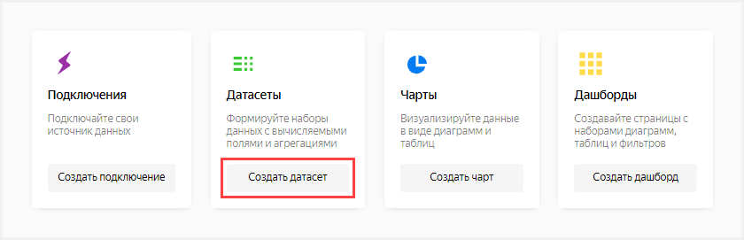

1. Click **Create connection**.

    

1. Choose **CSV**.

    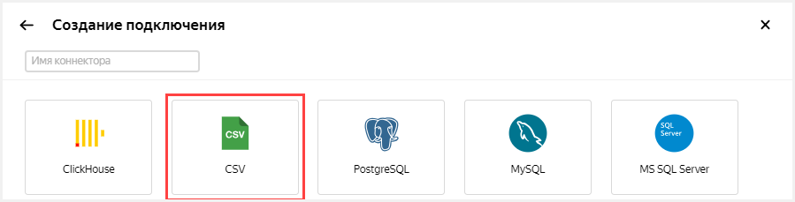

1. Click **Select CSV file**.

    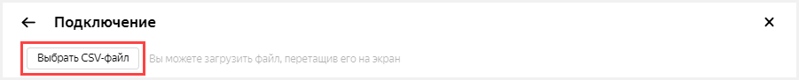

1. Select a file. In this example, it's **SuperHeroes.csv**.

1. Wait until the table content appears on the screen.

1. Click **Save**.

    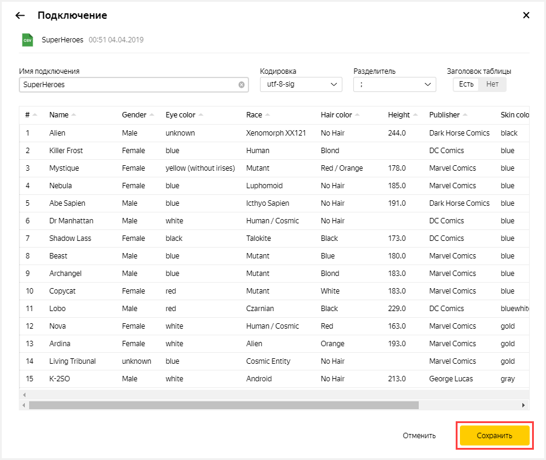

1. Enter a name for the dataset: **SuperHeroes**.

1. Click **Create**.

    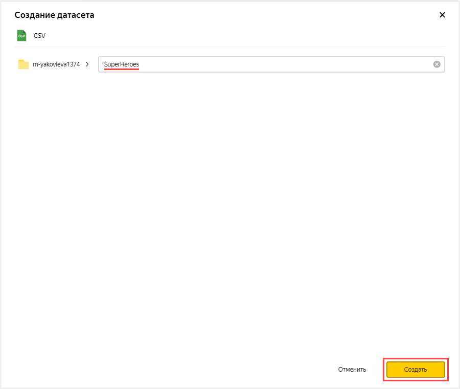

1. Create a field to store the average superhero weight.

    1. Duplicate the **Weight** field.

    1. Click  in the **Weight** row.

    1. Choose **Duplicate**.

        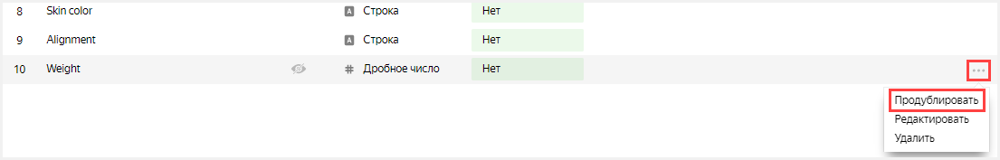

    1. Rename the **Weight (1)** duplicate field to **Weight avg**: click the row name, delete the current name, and enter the new one.

    1. In the **Aggregation** column, select **Average** for the **Weight avg** field.

        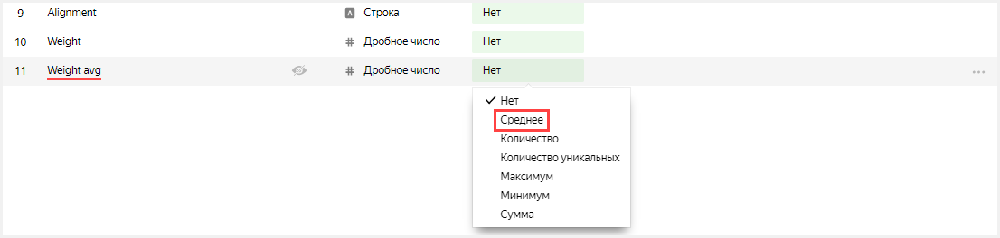

1. Click **Save** in the upper-right corner to save the dataset.

    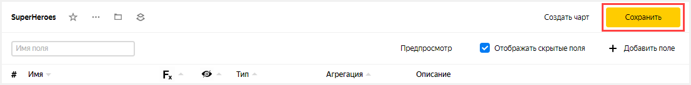

## Step 2. Create the first chart {#step2}

To visualize data divided by gender, create a bar chart type [chart](../concepts/chart.md).

1. Click **Create chart** in the upper-right corner.

    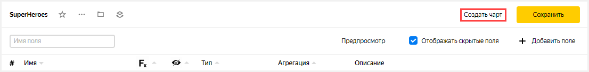

1. In the in the second column of the window that opens, click **Line chart** and choose a different chart type: **Bar chart**.

    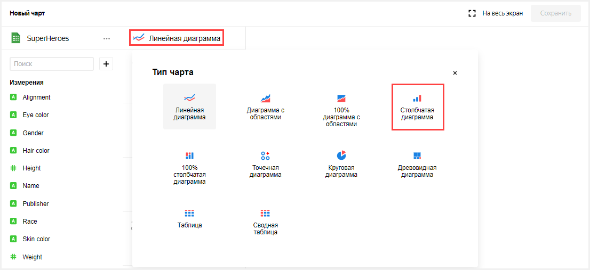

1. Add the names of superheroes to the chart. To do this, from the first column in the  **Dimensions** section, drag the **Name** field to the **X**-axis in the second column.

1. Add the superheroes' weight to the chart. To do this, from the first column in the **Measures** section, drag the **Weight avg** field to the **Y**-axis in the second column.

1. Sort the chart by weight (for example, in descending order).
    1. From the first column in the **Measures** section, drag the **Weight avg** field to the **Sorting** section.

1. Leave only the superheroes whose weight is greater than zero on the chart.

    1. From the first column in the **Measures** section, drag the **Weight avg** field to the **Filters** section.

    1. In the window that opens, specify **Greater** and **0**.

    1. Click **Apply**.

        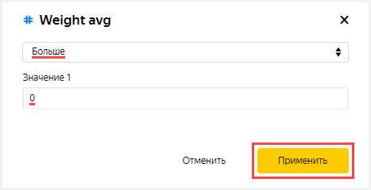

1. Add to the chart a color division for superheroes depending on their gender. To do this, from the first column in the **Dimensions** section, drag the **Gender** field to the **Color** section.

    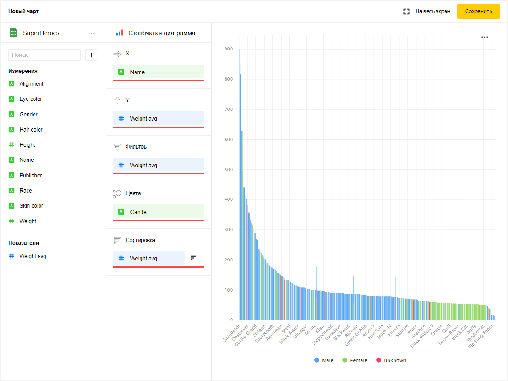

1. Save the chart.

    1. Click **Save** in the upper-right corner to save the chart.

        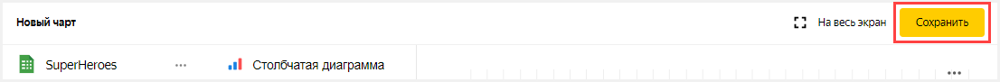

    1. In the window that opens, enter the name of the chart: **SuperHeroes — gender**.

    1. Click **Save**.

        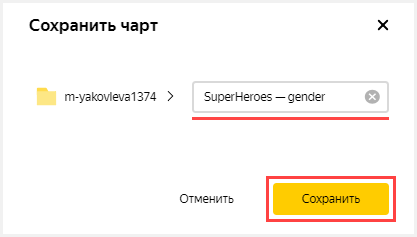

## Step 3. Create the second chart {#step3}

To visualize whether a superhero is good or bad, create a bar chart.

1. Copy the chart from the previous step.

    1. Click  in the upper-left corner next to the chart name.

    1. Choose **Copy**.

        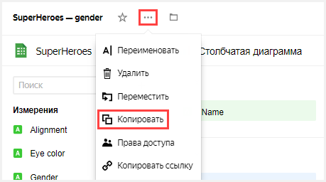

    1. In the window that opens, enter the name of the new chart: **SuperHeroes — alignment**.

    1. Click **Ready**.

        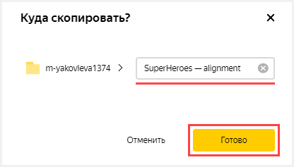

1. Add to the chart a color division for superheroes depending on whether they are good or bad. To do this, from the first column in the **Dimensions** section, drag the **Alignment** field to the **Color** section.

    The previous value of the section (the **Gender** field) is replaced with **Alignment**.

    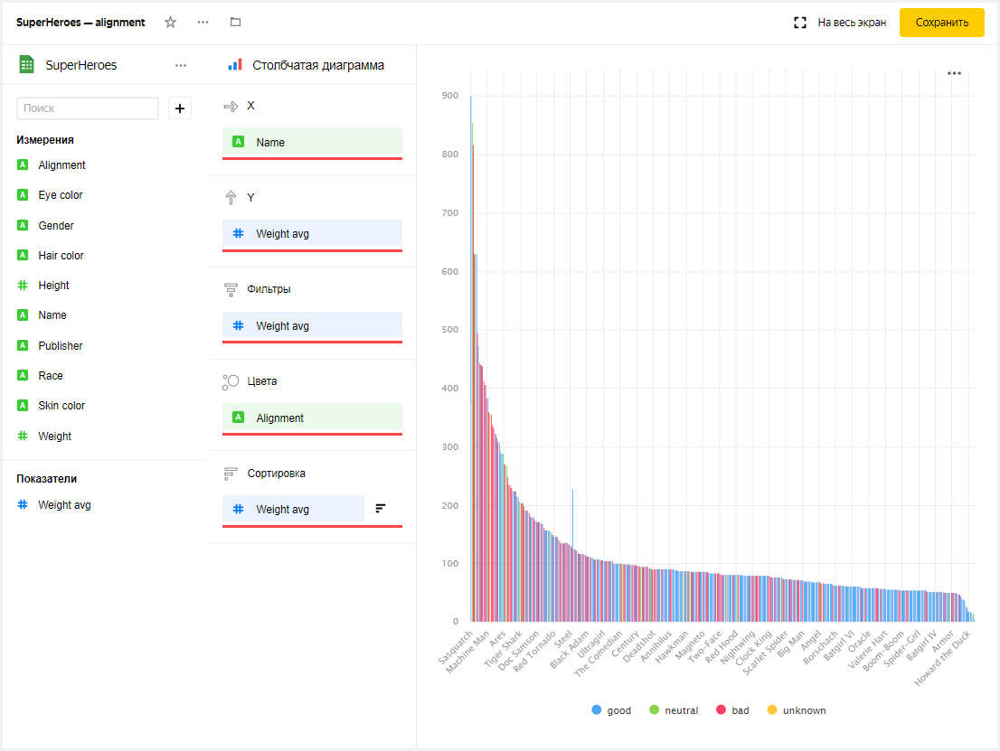

1. Click **Save** in the upper-right corner to save the chart.

    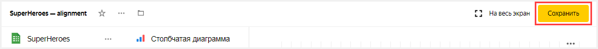

## Step 4. Create a dashboard {#step4}

Create a [dashboard](../concepts/dashboard.md) that these charts will be added to.

1. Go to the DataLens homepage. To do this, click the words **Yandex DataLens** in the upper-left corner.

1. Click **Create dashboard**.

    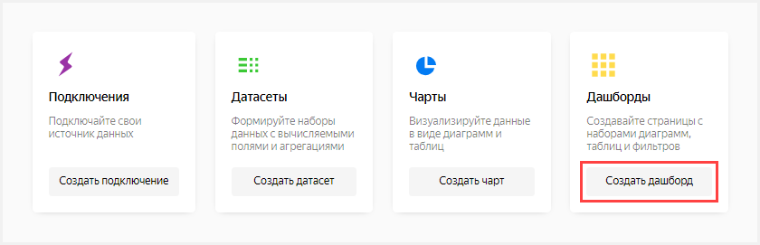

1. Enter the dashboard name: **SuperHeroes dashboard**.

1. Click **Create**.

    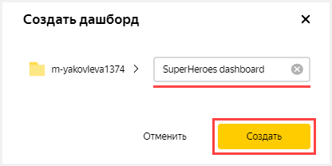

## Step 5. Add charts to the dashboard {#step5}

Prepare the dashboard for analysis by adding both charts to it.

1. In the dashboard that opens, click **Edit** in the upper-right corner.

    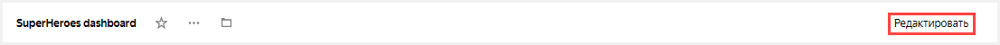

1. Click **Add**.

1. Choose **Chart**.

    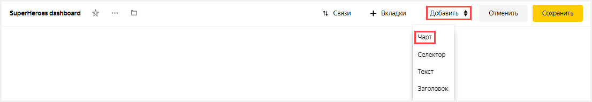

1. In the window that opens, click **Select**.

1. Select the **SuperHeroes — gender** chart. This automatically fills in the **Title** field with the name of the selected chart.

1. Click **Add**.

    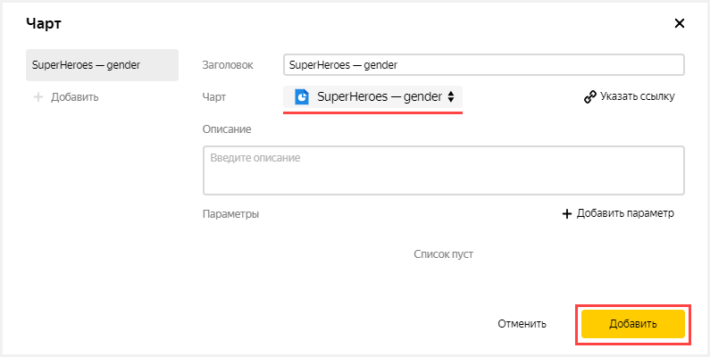

1. Add another chart. Perform all the steps from the beginning and specify the **SuperHeroes — alignment** chart in step 4.

    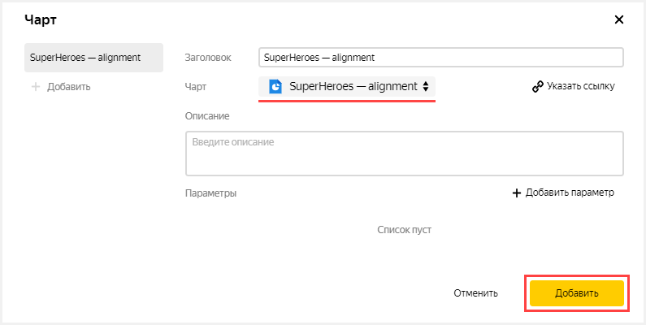

## Step 6. Add selectors to the dashboard {#step6}

Add [selectors](../concepts/dashboard.md#selector) to be able to filter superheroes by race (the **Race** field) and publisher (the **Publisher** field).

1. Click **Add**.

1. Choose **Selector**.

    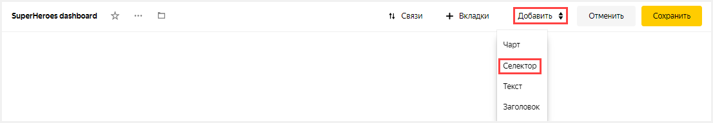

1. Under the word **Dataset**, click **Select**.

1. Select the **SuperHeroes** dataset.

1. Under the word **Field**, click **Select**.

1. Select the **Race** field. This will automatically fill in the **Title** field with the name of the selected field.

1. Enable the **Multiple choice** option.

1. Click **Add**.

    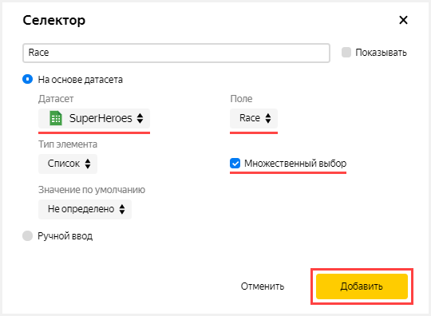

1. Add another selector. Perform all the steps from the beginning and specify the **Publisher** field in step 6.

    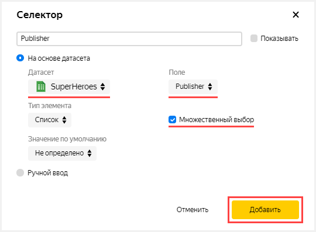

## Step 7. Set up widgets and start analyzing dependencies {#step7}

1. Drag the selectors to the top of the page next to each other.

1. Stretch the charts across the width of the dashboard.

1. Click **Save** in the upper-right corner to save the dashboard.

    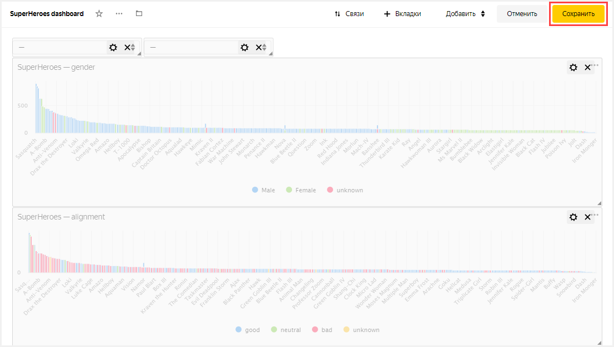

1. Apply various filters and analyze the weight dependencies on a superhero's gender and good or bad alignment.

    The dataset analyzed shows the following dependencies:
    - Men are generally heavier than women.
    - Bad superheroes are mostly heavier than good ones.

## Step 8. Continue to analyze the data about superheroes {#step8}

You can create new measures in the dataset, such as average height (average from the **Height** field) and the number of superheroes (number of unique entries from the **Name** field) and answer the following questions:

- Representatives of which race are the most numerous?
- Does a superhero's height depend on whether they are good or bad?
- Which studio created the most superheroes?

